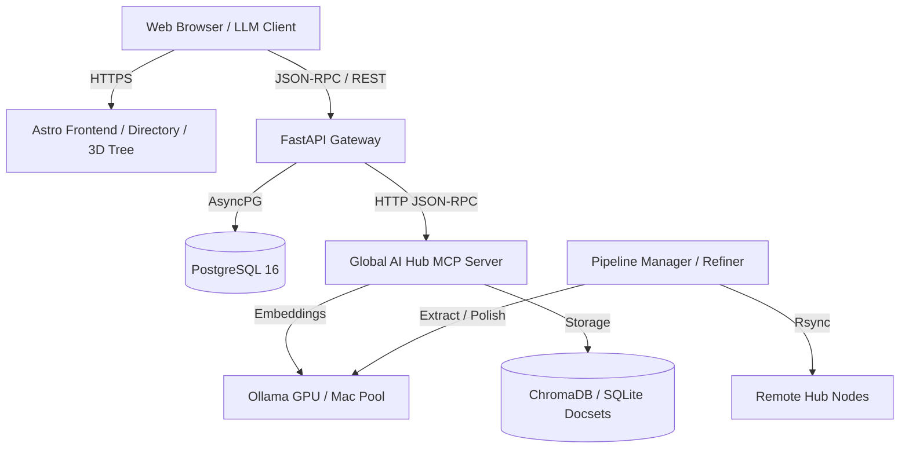

# LLMS-Explorer Architecture

## System Overview

LLMS-Explorer is an integrated platform providing documentation exploration for LLMs, semantic search indexing, accounts/metering infrastructure, and an interactive web portal.

## Architectural Components

1. **Frontend (`site/`)**:
   - Built with Astro (SSR + Static generation), TypeScript, and TailwindCSS.
   - Hosts the directory of llms.txt sources, 3D force-directed concept graph, documentation viewers, and account islands.
   - Postbuild tools generate twin format endpoints and llms.txt indexes.

2. **API & Metering Service (`api/`)**:
   - Built with FastAPI, SQLAlchemy 2.0 (asyncio), and asyncpg.
   - Enforces append-only accounting in PostgreSQL via database triggers.
   - Implements authentication via WebAuthn passkeys and OAuth (GitHub/Google).
   - Manages API keys with Argon2id hashing and daily spend limits.
   - Handles Stripe subscription lifecycles and invoice idempotency.

3. **Global AI Hub (`hub/`)**:
   - Python-based semantic ops and document refinement pipeline.
   - Distributes embedding workloads across a multi-host Ollama pool (`embed_core.py`).
   - Maintains ChromaDB collections and SQLite BM25 full-text search indexes for documentation corpora.
   - Exposes standard MCP tools via `mcp-server/hub_mcp_server.py`.

4. **Standard Library & CLI (`llmsx/`)**:
   - Reference parser, validator, and generation tooling for llms.txt specification v2.
