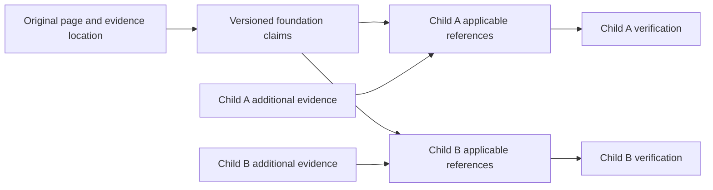

# Shared-source research batches for the LLMS-Explorer frontier

Version: 1.0.0  
As of: 2026-10-01  
Delta: +3,934 concept assignments; +106 candidate source cohorts; +1 inheritance/retrieval design; +0 research runs.

## Recommendation

Yes. Let a child reuse **applicable, cited parent facts by reference**, then research the child's additional mechanisms, exceptions and disagreements. Discover and retrieve shared sources before dispatching individual concept researchers. Firecrawl batch scraping fits that retrieval stage.

The token saving comes from deduplicating evidence and supplying smaller briefs. Putting the same pages in one Firecrawl job does not by itself reduce the tokens spent reading them six times. Use a shared source store and a compact claim index, then give each researcher only the facts and excerpts that address its questions. Keep each concept's claims, authority floor, verification and completion status separate.

The full assignment is saved in [/Users/mitch/dev/llms-explorer/docs/research/frontier-batches-2026-10-01/frontier-groups.md](frontier-groups.md). It assigns every frontier name exactly once and preserves its parent and origin. Read only the cohort selected for a run; loading the full inventory into every worker would defeat this plan.

## Inventory and scope

The source checkout at /Users/mitch/dev/llms-explorer has **3,934 unique frontier names under 420 parent labels**, derived from its source tree and unchecked research queue. Of those names, 3,827 come from child references and 107 from the queue. The saved website JSON has 3,923 names and is slightly behind this checkout's source data. The inventory records the hashes, local Git revision and the twelve added names/one removed name through its exact assignment rows and snapshot description. The separate, freshly fetched origin/main has a different 3,924-name frontier. This is deliberately a report of the user's local checkout snapshot.

Frontier means “a named child or queued concept without its own exact-name node.” It does not prove that its facts are unknown. Before dispatch, check aliases, existing claims and installed references. In particular, `CUSTOM Criteria` matches the existing `Archive Rules` alias `CUSTOM criteria`; it remains in this inventory for exact coverage but needs a deduplication decision before new research.

This deliverable groups candidate work. It does not execute /dr or /rabbithole, change the skills, alter trees, refresh accepted research, or resume indexing. Source overlap and token savings remain hypotheses until a bounded pilot measures them.

## What the workflows already reuse

| Workflow or runner inspected | Existing behavior | Useful addition |
| --- | --- | --- |
| /Users/mitch/.agents/skills/claude-command-dr/SKILL.md | A family starts with its shared foundation. Siblings cite it. Source lookup precedes fetching; retained page bodies can be shared across runs. | Prepare one source union and compact foundation record before pending concept agents start. Require a readable body, not just cache metadata. |
| /Users/mitch/.global-ai-hub/scripts/dr_run.py | `cmd_source_put` can store a body; `cmd_source_lookup` returns freshness and optional text. Research agents use slim briefs and an empty MCP configuration. | An orchestrator can retrieve pages centrally and pass selected local evidence to agents. Extending briefs is an implementation task, not an existing CLI capability. |
| /Users/mitch/.agents/skills/concept-family-explorer/SKILL.md | Related clusters are permitted; concepts are scored, deduplicated before dispatch, then completed with serialized shared-state writes. | Add source-affinity planning after selection; reuse foundation evidence across clusters without weakening novelty or saturation checks. |
| /Users/mitch/dev/skills/misc-catch-all/references/rabbithole/rabbithole.md | Each expansion receives parent claims, seed material and a do-not-repeat claim list. Same-depth siblings may run together, up to four. | Replace repeated full claim lists with scoped claim references and shared source excerpts. Preserve the deletion test, LIFO traversal and independent saturation gate. |
| /Users/mitch/dev/llms-explorer/hub/scripts/frontier_research_batch.py | Each concept gets mechanism, history, edge-case and practice briefs, plus synthesis and source gates. Allowed tools are WebSearch, WebFetch, Read and Write. | Share evidence across the four roles and neighboring concepts before launching them. A retrieval “batch” here does not currently mean a Firecrawl batch job. |

The migrated /rabbithole wrapper still names a retired standalone path. The consolidated reference above supplied the contract for this review. No path repair is included in this documentation change. The installed CFE file reports version 1.8.1 while the routing index advertises 1.8.2; this review used the installed file's actual text.

## How to inherit facts safely and cheaply

Use a graph of evidence references rather than copying a parent's report into every child. A parent supplies candidates. A child accepts a candidate only when its scope and the underlying source support that child's use.

A proposed shared claim record needs a stable claim ID, statement, originating concept, source URL, retained body hash, exact evidence location, verification date, applicability constraints and invalidation status. A child's reference also records the parent-claim version and why it applies. These are design fields; they are not already supported extensions to the /dr claims schema.

Keep the following rules:

- The original page is the source. A parent summary is a navigation aid, not an additional independent authority.
- Inherit stable definitions and demonstrated invariants. Recheck limits, release support, pricing, security behavior and other volatile claims for the relevant version and context.
- Model a concept with several parents as having several candidate foundations. Deduplicate shared evidence across that graph and detect conflicting scopes.
- A child adds its own details and disconfirming evidence. It still meets the source floor for its chosen depth. Three sibling references to one vendor page count as one origin.
- An unavailable, unreadable or provenance-only cache entry cannot support a claim. Mark missing evidence unverified and retrieve it before relying on it.
- Pin referenced claim versions for reproducibility. If evidence is corrected or expires, invalidate affected child claims and queue focused verification.
- Keep blind gates independent. Avoid giving the verifier the researcher's conclusions as the only evidence or replacing required fresh checks with the same shared summary.

For Online Archive, inheritance can share the archive lifecycle and rule vocabulary. It must preserve the distinction between `criteria.expireAfterDays` and `dataExpirationRule.expireAfterDays`. The common leaf name does not permit moving limits from one path to the other. The existing claim validator and accepted run remain the authority for that research.

## How the grouping works

The inventory contains **106 candidate source cohorts**. Each cohort states the source pool to discover once, the foundation facts that might apply, and the details each child must add. Existing parent labels form narrower subsections inside a cohort. Generic names such as `Architecture` remain tied to their original parent.

Source cohorts are planning pools, not fixed giant research jobs. Some combine strongly overlapping sources, such as the 18 Online Archive names or 38 LiteLLM names. Others, such as SaaS APIs or personal finance, have weaker overlap and must keep vendor, product and jurisdiction subsections separate. They can share generic protocol vocabulary or retrieval infrastructure; they cannot inherit each other's product rules. Treat those as discovery pools until URL overlap confirms a smaller batch.

After source discovery, rank a pair of concepts by shared canonical URLs, relevant evidence sections, applicable foundation claims and compatible version/context. Penalize contradictory scope, product-version differences, distinct jurisdictions and unrelated source origins. A common ancestor alone is insufficient. Keep a 4–8-concept /dr packet within its depth cap; use only the existing up-to-four-sibling exception in /rabbithole. Split a packet when its evidence no longer fits the brief budget.

| First source cohorts to consider | Names | Why reuse is promising | Required separation |
| --- | ---: | --- | --- |
| D04 — Atlas Online Archive | 18 | Archive overview, API criteria and Terraform schemas recur across rules, partitioning and queries. | DATE/CUSTOM, archival age/deletion age, time-series exceptions. |
| A18 — LiteLLM | 38 | The existing local LiteLLM corpus can seed new endpoint and integration research. | Endpoint parity, routing, credentials and migration versions. |
| A14 — Local inference runtimes | 40 | Several frontier labels are alternate descriptions of the same runtime or interface. | Vendor/runtime/platform APIs; inherited runtime facts must remain versioned. |
| D08 — Atlas on GCP | 47 | Networking, identity and encryption topics share Atlas/GCP architecture and API vocabulary. | Separate PSC/networking, identity, KMS and billing evidence packets. |
| D11 — Atlas infrastructure as code | 42 | API resource ownership and reconciliation recur across IaC tools. | Terraform/AKO/Pulumi/CloudFormation schemas and versions. |
| A15 — Inference memory and kernels | 86 | KV/cache/layout/bandwidth evidence recurs across several hardware parents. | Metal/CUDA/CPU/GDDR7 assumptions and model-specific workloads. |
| W01 — LLM lexical and rhetorical tics | 161 | Existing taxonomies and baseline studies are shared across measurement and mitigation topics. | Genre, language, model, study population and causal claims. |

## Concrete first research packets

These are exact frontier labels, not verified technical statements. The quoted versions or product assertions inside a label still need evidence. The packets are recommendations for a future bounded run; none ran during this task.

| Packet | Exact concepts to research together | Reuse first | Child work |
| --- | --- | --- | --- |
| Archive DATE fields — four concepts | `DATE criteria date format specifications`; `DATE criteria field types and formats`; `expireAfterDays data age calculation`; `Partition fields constraints for DATE rules` | Accepted DATE Criteria evidence and full-path API/Terraform schema excerpts. | Deduplicate existing claims, verify field types, formats, scope and constraints. |
| Archive lifecycle/configuration — four | `Archive Data Expiration Rule`; `Archive Schedule Window`; `Online Archive Terraform Resource`; `Index Sufficiency Warning` | Archive lifecycle, API criteria and Terraform resource evidence. | Verify each field and warning separately; resolve archival/deletion scope before synthesis. |
| Archive queries — four | `Partition Fields`; `Federated Query on Archive`; `Online Archive query performance optimization`; `Archive Anti-Patterns` | Query/partitioning foundation and retained Atlas docs. | Partition restrictions, query behavior and justified performance evidence. |
| GCP private networking — six | `GCP Private Service Connect`; `PSC Port-Mapped Architecture`; `PSC Legacy Migration`; `PSC Terraform GCP`; `Cloud DNS Private Zone for Atlas`; `GCP Global Access PSC` | Atlas/GCP private-connectivity architecture and PSC API docs. | Endpoint/port/DNS behavior, migration and region/global-access restrictions. |
| LiteLLM new gateway surfaces — five | `LiteLLM A2A agent gateway`; `LiteLLM MCP permission governance`; `LiteLLM Responses API interoperability`; `LiteLLM passthrough endpoint capability parity`; `LiteLLM Rust gateway migration` | Existing LiteLLM packs, gateway configuration and normalization facts. | Verify new endpoint contracts and version-specific capability gaps. |
| llama.cpp and grammars — four | `llama.cpp / llama-server & the GGUF format`; `llama.cpp / llama-server and GGUF (semver, --load-mode, router mode, MCP tools)`; `GBNF grammars & local schema-constrained decoding`; `GBNF grammars and JSON-schema structured output` | One retained llama.cpp source set and existing format/grammar claims. | Alias/overlap review before dispatch; server interfaces and grammar-specific restrictions. |
| Ollama overlap review — two | `Ollama (llama.cpp engine since 0.30, Modelfile, library)`; `Ollama Modelfile & local model library` | One Ollama docs/source set. | Resolve whether these need one canonical concept; verify rather than assume the version claim embedded in the first label. |

For the local-runtime pool, also compare the paired Apple MLX, WebLLM/Transformers.js, MLC-LLM, Windows local-runtime and hardware-sizing labels listed in the inventory. Reusing or aliasing covered material may save more work than batching new scrapes. Keep aliases as a proposal until exact scope has been checked; this report changes no node names.

## Central Firecrawl retrieval stage

First inspect readable local source bodies, claims and adopted upstream documentation. Stele's prior upstream-reuse decision, KNOW-130 in project skills-h35oa, informed this ordering. Use an upstream index to select pages or sections. A published full bundle can avoid scraping, but reading the whole bundle in every worker would still waste tokens. Check freshness and page coverage before adopting it.

For missing material, discover URLs once per source cohort. Form a global union of page identities across selected concepts and the runner's four roles. Preserve meaningful version, locale and query parameters; remove only confirmed tracking noise. Store evidence fragments separately so several section citations can reuse one fetched page.

Firecrawl accepts an explicit URL list and processes a batch concurrently. It supports asynchronous job IDs and scrape options. Use this for the missing-page union rather than broad crawling of unrelated documentation. [Official batch guide](https://docs.firecrawl.dev/features/batch-scrape)

https://docs.firecrawl.dev/features/batch-scrape

Group URLs by compatible scrape configuration, such as locale, headers, freshness and parsing needs. Prefer Markdown/main content for synthesis. Structured extraction can be useful with a shared schema, but retain original evidence text as well. The request endpoint is `POST https://api.firecrawl.dev/v2/batch/scrape`; its options include `formats`, `onlyMainContent`, `maxAge` and `maxConcurrency`. A source cohort may need several jobs if configurations differ. [Official API contract](https://docs.firecrawl.dev/api-reference/endpoint/batch-scrape)

https://docs.firecrawl.dev/api-reference/endpoint/batch-scrape

Persist job IDs and URL states, poll until terminal status, and follow every `next` results page. Inspect per-URL errors and retry only missing/failed pages; one completed job must not turn empty or failed results into evidence. Save retained bodies and URL-to-concept mappings locally. [Official status contract](https://docs.firecrawl.dev/api-reference/endpoint/batch-scrape-get)

https://docs.firecrawl.dev/api-reference/endpoint/batch-scrape-get

Budget concurrency across all jobs. Firecrawl's team browser limit applies across the account, so multiplying researcher concurrency by batch concurrency can create queues rather than speed. [Official rate/concurrency guidance](https://docs.firecrawl.dev/rate-limits)

https://docs.firecrawl.dev/rate-limits

Register retained sources through the existing /dr source-cache helper when running /dr. Preserve helper ownership of claims, manifests, rendering and finalization. Proposed batch-job and shared-claim records need implementation and validation; do not hand-edit existing manifests to simulate support. The central retrieval stage can write bounded local evidence for the current slim agents, whose empty MCP configuration prevents them from directly using a Firecrawl MCP server.

## Measure the saving before changing defaults

As a simple illustration, six researchers each reading 1,500 shared tokens plus 1,200 unique tokens consume 16,200 input tokens. Reading the foundation once, then supplying a 150-token reference/summary plus the same 1,200 unique tokens to each researcher consumes 9,600. This hypothetical example excludes extraction, output, verification and tool overhead. It is not a measured 41% saving for this frontier.

Run the four archive DATE topics as a matched baseline/shared-evidence pilot. Reuse the same model, depth, source floors, question set and verification gate. Resume accepted work instead of refreshing it without a new need. Record requested/fetched/unique URLs, readable cache hits, source tokens, uncached/cached model input, output, retrieval credits, elapsed time, unsupported claims and gate results. Count evidence extraction and the foundation builder in the optimized total. Provider prompt-cache hits can reduce billed input but do not mean the same text was never transmitted or consumed.

Track `retrieval reuse = 1 - unique fetched page identities / requested page identities` and `net model-token reduction = 1 - optimized total model tokens / baseline total model tokens`. Measure total Firecrawl credits separately; a batch does not imply a per-page discount. Keep the optimization only if authority coverage and gate outcomes hold. No savings percentage or optimal grouping is claimed here.

## Next implementation work

Implement the source union and durable retrieval-job state, then a scoped foundation-claim record and brief adapter. Add dependency/version invalidation before making inheritance automatic. Run the bounded pilot and review claim quality. Only then update CFE, /dr and /rabbithole defaults. Their existing scoring, child scope, serialized finalization and blind gates remain requirements.

The exact prompt and continuation record are /Users/mitch/dev/llms-explorer/docs/research/frontier-batches-2026-10-01/prompts.md and /Users/mitch/dev/llms-explorer/docs/research/frontier-batches-2026-10-01/memory.md.
