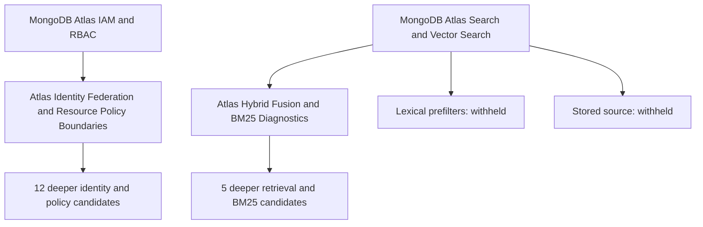

# MongoDB concept-family expansion

Version: 1.1.0
Delta: Completed bounded research, verified installation, tree expansion and source-based continuation queue.

Six qualified topics are installed in two grouped references. Five missing-node frontiers were resolved. The existing Cedar node now links to the verified identity reference; its page and70-fact concept pack remain intact. Seventeen deeper candidates were added; two original topics remain withheld. This is a budget-limited expansion, not saturation.

## 1. Conceptual family map

Canonical inventory: 701 nodes, 118 MongoDB-linked nodes and 673 unresolved exact frontier names (672 casefold-unique). The inventory follows parent links and explicit cross-listings from MongoDB Expert Knowledge. Thirty-two candidates were mapped and scored; the other frontier names were inventoried, not scored.

- **parent**: Database Systems; Distributed Systems; Data Engineering; Information Retrieval; Identity and Access Management.
- **sibling**: PostgreSQL; Redis; Elasticsearch; DynamoDB; Cassandra.
- **child**: MongoDB Replication; MongoDB Transactions; MongoDB Driver Internals; MongoDB Atlas IAM and RBAC; MongoDB Atlas Search and Vector Search; DATE Criteria.
- **adjacent**: Atlas Kubernetes Operator; mongodb-kafka-connector; MongoDB Spark Connector and Databricks Integration; Cross-Encoder Re-ranking vs Bi-Encoders for Terminal Validation in RAG and Deduplication; Hybrid Score Fusion (Reciprocal Rank Fusion - RRF).
- **frontier**: Atlas Workload Identity Federation; Atlas Workforce Identity Federation; Atlas Service Accounts OAuth 2.0; Atlas Resource Policies Cedar; Hybrid Search $rankFusion $scoreFusion; Lexical Prefilters for Vector Search; Stored Source Performance Optimization; Score Details BM25 Diagnostics; GCP Private Service Connect; Vector Quantization; MongoDB Atlas Data Federation.

Two related evidence groups: identity/API/policy boundaries and hybrid retrieval/BM25 diagnostics. Read older broad parent references as seeds; inherit only evidence that has usable citations, a clear product scope and a current verification date. The older references were not comprehensively refreshed.

## 2. Scored gap table

Axes: relevance, usefulness, novelty, interest, viability; weights 0.25/0.25/0.20/0.15/0.15. Threshold 3.2. Scores are planning judgments. The canonical checker passed all 32 initial and 17 child rows. No recent prior-SKIP telemetry matched the eight selected topics.

| Concept | Neighborhood | Coverage | R/U/N/I/V | CVS | Decision |
| --- | --- | --- | --- | --- | --- |
| Atlas Resource Policies Cedar | frontier | STALE | 5/5/3/5/4 | 4.45 | REFRESH · selected |
| Atlas Service Accounts OAuth 2.0 | frontier | STALE | 5/5/3/5/4 | 4.45 | REFRESH · selected |
| Atlas Workforce Identity Federation | frontier | STALE | 5/5/3/5/4 | 4.45 | REFRESH · selected |
| Atlas Workload Identity Federation | frontier | STALE | 5/5/3/5/4 | 4.45 | REFRESH · selected |
| Hybrid Search $rankFusion $scoreFusion | frontier | STALE | 5/5/3/5/4 | 4.45 | REFRESH · selected |
| Lexical Prefilters for Vector Search | frontier | STALE | 5/5/3/5/4 | 4.45 | REFRESH · selected |
| Score Details BM25 Diagnostics | frontier | STALE | 5/5/3/5/4 | 4.45 | REFRESH · selected |
| Stored Source Performance Optimization | frontier | STALE | 5/5/3/5/4 | 4.45 | REFRESH · selected |
| GCP Private Service Connect | frontier | GAP | 4/4/3/4/3 | 3.65 | RESEARCH |
| MongoDB Atlas Data Federation | frontier | GAP | 4/4/3/4/3 | 3.65 | RESEARCH |
| Vector Quantization | frontier | GAP | 4/4/3/4/3 | 3.65 | RESEARCH |
| Atlas Kubernetes Operator | adjacent | STALE | 4/4/1/3/5 | 3.40 | REFRESH |
| MongoDB Atlas IAM and RBAC | child | STALE | 4/4/1/3/5 | 3.40 | REFRESH |
| MongoDB Atlas Search and Vector Search | child | STALE | 4/4/1/3/5 | 3.40 | REFRESH |
| MongoDB Driver Internals | child | STALE | 4/4/1/3/5 | 3.40 | REFRESH |
| MongoDB Replication | child | STALE | 4/4/1/3/5 | 3.40 | REFRESH |
| MongoDB Spark Connector and Databricks Integration | adjacent | STALE | 4/4/1/3/5 | 3.40 | REFRESH |
| MongoDB Transactions | child | STALE | 4/4/1/3/5 | 3.40 | REFRESH |
| mongodb-kafka-connector | adjacent | STALE | 4/4/1/3/5 | 3.40 | REFRESH |
| Cross-Encoder Re-ranking vs Bi-Encoders for Terminal Validation in RAG and Deduplication | adjacent | HAVE | 4/4/0/3/5 | 3.20 | SKIP |
| DATE Criteria | child | HAVE | 4/4/0/3/5 | 3.20 | SKIP |
| Hybrid Score Fusion (Reciprocal Rank Fusion - RRF) | adjacent | HAVE | 4/4/0/3/5 | 3.20 | SKIP |
| Cassandra | sibling | GAP | 2/2/4/3/1 | 2.40 | SKIP |
| Data Engineering | parent | GAP | 2/2/4/3/1 | 2.40 | SKIP |
| Database Systems | parent | GAP | 2/2/4/3/1 | 2.40 | SKIP |
| Distributed Systems | parent | GAP | 2/2/4/3/1 | 2.40 | SKIP |
| DynamoDB | sibling | GAP | 2/2/4/3/1 | 2.40 | SKIP |
| Elasticsearch | sibling | GAP | 2/2/4/3/1 | 2.40 | SKIP |
| Identity and Access Management | parent | GAP | 2/2/4/3/1 | 2.40 | SKIP |
| Information Retrieval | parent | GAP | 2/2/4/3/1 | 2.40 | SKIP |
| PostgreSQL | sibling | GAP | 2/2/4/3/1 | 2.40 | SKIP |
| Redis | sibling | GAP | 2/2/4/3/1 | 2.40 | SKIP |

Cedar already had a recent70-fact concept pack, despite skillId null and conceptsCount zero in the tree. Those fields did not describe all available knowledge. The current scoped reference adds an installed skill binding. The prior pack and its page remain accessible.

## 3. Researched this run

| Group | Qualified topics | Claims | Final blind sample |
| --- | --- | --- | --- |
| Identity/policy | Service-account OAuth; workforce federation; workload federation; Cedar policies | 42 | 12 supported; 0 contradicted; 0 unverified |
| Retrieval/diagnostics | Rank/score fusion; BM25 score details | 19 | 10 supported; 0 contradicted; 0 unverified |

The blind gates sampled 22 of 61 claims. They do not prove every claim. Corrections removed unverified compound clauses, a preference ranking inferred from a list, unsupported historical addition dates, blanket pagination/edition availability statements and ungrounded child names. Some single-source claims remain explicitly tentative.

Independent authorship, not hostname count, governed the three-origin requirement.

| Topic | Author origins | Evidence boundary |
| --- | --- | --- |
| Service accounts | MongoDB; IETF; OWASP | Atlas behavior; OAuth semantics; secret guidance respectively |
| Workforce | MongoDB; Microsoft; NAPA | Atlas behavior; Entra token claims; independent deployment instructions |
| Workload | MongoDB; Google; Microsoft | Atlas behavior; provider token acquisition/security |
| Resource policies | MongoDB; Cedar/AWS; OWASP | Atlas restrictions; Cedar semantics; authorization testing |
| Fusion | MongoDB; OpenSearch; Waterloo paper authors | Atlas operators; OpenSearch-only experiment; RRF theory |
| BM25 | MongoDB; Apache Lucene; Robertson/Zaragoza | Atlas diagnostics; Lucene formulation; BM25 theory |

Different-domain MongoDB employee articles, MongoDB-authored Apache PRs, coauthored vendor posts and our own generated material did not add independent origins. Protocol/theory/provider evidence does not independently prove Atlas implementation details.

Fourteen headless calls: eight research jobs and six blind gates. Reported cost $4.7039149; cumulative reported usage 3,494,803 tokens includes repeated/cache accounting. Workers took approximately 11–15 minutes within their 30-minute limits. Helper manifests retain only the latest gate usage; separate usage histories preserve all calls. No end-to-end token savings were measured. This expansion used headless WebSearch/WebFetch; it did not run another Firecrawl batch. The earlier batch pilot is separate.

## 4. Skipped and failed

Lexical Prefilters for Vector Search and Stored Source Performance Optimization remain unresolved. Two broadened query rounds did not find three qualified author origins. Existing claims and source provenance remain in the original helper run. The original mixed run finished INSUFFICIENT-AUTHORITY; the two eligible retrieval topics published through a narrower run.

The helper consumes every manifest alias during a tree-writing finish, including blocked concepts. Splitting publication prevented false resolution of the withheld names. They remain in the canonical and published frontier.

New child decisions:

| Child candidate | CVS | Decision | Source lead |
| --- | --- | --- | --- |
| Service account secret rotation | 3.85 | RESEARCH | https://www.mongodb.com/docs/atlas/tutorial/rotate-service-account-secrets/ |
| Atlas IP access list for service accounts | 3.85 | RESEARCH | https://www.mongodb.com/docs/atlas/api/service-accounts/generate-oauth2-token/ |
| Terraform mongodbatlas_service_account without initial secret | 3.85 | RESEARCH | https://github.com/mongodb/terraform-provider-mongodbatlas/pull/4735 |
| Atlas org mapping and domain mapping | 3.85 | RESEARCH | https://www.mongodb.com/docs/atlas/security/manage-org-mapping/ |
| Entra ID group overage in Atlas | 3.95 | RESEARCH | https://learn.microsoft.com/en-us/troubleshoot/entra/entra-id/app-integration/get-signed-in-users-groups-in-access-token |
| Atlas federated database users and groups | 3.85 | RESEARCH | https://www.mongodb.com/docs/atlas/workforce-oidc/ |
| Atlas WIF built-in vs callback authentication | 3.85 | RESEARCH | https://www.mongodb.com/docs/atlas/workload-oidc/ |
| AWS IAM Outbound Identity Federation to Atlas | 3.60 | SKIP | https://jimmydqv.com/m2m-outbound-federation-mongodb/ |
| Federated database user mapping by sub/groups claim | 3.85 | RESEARCH | https://www.mongodb.com/docs/atlas/workload-oidc/ |
| Atlas nonCompliantResources endpoint | 3.85 | RESEARCH | https://www.mongodb.com/docs/atlas/atlas-resource-policies/ |
| Cedar forbid-only policy patterns for Atlas | 3.85 | RESEARCH | https://www.mongodb.com/docs/atlas/atlas-resource-policies/ |
| Atlas Terraform mongodbatlas_resource_policy | 3.85 | RESEARCH | https://www.mongodb.com/docs/atlas/atlas-resource-policies/ |
| BM25 IDF corpus statistics | 3.85 | RESEARCH | https://www.mongodb.com/docs/atlas/atlas-search/score/get-details/ |
| BM25 term frequency saturation and field length normalization | 3.45 | SKIP | https://www.mongodb.com/docs/atlas/atlas-search/score/get-details/ |
| Fusion score normalization strategies | 3.85 | RESEARCH | https://www.mongodb.com/docs/manual/reference/operator/aggregation/scorefusion/ |
| Ranked and scored input pipeline eligibility | 3.45 | SKIP | https://www.mongodb.com/docs/manual/reference/operator/aggregation/scorefusion/ |
| Per-query fusion weighting | 3.85 | RESEARCH | https://www.mongodb.com/docs/manual/reference/operator/aggregation/scorefusion/ |

Three child rows were skipped: two baseline sub-angles are already covered in fresh parent claims; AWS outbound federation has only a personal-blog lead. That lead is a research question, not an accepted setup recipe. Fourteen child candidates and eleven earlier above-threshold candidates remain queued.

## 5. Optimization results

Scoped structural checks ran with /sko --meta --no-sync semantics: readable reference cards, capability/TRIGGER/SKIP descriptions under 1,000 characters, routing rows, owning manifests, resolvable reference files and whitespace. Installed and isolated-repo hub lints ended with zero High or Medium findings. The private repo had one pre-existing platform-changelog orphan; its routing row was repaired without changing its content. A 1,015-character private hub description was shortened. Hub and manifest versions were incremented. Three volatile Cedar date fields were corrected to October1 after fresh original-source reads; the claim text and blind results did not change.

Referent normalization dry-run was clean. No library-wide rewrite, new embeddings, registry rebuild, semantic routing or Ollama activity ran. Full owning-hub optimization and whole-tree architectural audit remain owed under the CFE budget exit rule. They were not reported as completed.

## 6. Handoffs

For batch research, remove the fixed eight-concept cap from source discovery and deduplicated scraping. Firecrawl can scrape an explicit URL list concurrently in one job. Keep synthesis and verification in smaller source-coherent groups, with time/cost/context bounds and per-concept authority checks. The benefit comes from reusing evidence and compact verified parent facts, not merely placing every topic in one model prompt. Source: https://docs.firecrawl.dev/features/batch-scrape

This is a workflow recommendation. The skill defaults were not changed, and the current eight-topic run was not enlarged. A future change should separately bound retrieval credits, active synthesis groups, claim counts and recursion rounds; checkpoint each group before continuing.

Retained research gaps include numerical service-account limits, API-key sunset, Atlas handling of Entra group overage, independent AWS outbound federation validation, workload opaque-token restrictions and historical resource-policy addition dates/size limits.

## 7. Saturation verdict

**BUDGET_EXHAUSTED.** Eight of eight allowed original topics attempted: six qualified and two failed authority. One of three possible rounds used. Two original /dr research calls plus one publication-only helper run; the publication run reused claims and did not add research jobs.

Round 1 produced 17 new candidate names from six qualified topics: 2.83 candidates per qualified topic, or 2.125 per attempted topic. This is a frontier-harvest rate, not a measured token saving or evidence of saturation. Twenty-five scored above-threshold candidates remain queued; most of the full MongoDB frontier remains unscored. Indexing and Ollama stay paused.

## 8. Updated concept tree

Canonical tree: 701 → 703 nodes; MongoDB family 118 → 120 nodes; exact-name frontier 673 → 685 (casefold-unique 672 → 684). Two research-group nodes resolve five missing-node frontiers. The existing Cedar node receives a repaired installed-reference binding. Seventeen new candidate names explain the net frontier increase of twelve.

Only these new nodes, resolved aliases, the Cedar reference binding, parent links and summaries were merged into the website snapshot. Four unrelated unpublished canonical nodes were left out. Repo tree 697 → 699 nodes; no unrelated node or frontier was lost. The existing tree guard passed with an exact five-alias allowance and zero node-shrink allowance. Site data came from gen_tree.py.

Artifacts:

- /Users/mitch/dev/llms-explorer/docs/research/mongodb-family-expansion-2026-10-01/inventory.json — complete inventory and bounded neighborhood map.
- /Users/mitch/dev/llms-explorer/docs/research/mongodb-family-expansion-2026-10-01/scored-gaps.json — 32 initial rows.
- /Users/mitch/dev/llms-explorer/docs/research/mongodb-family-expansion-2026-10-01/child-frontier.json — 17 child rows with source leads.
- /Users/mitch/dev/llms-explorer/docs/research/mongodb-family-expansion-2026-10-01/results.json — counts, gates, cost and limitations.
- /Users/mitch/dev/llms-explorer/docs/research/mongodb-family-expansion-2026-10-01/placeholder-fold.json — corrected Cedar preservation/binding record, including the superseded fold.
- /Users/mitch/dev/llms-explorer/docs/research/mongodb-family-expansion-2026-10-01/prompts.md — exact prompt history.
- /Users/mitch/dev/llms-explorer/docs/research/mongodb-family-expansion-2026-10-01/memory.md — resumable continuation state.
