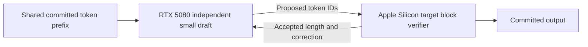

# Speculative decoding across Apple Silicon and RTX 5080

Version: 1.0.0. Researched: 2026-09-30. Verified-as-of: 2026-09-30 for source snapshots, manifests and local topology. TASK-59. Delta: new investigation; companion manifest audit advances to 1.1.0.

## Executive summary

**The split is technically plausible, but the current endpoints cannot enable it through configuration alone.** For this hardware, keep `llmsx-research-gemma31-mlx` as the Apple Silicon target and investigate a small, compatible independent draft on the RTX. The installed canonical alias **already includes a Gemma4 Assistant**, so first measure the existing local Ollama MLX path. The cross-device proposal remains [SPECULATIVE]: no acceptance rate, correctness parity or speedup was measured. [Canonical audit][local-manifest], [Ollama engine][ollama-spec], [algorithm][algorithm].

## What the inspected system actually provides

| Observation | Evidence and limit |
|---|---|
| Canonical target | `llmsx-research-gemma31-mlx`, official `gemma4:31b-mlx` base, requested 65,536-token context, one scoped Ollama endpoint for coordinator/workers; indexing disabled. [Qualification record][handoff]. |
| Target artifact | 19,424,434,468 bytes, including its draft. RTX 5080 has 16 GB VRAM; this exact artifact cannot reside entirely there with its cache. A smaller quantization or offload would be a new candidate. [Manifest audit][local-manifest], [NVIDIA specifications][nvidia]. |
| Bundled assistant | Local base matches official manifest SHA256 `a22a363052da770302019d5afab29bd967f9318e4377bddd297421189ea09d7d`. Canonical alias declares `Gemma4AssistantForCausalLM`; 52 draft descriptors include 48 tensors totaling 939,042,872 bytes. Presence is verified; active speculation and benefit are unmeasured. [Corrected audit][local-manifest], [official assistant config][assistant-config]. |
| Current NVIDIA route | Same-Mac TinyGPU DriverKit/tinygrad NV backend. Existing process/log evidence identifies Qwen2-beta-14B-Chat behind the Ollama-compatible bridge. This is not a stock CUDA server. [Local inspection][local]. |
| Bridge limitation | Ordinary completions; synthesized model metadata and hardcoded nonstream durations. The installed tinygrad forward produces a sampled last-position token rather than a block-verification interface. [Inspection anchors][local]. |

**Audit correction:** `mtp_layers: 0` counted another tensor naming pattern. It did not inspect `draft.*` tensors or the container's `draft` configuration. The companion audit retains that original count, adds the assistant fields and states this limitation explicitly. No model weights or inference configuration changed. [Corrected audit][local-manifest].

## The protocol required

A small model proposes several tokens. The target scores the proposed block with causal attention in one forward pass and commits only the accepted prefix plus a correction or bonus token. Each backend retains its own cache and must restore the accepted state after rejection. Two independent text-completion calls do not expose those operations. [Algorithm 1][algorithm], [Ollama block verification and rollback][ollama-spec].

For a first proof of concept, use **greedy decoding**: accept the prefix matching target argmax, emit the target token at the first mismatch, and discard later proposals. For stochastic distribution preservation, acceptance uses `min(1, p_target(x)/q_draft(x))`; rejection samples from normalized `(p_target - q_draft)+`. That requires more probability information than proposed token IDs or top few logits. Equality of sampled text alone is not the stochastic correctness criterion. [Algorithm 1][algorithm].

The target defines output quality. Require the same target weights, quantization, prompt formatting, sampling and context for comparison. Batched versus single-token numerical differences still require parity tests; upstream Gemma MLX-LM reports are warnings to investigate, not failures reproduced on this canonical Ollama installation. [MLX-LM report #1423][parity].

## Model choice and placement

[SPECULATIVE] Start with an independent Gemma 4 E2B instruction model on the RTX; compare E4B only if improved acceptance repays its draft cost. Verify actual token-ID mappings, special tokens, encoded prompts, thinking/tool delimiters and compatible context. A matching family or vocabulary size does not prove matching token IDs. The existing Qwen model is not a qualified Gemma draft. Gemma 4 loading on this installed tinygrad backend remains unverified. [Official model card][model-card], [E2B config][e2b], [llama.cpp tokenizer validation][llama-spec], [bounded local inspection][local].

Gemma's **bundled MTP assistant is a different architecture**. Google documents target embeddings and hidden-state dependence. Ollama's assistant also reads the target KV cache rather than maintaining its own KV. Moving that head to the RTX would require target-state transport and a specialized implementation. An independent small draft is the cleaner cross-device experiment. [Google MTP][mtp], [Ollama assistant `Forward`/`NewCaches`][ollama-assistant].

This diagram describes proposed custom integration. On the current same-Mac setup, transport means IPC, host/device synchronization and Thunderbolt command costs. A Linux-hosted RTX alternative adds LAN transport. Models keep distinct caches; do not transfer KV tensors between the independent draft and target. [Local topology][local], [distributed protocol][dssd].

## Current runtime support

| Runtime | Source-backed support | Relevance to this pair |
|---|---|---|
| Ollama native MLX | Bundled Gemma speculation, adaptive depth and rollback; requesting log probabilities parks speculation in the inspected engine. [Engine][ollama-spec], [vendor explanation][ollama-blog]. | Existing local baseline. No remote draft-host or arbitrary proposed-block API found in reviewed public interfaces; a remote URL is not a substitute for its local draft metadata. |
| MLX-LM | Local model-module draft/target loop. Server rejects a draft in distributed mode. [Loop][mlx-generate], [server][mlx-server]. | Requires a custom coordinator and cache strategy. Its distributed mode is not distributed drafting. MLX itself also has a Linux CUDA backend; that does not create a remote drafter API. [MLX installation][mlx-install]. |
| llama.cpp | Separate target/draft device selection, tokenizer checks, Metal/CUDA and RPC. [Placement][llama-spec], [RPC][rpc]. | [LOW CONFIDENCE] Closest reusable experiment if RTX is on a CUDA-capable Linux host: one coordinator, explicit whole-model placement, both artifacts in GGUF. Exact combination untested. This changes the canonical runtime/artifact; qualify it separately. RPC is documented as fragile and insecure; use an isolated trusted network. |
| vLLM | Remote parallel drafting is an open RFC. [RFC #42109][vllm]. | No verified turnkey Mac-draft/RTX-target route. RFC discussion is not a shipped feature. |
| TensorRT-LLM | `UserProvidedDecodingConfig` and user `Drafter` hook. [Documentation][trt]. | [SPECULATIVE] A network drafter adapter could feed an NVIDIA target, but needs synchronization and compatibility work. Reverses the preferred placement and does not preserve the 19.4 GB canonical target on 16 GB VRAM. |

Stock CUDA tooling does not describe this Mac's TinyGPU route. A Linux CUDA alternative is a different deployment; the older Linux eGPU article does not establish that host's current availability. [NVIDIA platform history][cuda-platform], [local/historical topology][local].

## When splitting devices helps

Let `k` be proposed tokens per round, `d` draft milliseconds/token, `v(k)` actual block-verification milliseconds, `c` complete communication/serialization/synchronization cost per round, `A` mean **committed** output tokens per round including correction/bonus, and `t` target-alone decode milliseconds/token. For a synchronous implementation:

`round_time = k*d + v(k) + c`

`speedup_vs_target_alone = A*t / round_time`

A gain requires `k*d + v(k) + c < A*t`. Measure `v(k)`; do not assume it equals one ordinary target step. Under a simplified constant independent acceptance probability `alpha`, `E[A] = (1-alpha^(k+1))/(1-alpha)`; at `alpha=1`, `E[A]=k+1`. EOS, varying acceptance and protocol details require actual committed counts. [Latency analysis, equations 3–8][latency].

[Inference] For identical draft/target artifacts and acceptance, offloading the draft wins over a local draft only if saved drafting time exceeds added transport and synchronization, plus any change in verification cost. The cited paper's colocated comparison uses the same draft-time assumption; it does not prove that a faster heterogeneous drafter can never help. [Latency assumptions][latency].

**Unmeasured illustration:** with `k=4`, `alpha=0.8`, `t=25 ms`, `d=3 ms`, `v=30 ms`, `c=2 ms`, `A=3.3616` and predicted decode speedup is about `1.91x`. At `alpha=0.4`, the same costs yield about `0.94x`, a slowdown. These inputs are hypothetical, unrelated to this Mac's short probe results. This compares target-alone, not an already accelerated MTP baseline.

For a 262,144-token vocabulary, naive FP32 draft distributions cost 1 MiB per proposal. Four cost 4 MiB, about 33.6 ms at ideal 1 Gbit/s before overhead. This is arithmetic, not a measured link rate. Greedy token-ID transport is much smaller. DSSD defers a full target distribution transfer until rejection; stochastic transport design still needs validation. [Vocabulary][e2b], [DSSD §3][dssd].

## Correctness risk at research context lengths

MLX-LM Gemma constructs both full and rotating caches. A rotating cache becomes nontrimmable after its window fills. Generic speculation checks target trimmability before prefill; later rewind calls ignore a trim result of zero. [SPECULATIVE, source-code risk] A fresh long prompt could pass the initial check yet leave cache state unrewound after rejection. This was not executed here and does not establish a failure in Ollama's separate runner. Raising fallback `max_kv_size` does not replace a model's own `make_cache()`. Test window crossings explicitly, including rejected blocks, before a long-context performance claim. [Gemma constructor][mlx-gemma], [cache methods][mlx-cache], [generic rewind][mlx-generate].

## Concrete experiment plan

1. Preserve the canonical alias and pin its manifest, runner version, sampling and prompt template. Instrument the **current local Ollama path** to confirm assistant activation, draft depth and accepted tokens; do not infer activation from model presence. Measure streamed arrival times and actual token counts.
2. Establish local baselines: current assistant-enabled behavior; a verified plain-decoding control where the actual runner permits it; optionally a compatible independent local draft. Confirm the control in engine traces rather than assuming a documented flag reaches this backend.
3. Before cross-device implementation, prove that the RTX backend can load the chosen compatible draft and sustain its requested context. If it cannot, investigate the Linux CUDA alternative separately. Keep converted target artifacts separate from the canonical alias.
4. Add a persistent greedy token protocol: `open(prefix_ids)`, `propose(k)`, `verify(proposals)`, `commit(accepted_length, correction)` and `close`. The target coordinator owns committed history, positions, stop rules and cache rollback. Assert state after every rejection; handle cancellation and tool-turn boundaries.
5. Start with `k=2,4,8`, batch one and text-only prompts: code, factual synthesis, structured JSON and actual tool-call output. Test short and long prompts across sliding windows and up to the intended research context. Fix correctness before collecting speed results.
6. Compare greedy token streams against the same target; separately re-run the research workflow's factual/tool gate. Quantization or a runtime change needs its own qualification. For stochastic decoding, implement mathematically correct residual sampling and distribution tests rather than expecting seed-identical streams.
7. Measure end-to-end wall time, TTFT, committed tokens/s, inter-token p50/p95, acceptance, verification time, synchronization cost and CPU/GPU memory. Record cold and warm runs, repeated trials and real tool latency. Do not use the bridge's durations or whitespace token estimates. Ship a split only if it beats the current local baseline on the actual workload.

These are proposed execution steps. No inference, model download, hardware reattachment, service restart or indexing occurred during this investigation.

## Evidence quality, contradictions and gaps

The algorithm is established in the ICML paper and reflected in reviewed runtime code. Vendor source snapshots establish available interfaces; they do not establish installed activation or a cross-device speedup. A maintainer's open RFC and issue reports are direct evidence of proposals/reports, with lower authority than shipped code for implementation claims. Local JSON and process/log inspection provide a dated snapshot; the physical GPU PCI ID was not interrogated. Overall confidence is medium for feasibility and inspected constraints, **low for the untested implementation and any performance prediction**.

DSSD v1 has an internal `p/q` notation mismatch in §2.1 and its appendix. This report takes acceptance mathematics from Leviathan's Algorithm 1 and uses DSSD only for communication placement. Gemma's local MTP documentation and the lack of a remote drafting configuration describe different capabilities, not contradictory support claims. [Canonical algorithm][algorithm], [DSSD][dssd].

Unresolved: active assistant behavior in existing requests; compatible Gemma draft support on installed tinygrad; tokenizer equivalence after conversion; long-context rollback correctness; accepted-token rate; sustained memory headroom; actual cross-device costs; availability of a Linux RTX host. None supports a measured speedup today.

## Methodology and continuation

Three read-only agents covered runtime sources, distributed algorithms and local topology. The root verified core algorithm/protocol/code sections and registry metadata, resolved the assistant-count contradiction, and applied focused `/rabbithole` deepening. Scope stayed inside cross-device speculative decoding; model sharding and broader multi-agent orchestration were excluded.

The companion [atomic claim ledger](speculative-decoding-apple-silicon-rtx5080-2026-09-30.claims.md) records six deepening passes after pass 0. The final pass remained productive: **BUDGET_EXHAUSTED**, not depth saturation. The practical research questions are answered or named as measurement/integration gaps. Further paper searches cannot establish this installation's speedup.

Runtime source pins: Ollama `1abe35e6`, MLX-LM `a9bd8af5`, llama.cpp `22bdcc4c`, TensorRT-LLM `1553b524`. Web sources below were fetched this run; pins describe upstream snapshots, not installed-version equivalence. Research used official docs, original papers, project source and primary issue/RFC reports, including disconfirming searches. Local inference stayed untouched.

Sources and exact evidence anchors

All accessed 2026-09-30. Code and live docs are undated snapshots unless dated below.

- Algorithm: Leviathan et al., ICML 2023, Algorithm 1 — original peer-reviewed sampling proof. [Paper][algorithm].
- MTP: Google official docs, updated 2026-05-05, MTP Enhancements — architecture source. [Docs][mtp].
- Ollama blog: official explanation, 2026-06-29 — implementation intent and workload-dependent performance; its benchmark is not our result. [Blog][ollama-blog].
- Ollama code: `newSpeculation`, `open`, `accept`; assistant `Forward` and `NewCaches` — source authority for implementation. [Engine][ollama-spec], [assistant][ollama-assistant].
- Official assistant JSON: `architectures`, `backbone_hidden_size`, `text_config` — immutable blob identity. [Config][assistant-config].
- Google model card and E2B JSON: variant/config metadata, not conversion compatibility proof. [Card][model-card], [JSON][e2b].
- NVIDIA: RTX 5080 Memory Specs — authoritative 16 GB capacity. [Specs][nvidia].
- MLX-LM: `speculative_generate_step`, `_rewind_cache`, `ModelProvider._load`, `RotatingKVCache.is_trimmable`, `make_prompt_cache`, Gemma `Model.make_cache` — source-derived cache risk, unexecuted. [Loop][mlx-generate], [server][mlx-server], [cache][mlx-cache], [Gemma][mlx-gemma].
- MLX installation: Linux CUDA wheel instructions — official platform documentation. [Install][mlx-install].
- llama.cpp: draft context/device construction and tokenizer compatibility; RPC overview — source/documented components, exact combination untested. [Source][llama-spec], [RPC][rpc].
- vLLM #42109: open remote drafting RFC — primary proposal, not shipping evidence. [RFC][vllm].
- TensorRT-LLM: User-provided drafting — official extension interface, hypothetical remote adapter. [Docs][trt].
- Latency paper: Lyu et al., 2026-06-23, §II–III — preprint model with explicit assumptions. [Paper][latency].
- DSSD: 2025 preprint, §3 and appendix — protocol precedent; notation inconsistency limits its algorithm authority. [Paper][dssd].
- MLX-LM #1423: user report, 2026 — not our reproduction or an installed-failure verdict. [Issue][parity].
- CUDA platform history: NVIDIA official CUDA 10.2 release notes — macOS support endpoint, not the TinyGPU backend. [Notes][cuda-platform].
- Local evidence: corrected manifest audit, prior reviewed qualification and dated external-checkout/process inspection below. [Audit][local-manifest], [handoff][handoff], [inspection][local].

## Local inspection anchors

Read-only agent inspected the M5 Max/64 GiB project qualification, current saved provider/model fields, process command metadata and existing tinygrad log. The current host reports Darwin arm64/macOS 27.2. The harness documents the Thunderbolt 5 RTX 5080; process evidence establishes an NV backend and TinyGPU extension, not independently read PCI identity.

External checkout `~/tinygrad` at `5877c3806ab119e5cac88fed05ea935880a84b14` has local modifications. In `tinygrad/llm/model.py`, `Transformer.forward` projects the last token and returns a sample; ordinary `generate` lacks a coordinated proposal/accept protocol. Bounded `rg -n -i 'gemma|speculat|draft' tinygrad/llm` returned no matches across eight files. This does not prove universal Gemma incompatibility.

External harness `~/dev/skills/rtx5080-egpu-harness`: `SKILL.md`/launcher describe TinyGPU rather than CUDA. `scripts/ollama-egpu-proxy.py` nonstream response hardcodes `total_duration=1000000000` and `load_duration=10000000`; tags/show synthesize metadata. `scripts/rtx5080_egpu_harness.py` uses `len(resp.split())` as a token estimate. These concrete inspection anchors explain why those fields cannot measure speculative speed.

Historical Linux topology is documented in [the Linux eGPU article](../../site/src/content/blog/thunderbolt-egpu-rtx-5080-linux-nuc.md); its current operation was not checked. Prior unsupported comparative ranges remain withdrawn in [the performance article](../../site/src/content/blog/local-model-performance-evaluation-mlx-egpu.md).

[local]: #local-inspection-anchors
[local-manifest]: ../verification/local-ollama-dr-2026-09-30/gemma31-manifest.json
[handoff]: ../verification/local-ollama-dr-2026-09-30/HANDOFF.md
[algorithm]: https://proceedings.mlr.press/v202/leviathan23a/leviathan23a.pdf
[mtp]: https://ai.google.dev/gemma/docs/mtp/overview
[ollama-blog]: https://ollama.com/blog/faster-gemma-4-mlx-mtp
[ollama-spec]: https://github.com/ollama/ollama/blob/1abe35e6e6e777e858bbfbba283667ee8d516801/mlxrunner/speculate.go
[ollama-assistant]: https://github.com/ollama/ollama/blob/1abe35e6e6e777e858bbfbba283667ee8d516801/mlxrunner/model/gemma4/assistant.go
[assistant-config]: https://ollama.com/library/gemma4:31b-mlx/blobs/8ac14f00efe5
[model-card]: https://ai.google.dev/gemma/docs/core/model_card_4
[e2b]: https://huggingface.co/google/gemma-4-E2B-it/blob/main/config.json
[nvidia]: https://www.nvidia.com/en-us/geforce/graphics-cards/50-series/rtx-5080/
[mlx-generate]: https://github.com/ml-explore/mlx-lm/blob/a9bd8af5c02118882af735cef60705d2efce9fd0/mlx_lm/generate.py
[mlx-server]: https://github.com/ml-explore/mlx-lm/blob/a9bd8af5c02118882af735cef60705d2efce9fd0/mlx_lm/server.py
[mlx-cache]: https://github.com/ml-explore/mlx-lm/blob/a9bd8af5c02118882af735cef60705d2efce9fd0/mlx_lm/models/cache.py
[mlx-gemma]: https://github.com/ml-explore/mlx-lm/blob/a9bd8af5c02118882af735cef60705d2efce9fd0/mlx_lm/models/gemma4_text.py
[mlx-install]: https://ml-explore.github.io/mlx/build/html/install.html
[llama-spec]: https://github.com/ggml-org/llama.cpp/blob/22bdcc4cdd54e590a3ba1da1e5b0d3864bbdda2a/common/speculative.cpp
[rpc]: https://github.com/ggml-org/llama.cpp/blob/22bdcc4cdd54e590a3ba1da1e5b0d3864bbdda2a/tools/rpc/README.md
[vllm]: https://github.com/vllm-project/vllm/issues/42109
[trt]: https://github.com/NVIDIA/TensorRT-LLM/blob/1553b52449a20eda8ddaa8fe742449d27039c0e2/docs/source/features/speculative-decoding.md
[latency]: https://arxiv.org/html/2606.25091v1
[dssd]: https://arxiv.org/html/2507.12000v1
[parity]: https://github.com/ml-explore/mlx-lm/issues/1423
[cuda-platform]: https://docs.nvidia.com/cuda/archive/10.2/pdf/CUDA_Toolkit_Release_Notes.pdf
