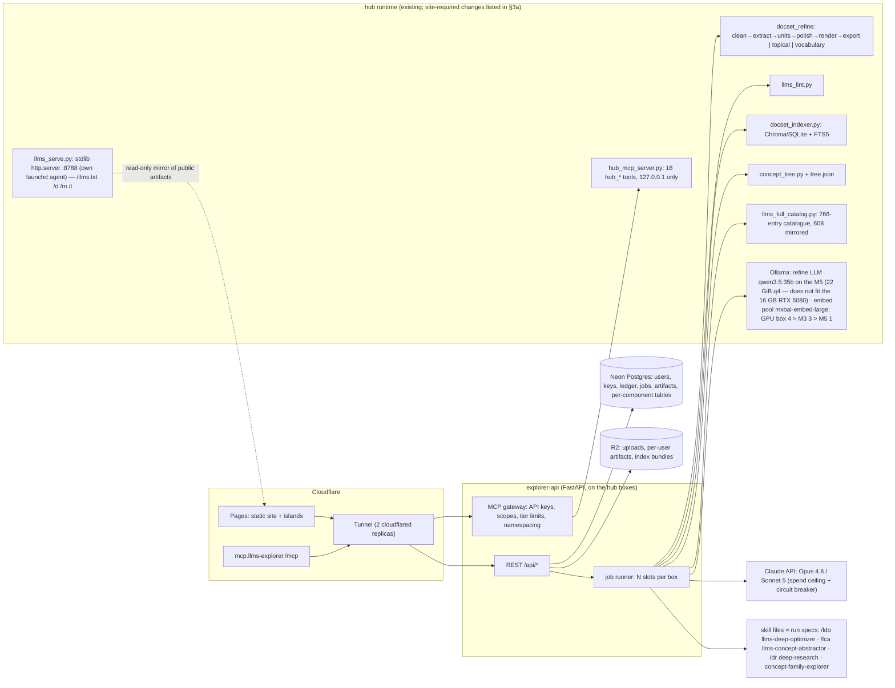

# 00 — LLMS-Explorer: platform design

**Status:** design, not implemented · **Date:** 2026-08-31 · **Owner:** Mitchell Hudson
**Repo:** github.com/mithudso/llms-explorer (this repo becomes the site)
**Runtime today (the hub):** `~/.global-ai-hub` on three boxes — **M5** (this Mac, sole writer of
the public stores), **GPU box** 192.168.4.75 (Linux, RTX 5080), **M3** 192.168.4.113 (a work laptop:
quiet hours Mon–Fri 09:00–17:00 for both job placement and embedding traffic — configured by
`scripts/box_schedule.py`, enforced by `quiet_hours_enforce.py` from launchd).

This is the master spec. Each numbered component has its own file under `components/`
(index: `README.md`); this file fixes what they all share. Where a spoke and this file
disagree, this file wins and the spoke is edited. Section 12 lists what is decided; do not
re-decide those in a plan.

**Contents** [1. Product](#1-product) · [2. Principles](#2-principles) · [3. Architecture](#3-architecture)
· [4. Stores and data model](#4-stores-and-data-model) · [5. Job model](#5-job-model)
· [6. Surfaces](#6-surfaces) · [7. Tiers and metering](#7-tiers-and-metering)
· [8. Deployment and operations](#8-deployment-and-operations) · [9. Security and rights](#9-security-and-rights)
· [10. Build order](#10-build-order) · [11. Non-goals](#11-non-goals) · [12. Decisions and open questions](#12-decisions-and-open-questions)

**Terms.** Hub vocabulary (docset, mirror, raw/facts layers, BoxPool, quiet hours, frontier) is
defined in the hub's `CLAUDE.md` (`hub/CLAUDE.md` in this repo) except two used here: *frontier* = a
concept the tree names but has no node for (known, unresearched — 09 §5); *internal marker* = the
`<!-- internal -->` rights comment (attribute P3) that keeps third-party full text off public
surfaces. Site-specific terms are glossed at first use. *Pass ids* `P0–P15` are the `/ldo` audit passes (`skills/llms-deep-optimizer/references/passes.md`);
*attribute ids* like `P4`/`P5` inside the P9 pass are rubric rows (`…/attributes.md`) — the two
numberings collide, so this document always says "pass P9" or "attribute P5".

## 1. Product

LLMS-Explorer is the **concept-family-tree explorer** (09) with the hub's llms tooling hung off
its nodes. Around a node you can: lint or optimize an llms file (01), turn notes into one (02),
abstract a concept out of a corpus (06), deepen it with a research wave (07), map its family
(08), and read the reference, the reasoning and the examples (03, 05, 11, 12, 14, 16).
Across the whole site: a directory of every known llms file and its conformance (10), semantic +
keyword indexes over everything (16, 17), and one product reached through the web, a REST API,
the `llmsx` CLI, and an MCP server you can run locally or use hosted (13), with accounts and
metered billing above a free tier (15). Component numbers map to files under `components/`.

Positioning line (for the README, not a requirement): *the concept tree is the map; llms files
are the territory; the site keeps the two in agreement.*

## 2. Principles

1. **Files are promises.** Every link resolves, every fact is anchored, every volatile claim is
   stamped. The `/ldo` rubric is the bar; the lint (01) gates everything published.
2. **Generate, don't hand-edit.** Artifacts come from a generator with inputs (mirror, units,
   tree, overrides). Today only `docset_refine topical` reads `manifest.json["overrides"]`; docset
   *exports* have no overrides input, so a hand edit to `<stem>.llms/` is lost on regeneration —
   step 1 adds the same `overrides` hook to `export_llms` (`title`, `summary`, `section_order`, `note`).
3. **Two axes, one grammar.** Source axis (a site's `llms.txt` / full / small / facts) and
   concept axis (topical files, concept packs, vocabulary, the tree). One reader reads both.
4. **Cheap path first.** Keyword (FTS5) before vector before model; deterministic passes before
   model passes; local Ollama before Claude. Every metered step has a free deterministic shadow.
5. **One writer per store; everything else is a view.** The hub (M5) stays the sole writer of the
   public stores and they replicate one way; the site owns only accounts, usage, jobs and
   per-user artifacts, in stores of its own (§4).
6. **Dog food.** The site publishes its own `/llms.txt`, `.md` twins, facts and vocabulary and
   lints them in CI.
7. **Rights are explicit.** Index + facts + your own words are publishable; third-party full text
   is served only to its owner or under the internal marker.

## 3. Architecture



- **Frontend**: Astro on Cloudflare Pages (content-first; *islands* = the few interactive
  components — tree browser, 3D view, lint viewer, query demo, job status — hydrated on an
  otherwise static page). Every content page has a `.md` twin and appears in the site's `/llms.txt`.
- **explorer-api**: Python FastAPI, thin: validates, meters, enqueues, streams job status, serves
  per-user artifacts (`/u/…`, new — mirrors the `/d/` route of `llms_serve.py`). On the boxes it
  imports the authoritative hub scripts (`~/.global-ai-hub/scripts`); `hub/scripts/` in this repo
  is a read-only vendored snapshot for CI, tests and `llmsx --local`.
- **MCP gateway**: terminates the hosted MCP session, checks the API key and scopes, applies tier
  limits and per-user namespacing, then calls the hub server on 127.0.0.1. The hub server itself
  has no auth and is never the tunnel's origin (`hub/docs/MCP.md`: "do not expose off-box without
  adding auth").
- **Job runner**: long-running skill runs execute as jobs (§5). Deterministic stages run
  in-process; model stages call Ollama or Claude; frontier-agent stages (`/ldo` passes P4 navigation,
  P8 facts truth, P12 agent usability; `/lca` lexicon + verify; `/dr`; family maps) run through the
  Claude Agent SDK with the SKILL.md as the run spec and a **read-only** subset of the hub MCP as
  tools (no `hub_index_docset`, `hub_delete_docset`, `hub_distill_run`, `hub_memory_*`).
- **Ollama**: the refine LLM (qwen3.5:35b, 22.2 GiB at Q4_K_M) runs on the M5 (unified memory;
  the hub default `HUB_REFINE_LLM_URLS=localhost`) — it does not fit the RTX 5080's 16 GB. The GPU
  box carries the embedding pool (weights GPU box 4 > M3 3 > M5 1). A generate OOM fails the stage
  and requeues once; a smaller quant for the GPU box is O4.
- **3D**: the `json-3d-renderer` bundle, fed by the tree API (09).

### 3a. Hub changes the site requires

All land in `~/.global-ai-hub` (tests there) and reach `hub/` in this repo through the snapshot;
never edited in `hub/` directly.

| Change | For | Step |
|---|---|---|
| `export_llms` overrides hook (`title`, `summary`, `section_order`, `note` survive regeneration) | principle 2, site dog food | 1 |
| `llms_lint.py --kind vocabulary` | the site's own `llms-vocabulary.txt` under the CI gate; 12/13 publish gate | 1 |
| `hub_concept_search`, `hub_concept_subtree`, `hub_concept_family`, `hub_concept_artifacts` (09 §5) — hosted tier `public` | tree API | 2 |
| `hub_directory_score` + `min_grade` on `hub_llms_full_list` (10 §5) — hosted tier `public` | directory | 2 |
| `/u/<user>/<slug>.llms/…` route | per-user artifacts — in explorer-api, not `llms_serve.py` (13 §7 edited) | 3 |

## 4. Stores and data model

| Store | Writer | Holds | Backup / restore |
|---|---|---|---|
| `~/.global-ai-hub/.chroma-docsets/` + `docsets.db` (per box) | hub (M5), replicated one-way hourly | raw + facts vector layers, FTS5 `kw` rows, raw page text, registry | rsync push is the replica; weekly `docsets.db` copy to R2; restore = re-index from mirrors |
| `~/.claude/skills/web-text-mirror/text-mirror/` (`<stem>.md`, `<stem>.reference/`, `<stem>.llms/`) | hub pipeline | mirrors, refine intermediates, public exports | daily snapshot into this repo (`scripts/refresh_snapshot.sh`) |
| `llms-full/{catalog,manifest}.json` + `files/` | hub weekly timer | the directory seed (10) | same snapshot; re-downloadable |
| `concept-tree/tree.json` + `RESEARCH_QUEUE.md` | hub (`concept_tree.py`) | the public tree (09); frontier is derived | git history in the hub repo |
| `llms-topical/<slug>.llms/` (incl. each pack's `llms-vocabulary.txt`), concept packs `<slug>.llms/` | hub timers / jobs | concept-axis artifacts (02/06/12) | snapshot |
| **Per-user stores** `stores/<user_id>/docsets.db` (+ Chroma dir) on the M5 | site jobs | a user's private docsets/indexes, docset keys `u_<user>__<slug>` and `…__facts` — **outside** `.chroma-docsets/`, excluded from the replication push, read by the M5 only | copied to R2 after every job that writes the store (RPO = last completed job, ≤ 24 h); restore = download bundle (17) |
| Neon Postgres | site | accounts, billing, jobs + `job_events`, and each component's working tables (its §7 owns them) | Neon PITR + nightly logical dump to the M5 |
| R2 | site | uploads (02), per-user artifacts `/u/<user>/<slug>.llms/…`, index bundles (17) | versioned bucket, 30-day undelete |

*raw layer* = embeddings of mirrored page text (`<key>`); *facts layer* = embeddings of extracted
units (`<key>__facts`), preferred by `query --layer auto`. `SqliteStore` = the hub's vector-store
backend that keeps embeddings in SQLite instead of Chroma — adequate at single-user scale, and
the format of every downloadable bundle.

Artifact kinds every surface accepts: `index`, `family`, `full`, `small`, `facts`, `split-root`
(`<section>/llms.txt`), `vocabulary`, `concept-pack`. `llms_lint.py` lacks `--kind vocabulary`
today; 01 adds it before 12 or 13's publish gate ships.

Core entities (each spoke's §7 extends these; 15 §3 is the ledger contract and is authoritative):

```
User(id, email, auth_providers[], plan[free|starter|pro], created)
ApiKey(id, user, scopes[read|run|publish], prefix, hash, last_used, max_usd_day)
Job(id, user, kind[lint|optimize|notes|topical|abstract|pack|deepen|research|family|resolve|index|benchmark|probe|publish],
    input_ref, status, budget, estimate, worker, lease_expires, attempts, last_heartbeat,
    started, finished, cost_tokens, artifact_ref, log_ref)
JobEvent(job, seq, ts, kind[stage|iteration|findings|tokens|log], payload)      # the SSE source
# Rule: spokes may ADD columns to jobs / job_events; no parallel job tables (17's index_jobs) and no
# second status route (17's /api/index/jobs) — one `jobs` table, GET /api/jobs/<id>, SSE /api/jobs/<id>/events.
Artifact(id, owner[user|public], kind (list above), path, manifest_json, lint_summary_json, published_at)
LedgerEntry — see 15 §3 (call_id, component ∈ every component that spends: 01 02 05 06 07 08 13 16 17 — 10 writes none,
    kind[input|output|embedding|storage_mb_month], units, unit_cost_usd, price_usd, billable, reason)
Claim(site_key, user, verified_at, token)
Tree(user_id, forked_from_sha, updated_at) + file trees/<user_id>/tree.json     # private trees (09 §7)
Proposal(id, user, tree_sha, patch_json, status[proposed|merged|rejected], moderator, decided_at)  # merge-back (05)
```

## 5. Job model

Every model-backed or long action is a `Job`. Lifecycle: created with a cost **estimate** (input
size × stage plan, shown before confirmation) → quota/balance check → queued → leased by a worker
(`lease_expires`, heartbeat every 30 s; a reaper requeues expired leases up to `attempts = 3` and
releases the quota hold) → stage events appended to `job_events` → artifacts + lint summary +
ledger entries → `done | failed | cancelled`. Failure at a verify gate marks the failed
iteration's polish/judgment tokens `billable=false` (15 §8). Idempotency: same user + input hash
+ params within 24 h returns the prior job when it is queued, running or done; failed and cancelled
jobs are never reused.

**Box routing.** Requests that touch a per-user store (`u_<user>__*` keys, `/u/…` artifacts) pin to
the M5, where those stores live; public reads (`/d`, `/m`, `/t`, public docset queries) may be
answered by any box holding the replicated public stores. Public status URL `/jobs/<id>` (tokenised when private).

**Scheduler of record.** The hub's `pipeline_manager` owns box placement today: `BoxPool`
(default 2 slots per box) places only the *mirror* stage; refine and index always run on the M5
because `.chroma-docsets/` has one writer. Site jobs do not run a second scheduler: they enqueue
through the same `BoxPool` with a `site` priority class above the background timers, and an
admission controller over the Ollama pool reserves a floor of one slot each for site jobs and
for the hub's own pipeline. Quiet hours remove the M3 (pool weight 8 → 5, ≈37 % of embedding
capacity) every weekday; paid SLOs in the spokes are stated for off-hours and relaxed by that
factor in business hours.

**Streaming.** Status streams over SSE at `GET /api/jobs/<id>/events` with a keepalive comment every ≤ 20 s and `Last-Event-ID`
resume from `job_events`; `GET /api/jobs/<id>` (polling) is the authoritative state. Refine stages
can run for hours (`STAGE_TIMEOUT` refine = 6 h, cap 24 h in the hub), so the UI never depends on
a single long connection.

## 6. Surfaces

Shared contracts; each component's §5 owns its own routes, subcommands and tools.

| Surface | Contract |
|---|---|
| Web | Astro pages; islands: tree browser, 3D view, lint viewer, query demo, job status |
| REST | `/api/…` (unversioned in v1; a breaking change introduces `/api/v2/…`), JSON, API key or session; each component's §5 owns its routes |
| CLI `llmsx` | `pip install llmsx`; thin wrapper over the REST API with `--local` for the deterministic paths that run on the vendored scripts. Top-level nouns: `login keys usage jobs billing · lint optimize migrate · notes topical · abstract deepen family · tree tui · index query · dir · vocab · reference blog examples · mcp · resolve · export · serve`. Each component's §5 owns its subcommands (e.g. `dir search|show|rescore|claim` in 10 §5). |
| MCP | hosted `https://mcp.llms-explorer.<domain>/mcp` (Streamable HTTP through the gateway) and local stdio (13). Two namespaces: the hub's 18 `hub_*` tools (inventory: `hub/docs/MCP.md`) with a tier column, and the site's `explorer_*` job tools (`explorer_lint`, `explorer_optimize`, `explorer_job`, `explorer_abstract`, `explorer_concept_pack`, `explorer_deepen_plan`, `explorer_deepen`, `explorer_deepen_diff`, `explorer_family_map`, `explorer_family_explore`) — 13 §5 lists both. `hub_ask` is not hosted in v1 (decision D5). |
| TUI | the hub-manager Concepts tab shape, pointed at the API (9a) |
| Served files (public, edge-cached) | `/llms.txt`, `/d/<stem>/…`, `/m/<key>/…`, `/t/<slug>/…` from `llms_serve.py`, with `text/markdown`, `X-Markdown-Tokens`, `Link rel=describedby` |
| Served files (private) | `/u/<user>/<slug>.llms/…` from explorer-api: same headers, authenticated, `Cache-Control: private, no-store`, cache key includes the key/session, never edge-cached |

## 7. Tiers and metering

Summary; every number lives in 15 §5 (D6/D7).

Plans: **Free** · **Starter** · **Pro** (prices and quotas in 15 §5; overage on Pro). "Paid tier" in a
spoke means Starter and above. Access vocabulary, used by every tool/route table: `public` = keyless,
rate-limited by IP; `account` = any signed-in plan; `read` / `run` / `publish` = API-key scopes
(`run` is metered, `publish` goes through moderation); `owner` = the site operator only, never
hosted for users. A `Free` plan gets `account` + `read`, and `run` only within its free allowances.

- **Free**: all content (03/04/05/11/12/14/16), public tree browse + 3D (09), directory (10),
  deterministic lint of files ≤ 64 KB, 20 runs/day (01; every plan's caps are owned by 15 §5 —
  D6), 200 keyword queries/day per user and per IP on public docsets, MCP read tools at a low
  keyless rate (13), the 16 demo's vector/hybrid legs (rate-limited, logged, not billed), one hosted
  index ≤ 20k units / 200 MB (17; D7),
  and a *plan-only preview* (cost estimate + stage plan, no tokens spent) of every metered job.
- **Token/GPU-metered**: optimize loops, LLM units and polish, abstraction (lexicon, classify,
  verify), deepen waves, family maps, embeddings beyond the per-component free allowance that 15 §5
  sets (16 §8 and 17 §8 must match it), hosted index storage (GB-month). Unit = model tokens
  (Ollama at a low rate, Claude at cost + margin) or storage.
- **Rate-metered (abuse control, not revenue)**: owner probes and rescoring (10), CI lint runs.
- **Hard stops**: balance ≤ 0 blocks new metered jobs; running jobs finish their current stage.
  Operator side: a global daily Claude spend ceiling with a circuit breaker to Ollama-only mode,
  and 429/outage backoff; a provider error mid-iteration bills nothing for that iteration. When the
  breaker is open, jobs whose next stage needs Claude (`/ldo` P4/P8/P12, deepen, abstraction verify)
  are **held** with a `stage: waiting-for-claude` event — a judgment pass is never skipped silently;
  a hold lasts at most 24 h, after which the job is `cancelled`, its quota hold released and the
  user notified.

## 8. Deployment and operations

- **Site**: Pages builds from `main` — the deployed asset set is `src/`, `docs/`, `skills/`,
  `blog/` and the *generated tables*; `outputs/` (838 MB, files over Pages' per-asset cap) is read
  at build time and never deployed; per-file cap 25 MiB, build budget 15 min.
- **Snapshot vs deploy**: today `scripts/refresh_snapshot.sh` pushes `HEAD:main` from the 04:30
  launchd job; before Pages is wired to `main` (step 1) the script pushes to the `snapshot` branch
  and CI (01 lint + build) promotes `snapshot` → `main` only when green, so an unattended rsync is
  never the deploy trigger. Pages keeps instant rollback to the previous build.
- **API and workers**: launchd (macOS) / systemd (Linux) services on the boxes, exposed only through
  two `cloudflared` replicas. Versioned release directories with a symlink swap and a one-command
  rollback. Each launchd job names its interpreter: anything that talks to LAN Ollama must run
  under a binary approved for macOS Local Network privacy (granted per binary — the reason
  `replicate_docsets.py` runs on `/usr/bin/python3`); the venv interpreter needs its own approval.
- **Postgres**: Neon (decision D2), pooled endpoint, ≤ 5 connections per worker and ≤ 20 per API
  process, 5 s statement timeout on job-status writes, PITR + nightly logical dump to the M5.
- **Disk**: box disk budget 200 GB for site stores; anything above 20 GB per user lives in R2;
  headroom alarm at 80 %; per-user indexes idle > 90 days are archived to R2 (bundle) and evicted.
- **Timers that keep feeding the public stores** (unchanged): pipeline runs, llms-full refresh
  weekly Sun 03:00, docset replication hourly, topical refresh weekly Sun 04:00, snapshot refresh
  daily 04:30.
- **Degraded mode**: if the tunnel or the API is down, Pages content and the public served files
  keep serving; `/api` and `/mcp` return 503 with a link to the status page.
- **Observability**: job logs to `logs/`, structured events in Postgres, `/health` probed every
  minute by an external monitor that pages the on-call channel; public status page.

### 8a. Roles

| Role | Holder at launch | Duty |
|---|---|---|
| Owner | Mitchell Hudson | product, billing (Stripe), DNS, keys; final say on merges |
| Moderator | owner (+1 delegated moderator before public contribute opens) | publish/contribute queue, merge-back proposals; 48 h turnaround commitment |
| On-call | owner, best-effort outside business hours; availability target 99 % monthly for the paid API, no target for free | alerts from the `/health` monitor and job-failure spikes |
| Contributor | any signed-in user | proposes artifacts and tree changes; nothing lands without the lint gate + moderation |
| Claimed-site owner (maintainer) | a user who verified a site with a 10 §5 claim token (`llms.txt` comment, `Link` header or DNS TXT) | lint-on-push, rescoring, badge for that site; sees that site's full text hosted |
| Continuity | documented in a private runbook: who holds Stripe/DNS/Neon access, the refund and wind-down commitment (30 days' notice, balances refunded, user data exportable via 17 bundles) | bus-factor mitigation |

## 9. Security and rights

- Localhost trust model preserved: nothing on the boxes listens off-box except through the tunnel;
  the hub MCP server is reached only via the gateway (§3); API keys hashed, scopes enforced per
  route/tool, per-user namespaces on every store.
- **Ingest-time scan**: every upload or fetched document passes the P9 checks — attribute P4
  steering spans, attribute P5 secrets — *before* any agent stage sees it (spoke 02 §10 gates at
  publish only; this moves it earlier). Steering spans are rejected, secrets redacted with a
  BLOCKED row, and agent stages get read-only tools (§3).
- Publish/contribute gate: `llms_lint.py check --json` with zero High findings, provenance banner
  present, rights check (third-party full text never on public pages; hosted `hub_llms_full_read`
  returns full text only to that site's claimed-site owner or under the internal marker).
- Uploads private by default, virus-scanned, size-capped per tier, deletable; data retention and
  GDPR basics in 15 §10.

## 10. Build order

| Step | Components | Deliverable | Acceptance |
|---|---|---|---|
| 1 | 03, 05, 11, 12 (intro + grammar), 14 (decision table + copy-only recipes), 04 launch posts, 01 lint in CI | published content pages with `.md` twins, the site's own `/llms.txt` + facts + vocabulary, `overrides` hook in `export_llms`, `llms_lint.py --kind vocabulary`, snapshot → `snapshot` branch with CI promotion to `main` | `llms_lint.py check` over the site's own llms files exits 0 in CI on every push; every page has a twin; the 8 launch posts render with numbers from `outputs/` — **accepted 2026-08-31**, live at https://llms-explorer.com (Cloudflare Pages project `llms-explorer`, root `site`, build `sh ../hub/bootstrap.sh --no-tests && npm run build`): 41 pages, 36 twins, family lints 0 High, twins serve `text/markdown` + `X-Markdown-Tokens` + `Link rel=describedby` |
| 2 | 09 read-only (tree API, browser, 3D, TUI parity), 10 read-only, 16 demo on public docsets | public tree + directory + query demo | tree page ≤ 1 s TTFB from cache; 3D loads the full tree; demo answers the golden questions with the three legs visible |
| 3 | 15 accounts + metering, 13 hosted MCP read tools + gateway, 05 governance (forks, proposals, moderation queue) | sign-in, keys, ledger, hosted MCP reads, private trees, the `/u/<user>/…` route in explorer-api | a paid key can call every read tool within tier limits; a proposal round-trips through moderation |
| 4 | 01 optimize, 02 notes→llms, 17 hosted indexes; 03 keyword search over the reference, 14 playground | first metered jobs | estimate → actual within ±20 % on the pilot set; refund rule verified on a forced gate failure |
| 5 | 06 abstraction, 08 family map, 07 deepen | concept-axis jobs | a concept pack passes the lint gate and lands on its tree node |
| 6 | 13 contribute flow (§2 M4), 10 owner claims + rescoring, CLI GA | community publishing | first external contribution merged through the ladder |

## 11. Non-goals

No general RAG chat product; no crawling-as-a-service (the mirror is a byproduct); no republishing
of third-party full text; no per-request *generation*-model choice beyond local/Claude tiers
(embedding-model choice is a feature of 17); no realtime collaboration on trees (proposals +
merges instead).

## 12. Decisions and open questions

Decided 2026-08-31 (owner) — do not re-decide in a plan:

- **D1** Astro on Cloudflare Pages.
- **D2** Managed Postgres (Neon) for accounts, ledger, jobs; hub stores stay on the boxes.
- **D3** Claude Agent SDK runs the frontier stages with each SKILL.md as the run spec.
- **D4** Public-tree governance as designed in 05 §4 (precedence ladder, `resolve` job, conflict
  records, forks + merge-back proposals, moderation queue) — *designed from launch, shipped in
  step 3 with accounts*, since proposals need identities.
- **D5** Hosted MCP exposes: the `hub_*` read tools (public/account), `hub_index_docset` (run) and
  `hub_delete_docset` (run, `confirm=true`) scoped to the caller's own `u_<user>__*` keys, and the
  `explorer_*` job tools; `hub_ask`, `hub_distill_run`, `hub_memory_*` are absent hosted (13 §5 edited).
- **D6** Every plan's caps are owned by 15 §5 (free lint ≤ 64 KB, 20/day; 200 keyword queries/day;
  Starter/Pro lint per 15 §5); spoke figures that differ (01 §8, 16 §5) are edited to point there.
- **D7** Embeddings and storage: Free = the 16 demo's vector legs (rate-limited, not billed) and one
  hosted index ≤ 20k units / 200 MB; Starter = 5 docsets / 5 GB; Pro = 50 docsets / 50 GB; beyond
  that, embedding tokens at the local rate and GB-month. 15 §5, 16 §8 and 17 §8 carry these numbers.

Still open:

- **O1** Neon region and the outbound WAN egress from the boxes to it (pooled endpoint, TLS, p95
  latency budget for job-status writes).
- **O2** Stable node `id` (uuid) beside `slug` in `tree.json` before forks ship (09 §12).
- **O3** Whether the M3 is excluded from the paid path entirely rather than SLO-relaxed in
  business hours (§5).
- **D8** Mirrored third-party full text is never served publicly by the site, whatever the source's
  `rights` flag says — the directory links to the source's own URL; hosted `hub_llms_full_read`
  returns pages only to that site's claimed-site owner or under the internal marker (13 §5/§10 edited).

Still open (continued):

- **O4** A ≤ 14 GB quant of the refine model for the RTX 5080, so generation can leave the M5.
