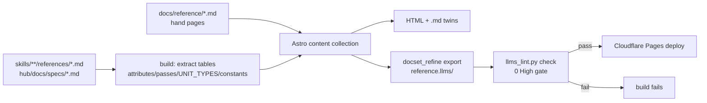

# 03 — Reference

**Status:** design, not implemented · **Date:** 2026-08-31 · **Surfaces:** web | api (read-only `.md` twins + `/llms.txt`) | mcp (via 13, read-only)

## 1. Purpose

The canonical, browsable account of what an llms file *is*, why each rule exists, and how to
produce and consume one — written once, generated from the same sources the tooling runs on,
so the reference can never drift from the linter. Audience: someone publishing a first
`llms.txt`, an agent author deciding how to read one, and the site's own agents (the section is
served as its own llms family, so an LLM can answer "what does the standard say" from it).

## 2. User stories and flows

- *Publisher*: "I have a docs site; what exactly goes in `llms.txt` and what makes it good?" →
  Formatting → Grammar page → Attribute rubric → Serving guide → runs 01 on the result.
- *Agent author*: "How should my agent read an index, and when should it fall through to
  full/facts?" → Usage guides → Consumption page → example links into 14.
- *Skeptic*: "Does anyone read these?" → Reasoning → Evidence page (Ahrefs logs, Google's
  position, the consumer-ceiling data) with dated `verified-as-of` stamps.
- *Contributor*: "I want to fix a wording error" → every page has an "edit source" link to the
  markdown in this repo; PR goes through the content lint (§4) before merge.
- *Machine*: an agent fetches `/reference/llms.txt`, follows ≤ 2 hops, answers from
  `/reference/llms-facts.txt` with anchors.

## 3. Inputs → outputs (content outline)

Every page lists its source material; pages marked **gen** are generated at build time, **hand**
are authored markdown with front matter, **both** = hand prose around generated tables.

| Route | Page | Kind | Source material |
|---|---|---|---|
| `/reference` | Landing: the ladder in one diagram (index → small/full → facts → vocabulary → concept pack), "start here" by role | hand | `skills/llms-deep-optimizer/references/attributes.md` §10 side-by-side table |
| `/reference/formatting/llms-txt` | Spec v2 grammar: H1, blockquote, free text, H2 link lists `- [name](url): notes`, `## Optional` last, subpath scoping (most-specific wins), BOM tolerance | both | `skills/document-formats/references/llms-txt.md` §2; llmstxt.org |
| `/reference/formatting/llms-full` | The three published grammars — Mintlify (`# Title` / `Source: <url>` / blank / body), Anthropic YAML blocks, Cloudflare frontmatter + `[View as Markdown]` — plus Firecrawl `<\|firecrawl-page-N-lllmstxt\|>` delimiters; the header comment that names the grammar; round-trip guarantee through `hub/scripts/llms_acquire.py::split_llms_full` | both | `llms-txt.md` §grammars; `hub/scripts/docset_refine/export_llms.py::GRAMMAR_NOTE` |
| `/reference/formatting/llms-small` | The budgeted variant: reference-class pages first, ≤ ~50k tokens (`SMALL_MAX_CHARS = 200_000`), exact rendered-cost budgeting | both | `export_llms.py::build_small`; `llms-txt-ecosystem-evidence.md` (consumer ceiling) |
| `/reference/formatting/llms-facts` | The unit line `- [type] text — url#anchor · keywords: a, b · verified-as-of: YYYY-MM-DD`; `UNIT_TYPES` = concept, fact, actionable, question, problem, statement, quote, idea, snippet, parameter, definition, change; `## <page title>` / `<url>` heading pairs; ≤ 2 sentences / 400 chars; anchors resolve to a heading that exists on the source page | both | `hub/scripts/docset_refine/__init__.py::UNIT_TYPES`; `export_llms.py::build_facts`; `hub/scripts/llms_lint.py::UNIT_RE` |
| `/reference/formatting/llms-vocabulary` | The lexical layer (grammar defined in 12; this page is the format summary + link) | gen | 12 |
| `/reference/formatting/family-and-split` | Family indexes (link other indexes, never pages; counts on every line; `## Shared` once) and hub-and-spoke split roots (`## Sections` → `<slug>/llms.txt`, recursion by path then `part-N`, `INDEX_SPLIT_BYTES = 10_000`, `PART_PAGES = 60`) | both | `export_llms.py::build_split_index`, `family()`; `2026-08-30-llms-txt-as-docset-schema-design.md` §3 |
| `/reference/formatting/manifest` | `manifest.json`: `files{bytes,tokens}`, `chars_per_token`, `pages`, `units`, `sections`, `dropped_empty_pages`, `acquired`, `overrides` | gen | `export_llms.py::run` |
| `/reference/reasoning/*` | One page per decision: extractive descriptions beat generated; size is a producer-side problem (ladder + counts); anchors make facts checkable; facts are the trusted layer; two hops; generate-don't-edit; rights | hand | `llms-txt-generation-tooling.md`; `llms-vs-skill-files.md`; design spec §2 |
| `/reference/evidence` | Dated evidence with stamps: Ahrefs 137k-domain logs (97% zero AI requests; Claude-Code UA out-fetched every retrieval bot bar statespace-indexer/GPTBot); Google's position; ~50k-token consumer ceiling (Cursor); the ~42% of wild files that try to steer the reader; adoption ~5–6% of top-1M | both | `llms-txt-ecosystem-evidence.md` |
| `/reference/usage/serving` | Headers (`Content-Type: text/markdown; charset=utf-8`, `X-Markdown-Tokens`, `Link: <…>; rel="describedby"`, `rel="alternate" type="text/markdown"` on HTML), `.md` twins (`page.md` / `page.html.md`), `Accept: text/markdown`, no redirects/auth, 200 not 5xx (Lighthouse) | both | `hub/scripts/llms_serve.py`; `llms-txt.md` §discovery |
| `/reference/usage/reading` | How an agent reads an index (view or search, then follow), when to fall through to small/full/facts, keyword vs vector vs hybrid | hand | 14; `facts-to-llms-howto.md` §7 |
| `/reference/usage/claude-code-and-mcp` | Consuming from Claude Code / MCP (`hub_docset_index`, `hub_query_docset(mode=…)`, `hub_llms_full_read(page=…)`), client config | both | `hub/docs/MCP.md`; 13 |
| `/reference/rubric` | The 59 attributes (I1–I6, N1–N7, D1–D6, C1–C7, P1–P6, S1–S6, R1–R7, F1–F6, H1–H8) as a filterable table: id, attribute, applies-to, measure, bar, severity | gen | `attributes.md` |
| `/reference/passes` | P0–P15 with bundle, kind (det/model/live), judges, how used/judged/updated, tools, relations; the N/A rules; severity resolution | gen | `passes.md` |
| `/reference/ethos` | Files are promises; generate, don't hand-edit; evidence is external; never instruct the reader; rights | hand | `llms-vs-skill-files.md`; SKILL.md |
| `/reference/glossary` | Terms of the field with senses (index, full, small, facts, twin, describedby, family, split root, unit, anchor, pool, concept pack, …) | gen | 12 (the site's own `llms-vocabulary.txt`) |
| `/reference/changelog` | Spec proposal history: v1 → v2 (2026-08-10) and the hub's schema changes, dated | both | `llms-txt.md`; 11 |

Outputs: HTML pages; a `.md` twin per page; `/reference/llms.txt` (index of the section),
`/reference/llms-full.txt`, `/reference/llms-facts.txt` (one unit per rule, anchored to the
page heading), `/reference/llms-vocabulary.txt` — the section is itself a docset that 01 lints
at build time.

## 4. Architecture

- Generated tables come from the same files the tooling reads: `attributes.md` and `passes.md`
  are parsed as markdown tables; constants (`INDEX_SPLIT_BYTES`, `SMALL_MAX_CHARS`,
  `UNIT_TYPES`, `PART_PAGES`) are imported from `hub/scripts/docset_refine/*.py` by a tiny
  build script so a number on a page is never typed by hand.
- Hand pages are markdown with front matter `{title, summary, verified-as-of, sources[]}`;
  every volatile claim carries an inline `verified-as-of` and a footnote to `sources[]`.
- The section's own llms family is produced by `hub/scripts/docset_refine/export_llms.py` run
  over a banner mirror rendered from the built pages, then gated by `hub/scripts/llms_lint.py
  check reference.llms/ --check-links`; a High fails the build.
- Review workflow: PR → content lint (front matter present, `verified-as-of` on volatile pages,
  no steering phrases, link check) → `/ddo` critique on prose changes over 40 lines →
  maintainer merge → Pages deploy.
- Search: client-side index (Pagefind or similar) over the `.md` twins; the same twins feed
  the site's FTS5 keyword layer via 17.

## 5. API / CLI / MCP surface

- `GET /reference/<page>.md` — twin; `GET /reference/llms.txt|llms-full.txt|llms-facts.txt|llms-vocabulary.txt|manifest.json`.
- `GET /api/reference/rubric.json`, `/api/reference/passes.json`, `/api/reference/constants.json` — the generated tables as data (free, cached, ETag).
- `llmsx reference rubric [--attr N6]`, `llmsx reference pass P7` — prints the row(s) from the same JSON.
- MCP (13): the reference docset is a public read-only docset (`hub_docset_index("reference")`, `hub_query_docset("reference", …, mode="keyword")`).

## 6. UI

Left nav mirrors the outline (Formatting / Reasoning / Evidence / Usage / Rubric / Passes /
Ethos / Glossary / Changelog); right rail = on-page headings; header = search, "view as
markdown", "edit source", `verified-as-of` badge. Rubric and passes pages: sticky filter bar
(kind: index/full/facts/family; severity; deterministic/model/live), row expands to the
anchored example. Empty states: a generated table whose source file is missing renders a
visible "source missing: <path>" block and fails the build in CI. Error states: a dead link in a
hand page fails the build with the URL listed.

## 7. Data model and storage

No database. Content = markdown in `docs/reference/` + generated JSON in `build/reference/`
(`rubric.json`, `passes.json`, `constants.json`, `glossary.json`) + the exported
`reference.llms/` dir. All static, versioned in this repo, deployed as files.

## 8. Tiering, metering and billing hooks

Free tier, unmetered, no auth. Only hook: page views and `.md` twin fetches are counted (not
billed) to show "agents read this" on the evidence page.

## 9. Acceptance bar

- Every generated number matches its source constant (build test imports and compares).
- `llms_lint.py check reference.llms/ --check-links` → 0 High, ≤ 5 Medium at build.
- 100% of pages have a `.md` twin, `Link: rel=describedby`, and appear in `/reference/llms.txt`.
- Agent test (01/P12 with a 10-question bank drawn from the rubric): ≥ 8/10 from the index in ≤ 2 hops.
- Every volatile page has `verified-as-of` ≤ 90 days old at deploy, else the build warns and the page shows a stale banner.

## 10. Security, rights, privacy

Static content, no user input. Quoted spec text is short and attributed to llmstxt.org (proposal,
not a ratified standard — the honesty note appears on the landing page). No third-party full
text; evidence pages cite, never republish. No tracking beyond aggregate counts.

## 11. Dependencies

01 (build-time lint and the rubric/passes it shares), 11 (changelog page), 12 (glossary and
the section's vocabulary), 14 (usage examples), 13 (MCP read access), 17 (site keyword index).

## 12. Open questions and assumptions

- Assumed Astro content collections; any static generator with markdown + build hooks works.
- Whether to mirror llmstxt.org's spec text verbatim (license) or paraphrase with quotes — assumed short quotes only.
- The rubric may grow past 59 attributes; the page is generated, so growth is free, but attribute ids must stay stable (link targets).
