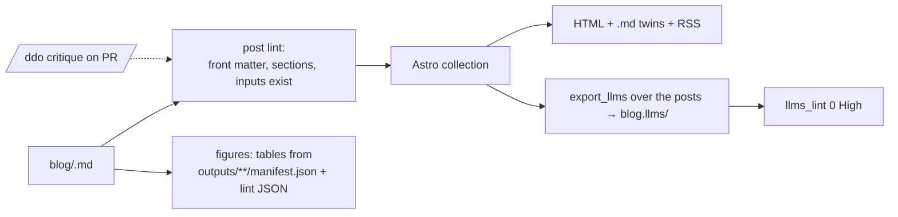

# 04 — Blog

**Status:** design, not implemented · **Date:** 2026-08-31 · **Surfaces:** web | api (`.md` twins, RSS, `/blog/llms.txt`)

## 1. Purpose

Implementation write-ups with real numbers: what was run, on what, what came out, what the
lint said, what we learned. Each post is a reproducible case study for one way of using the
LLMS system (a customer's docs, a topical file, a concept abstraction), so the blog doubles as
the worked-example layer of the reference (03) and the marketing surface for the metered
components (01, 02, 06, 07, 08).

## 2. User stories and flows

- *Evaluator*: "Show me it working on a site like mine" → reads the customer-docs post, clicks
  through to the live export under `outputs/exports/…` served by the site, runs 01 on it.
- *Practitioner*: "How do I do X" → post → commands block → linked cookbook entry in 14.
- *Author (us)*: run a job, collect numbers from `outputs/` and the lint JSON, write the post
  from the template, `/ddo` critique, publish; figures regenerate at build from data.
- *Agent*: fetches `/blog/llms.txt`, follows to a post's `.md` twin, cites a fact from
  `/blog/llms-facts.txt`.

## 3. Inputs → outputs (content outline)

**Post template** (front matter + fixed sections; the lint in §4 enforces them):

```
---
title:            Turning a customer's docs into an llms family
slug:             customer-docs-to-llms-family
date:             2026-09-xx
tags:             [export, split, customer]
components:       [01, 02]
inputs:           [outputs/exports/developers.cloudflare.com.llms/manifest.json]
verified-as-of:   2026-08-31
---
## Problem            what was wrong / what was needed, one paragraph
## Inputs             the docset(s), sizes, acquisition method (llms-full / llms / crawl)
## Commands run       exact CLI, copy-pasteable, with cwd
## Outputs            files produced, bytes/tokens per file (generated table from manifest.json)
## What the lint found  per-pass counts before/after (generated from llms_lint JSON), the Highs quoted
## Lessons            3–7 bullets, each one falsifiable
## Reproduce          the `llmsx` or hub commands + the dataset link
```

**Launch posts** (all written from material already in this repo):

| Slug | Thesis | Numbers / sources |
|---|---|---|
| `customer-docs-to-llms-family` | A product docset → index / full / small / facts, split hub-and-spoke at 10 KB | developers.cloudflare.com 509 KB → 9 KB root + 243 leaves; developer.paypal.com 343 KB → 4 KB + 231; docs.claude.com 118 KB → 2 KB + 73; docs.langchain.com 119 KB → 1.5 KB + 15 (`outputs/exports/*/manifest.json`) |
| `topical-llms-from-a-fact-pool` | `docset_refine topical`: sections from a concept-tree node's children, facts filed by keyword → file-affinity → embedding centroid → `## Shared` | the llms.txt family pilot (`outputs/llms-topical/`), `skills/llms-deep-optimizer/references/facts-to-llms-howto.md` |
| `abstracting-one-concept` | `/lca`: "heart" out of a textbook, "indexing" across the database docsets — lexicon expansion, harvest report, facets, disagreements | component 06; the abstractor's `output-contract.md` worked example |
| `six-months-of-hand-made-llms-files` | The site-dump problem ("hundreds of pages of repeating internal links") → the facts layer; V1→V2 | `hub/docs/specs/2026-08-30-docset-reference-extraction-design.md`; 11 |
| `anchors-that-point-nowhere` | 1,124 of 11,965 units anchored to headings the site never renders: MDX `<Step>`/`<Tab>` titles become headings when cleaned; fix = anchor to the nearest real source heading (`extract.real_headings`) | `logs/memory-hub.md` v1.1.53; `hub/scripts/docset_refine/extract.py` |
| `keyword-plus-vector-the-cheap-path` | FTS5 (BM25) beside embeddings: exact tokens (`CLAUDE_CODE_SYNC_SKILLS`, `--append-system-prompt`) cost no embedding call; RRF hybrid | `hub/scripts/docset_indexer.py::keyword_query`, `fts_match`; `hub_query_docset(mode=…)` |
| `the-lint-that-gates-the-estate` | `docset_rollout cleanup` → 652 files, 0 High; what the calibration taught (placeholder keys, PEM headers, quoted injection phrases) | `logs/memory-hub.md` v1.1.56; `hub/scripts/llms_lint.py` |
| `an-index-is-a-promise-list` | Why `/ldo` refuses to "improve the prose" of an index | `skills/llms-deep-optimizer/references/llms-vs-skill-files.md` |

Outputs per post: HTML, `.md` twin, an entry in `/blog/llms.txt` (description = the Thesis
column), units in `/blog/llms-facts.txt` (one `[fact]`/`[actionable]` per Lesson bullet,
anchored to the post's `#lessons`), RSS/Atom item, OpenGraph image generated from the Outputs table.

## 4. Architecture



- Posts live in `blog/<slug>.md`; figures are never pasted — a shortcode
  `` renders the bytes/tokens table and
  `` renders per-pass counts, so numbers stay tied to the artifact.
- The post lint (build step) checks: required sections present and in order; every `inputs:`
  path exists in the repo; every command block has a cwd comment; Lessons has 3–7 bullets;
  `verified-as-of` present; no steering phrases (same regex set as `llms_lint.py` P9).
- Review: PR → post lint → `/ddo` (document critique) for prose → maintainer merge.
- Dog food: the blog is a docset; `export_llms` builds `blog.llms/`, 01 gates it.

## 5. API / CLI / MCP surface

`GET /blog/feed.xml`, `GET /blog/<slug>.md`, `GET /blog/llms.txt|llms-full.txt|llms-facts.txt`,
`GET /api/blog/posts.json` (slug, title, date, tags, components, inputs). `llmsx blog list`.
MCP (13): public read-only docset `blog`.

## 6. UI

Index page (cards: title, thesis, tags, components chips linking to the product pages, the
headline number); post page (template sections, sticky "Reproduce" button, "run this on your
docs" CTA into 01/02); tag pages; component pages list their posts. Empty state: no posts for a
tag → link to the reference. Error: a figure whose data file is missing renders a red block and
fails CI.

## 7. Data model and storage

Static: `blog/*.md`, generated `build/blog/posts.json`, `blog.llms/`. No database.

## 8. Tiering, metering and billing hooks

Free. CTAs deep-link into metered flows with the post's inputs preloaded (e.g. "lint this
export" opens 01 on the linked `outputs/exports/...`).

## 9. Acceptance bar

- 8 launch posts published, each passing the post lint; every figure generated from a file in `outputs/` or a lint JSON committed beside the post.
- `blog.llms/` lints 0 High; `/blog/llms.txt` ≤ 10 KB (split when it grows).
- Each post's Commands block reproduces its Outputs table within ±2% bytes on a fresh run (CI job, monthly).

## 10. Security, rights, privacy

Posts quote our own outputs and short attributed excerpts; never third-party full text. Customer
posts name only public docs sites or anonymise. No comments system (no user content).

## 11. Dependencies

01 (lint figures, CTA), 02, 06, 11, 14 (cookbook cross-links), 13 (read access), 03 (shared layout).

## 12. Open questions and assumptions

- Assumed no comments/discussion; reactions could come later via GitHub Discussions.
- Whether customer posts need explicit permission when the site is public — assumed yes for named customers, none for public docs sites we mirrored.
- OpenGraph image generation is a build-time Playwright/Satori step — assumed available on Pages build.
