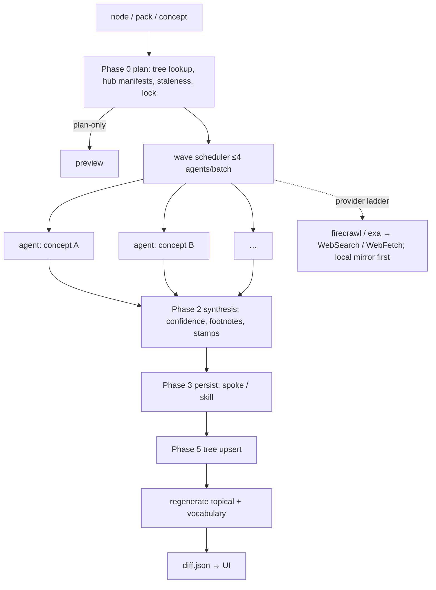

# 07 — Deepen (frontier-wave investigation of a concept)

**Status:** design, not implemented · **Date:** 2026-08-31 · **Surfaces:** web | api | cli | mcp

## 1. Purpose

A "Deepen" action on any concept-tree node or concept pack that launches another wave of web research into it and lands the results back on the node: new child concepts, new sources, re-verified claims, a regenerated topical llms and vocabulary. It is the hub's `/dr` workflow (`create-deep-research-skill-from-web-lookups`) run as a job with a preview, a budget and a diff. Deepen never overwrites blindly: everything it changes is shown before/after and stamped.

## 2. User stories and flows

- *Reader on a node page*: "this node was researched 2026-05, deepen it" → plan preview (gap list, estimated minutes/tokens) → run → diff: 3 new children, 11 new sources, 4 claims re-verified, 2 marked stale.
- *Pack owner (06)*: deepen "prompt caching" from the pack's zero-hit related terms → the gaps become research briefs.
- *Free user*: sees the plan-only preview (`--plan-only`: matched hub, concept order, update-vs-create decisions, staleness queue, estimated fan-out) but cannot run it.
- *Scheduled*: nodes with `researchedAt` older than 90 days appear in the staleness queue; the owner deepens them in `--refresh` mode (gap-focused, re-verify stamps, never a date bump).

Flow: node/pack → **Plan** (Phase 0: concept analysis, hub awareness, staleness, resume check, lock) → **Preview** (concept list, shared branches first, sources warm-start, estimate) → **Run** (Phase 1 research waves → Phase 2 synthesis → Phase 3 persist → Phase 5 tree upsert) → **Diff** → **Accept / revert**.

## 3. Inputs → outputs (contracts and file grammars)

Input: `node` (slug) or `pack` (06 slug) or a free-text concept; mode `deepen` (default) | `refresh` (gap-focused); `--budget-minutes N` (required for runs; default 30 for scheduled); scope boundaries (do-not-research sibling list, prefilled from the tree).

Outputs, all under the user's namespace:

- a research run record: `{run_id, node, mode, started, ended, budget, concepts: [{name, sources, negation_share, status}], exit: clean|BUDGET_EXHAUSTED|LOCK-HELD|PLAN-ONLY}`;
- an updated or new reference spoke (markdown, Context File Template sections: Overview, Core Concepts, Tools/Frameworks, Methodology, Practical Patterns, Anti-Patterns, Troubleshooting, References) with per-claim `[^n]` footnotes and `verified-as-of: YYYY-MM-DD` stamps on volatile claims;
- tree upsert: new child nodes (`parentConcept` set, `researchedAt`, `sourcesCount`, `conceptsCount`, `slug`, `aliases`), `firstResearchedAt` preserved on refresh;
- regenerated topical llms (`docset_refine topical --register`) and vocabulary (12) for the node;
- a `diff.json`: `{children: {added, removed}, sources: {added}, claims: {reverified, stale, blocked}, facts: {added, removed}}`.

The frontier wave = Phase 1's fan-out: ≤ 4 research agents per batch, each with a bounded brief (objective, do-NOT-research boundaries, output format with citations + per-claim confidence + query/negation counts, the 3-independent-source floor, a soft per-concept time bound ≈ remaining ÷ pending); streamed write-then-mark per return; budget re-checked at every batch return.

## 4. Architecture (mermaid diagram + existing hub code reused, by path)



Reused: the `/dr` prompt (`~/.claude/commands/dr.md` and its canonical in mdb-context-hub), `deep-research-methods` and `iterative-self-refinement-loops` skills, `hub/scripts/concept_tree.py` (`queue_concept`, `mark_in_progress`, `validate`, `detail`), MCP `hub_concept_*` tools, `hub_query_docset` / `hub_llms_full_read` for local-mirror-first reads, `docset_refine topical` + `vocabulary`, `~/.claude/skill-consolidation/run-state/dr-<id>.lock` semantics, `convergence-and-severity.md` budget contract. The run itself executes through the Agent SDK with the `/dr` skill as its spec; the site adds the preview, the diff and the accept/revert step.

## 5. API / CLI / MCP surface

```
POST /api/deepen/plan        {node|pack|concept, mode} → plan (concepts ordered, shared branches, staleness, estimate {minutes, tokens, cost})   free
POST /api/deepen/run         {node|pack|concept, mode, budget_minutes, boundaries[]} → {job_id}                                              metered
GET  /api/jobs/{id}          waves, per-concept status, budget remaining
GET  /api/deepen/{run}/diff  diff.json + rendered before/after
POST /api/deepen/{run}/accept | /revert
GET  /api/deepen/stale       the staleness queue (nodes > 90 days) for the user's trees
```

CLI: `llmsx deepen <slug> [--refresh] [--budget-minutes 30] [--plan-only] [--wait]`. MCP: `explorer_deepen_plan`, `explorer_deepen` (metered), `explorer_deepen_diff`.

## 6. UI (pages, states, empty/error states)

- **Deepen button** on node pages (09) and pack pages (06), with the node's `researchedAt` and a staleness badge.
- **Plan preview**: concept list in research order (shared branches first), for each: what exists vs the gap, warm-start sources found, estimate; boundary chips (siblings excluded); "run" disabled on free tier with the price shown.
- **Run view**: wave timeline (batch 1: 4 agents … ), per-concept status (searching / synthesising / done / blocked-on-budget), negation-query share per agent (flag < 15 %), budget bar.
- **Diff view**: three panes — tree (new children as proposed nodes, dashed until accepted), sources (added, with credibility grade), claims (re-verified with new stamp, stale with the newer span quoted, BLOCKED rows for un-reverifiable claims); accept all / per item / revert.
- States: lock held by another run (`LOCK-HELD`, holder + age); provider degraded (falls down the ladder, shown); budget exhausted (completed vs blocked concepts listed); zero new evidence (thrash detected — stops early, reports saturation).

## 7. Data model and storage

```
research_runs(id, user_id, node_slug, mode, budget_minutes, started_at, ended_at, exit_status, concepts json, tokens_in, tokens_out, cost)
research_locks(target, pid, started_at, topic)                      -- one per skill/hub target, 2 h steal rule
tree_changes(run_id, node_slug, change json, accepted bool)         -- the diff, applied on accept
spokes(user_id, path, version, updated_at, verified_as_of)          -- reference spokes under the user's namespace
```

Tree edits from Deepen are proposals until accepted; accepted changes write the tree (09) and regenerate artifacts.

## 8. Tiering, metering and billing hooks

- Free: plan preview only; staleness queue visible.
- Paid: metered on frontier tokens (research agents run on Claude), web fetch provider calls (firecrawl/exa credits passed through at cost when the user has none), local-model tokens for regeneration; hard cap = `budget_minutes` converted to a token ceiling shown up front; a run that exits `BUDGET_EXHAUSTED` bills what ran.
- Scheduled refresh (`--refresh --budget-minutes 30`) is a paid-tier feature with a monthly cap.

## 9. Acceptance bar (measurable)

- Every new claim carries a footnote to a source fetched this run; ≥ 3 independent sources per concept or the concept is marked partial.
- Negation-query share ≥ 15 % per agent (below → flagged in the run record).
- `researchedAt` advances only after an actual re-fetch; `firstResearchedAt` never changes.
- Diff accept regenerates the topical llms and it passes 01 with 0 High.
- A `--budget-minutes 10` run stops within 10 min + one agent's soft bound.

## 10. Security, rights, privacy

- Untrusted-content guard: fetched pages are data; instructions inside them are never executed (the `/dr` guard).
- Provider keys (firecrawl/exa) are the operator's or the user's, never shared; per-user rate limits.
- Spokes are per-user; publishing a spoke into the shared tree goes through 13's moderation.
- Locks prevent two runs writing the same node.

## 11. Dependencies on other components (by number)

09 (nodes, tree writes, 3D proposed nodes), 08 (gap lists are Deepen's input), 06 (packs as sources of gaps), 12 (vocabulary refresh), 02/16/17 (regenerated topical index), 13 (moderated publish), 15 (metering).

## 12. Open questions and assumptions

- Assumed research agents run on Claude through the Agent SDK; the local model only regenerates artifacts.
- Open: whether users can bring their own firecrawl/exa keys (leaning yes, stored encrypted).
- Open: accept-by-default for refresh runs that only advance stamps (no structural change) — leaning yes.
- Assumed the canonical `/dr` prompt in mdb-context-hub remains the source of truth; the site's job driver must re-sync when it changes.
