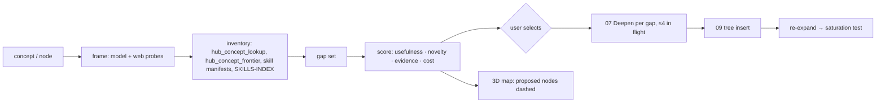

# 08 — Concept Family Explorer (gap discovery around a concept)

**Status:** design, not implemented · **Date:** 2026-08-31 · **Surfaces:** web | api | cli | mcp

## 1. Purpose

Map the conceptual family around a concept — parent domain, siblings, sub-concepts, adjacent and cross-over fields, the frontier — and say which of those the tree is **missing**, scored, so the user can choose what to research next. It is the `concept-family-explorer` skill (`~/.claude/skills/concept-family-explorer/`, the gap-discovery layer above `/dr`) as a service. It produces a map and a decision, not content: 06 compiles what your sources say about one concept; 08 maps which concepts exist around it, mostly from the web; 07 then researches the chosen gaps.

## 2. User stories and flows

- *Curator*: opens "vector databases" in the tree, runs Explore; the map proposes 14 concepts (HNSW, product quantization, hybrid search, …), 9 already present, 5 missing with scores; they approve 3 → 07 runs them → 09 inserts the nodes.
- *Newcomer*: types a concept that has no node; Explore frames the family first (domain, siblings) and offers to create the node with its family as frontier children.
- *Owner*: runs Explore in a loop with a budget until saturation (no new gap above threshold after two rounds) to grow a family systematically.

Flow: concept/node → **Frame** (Step 1: domain, siblings, sub-concepts, adjacent fields, frontier) → **Inventory** (Step 2: what the tree and skills already cover, via `hub_concept_lookup`, `hub_concept_frontier`, skill manifests) → **Gap set** (Step 3) → **Score** (Step 4: usefulness, novelty, evidence, cost) → **Select** (Step 5: within budget; user approves) → **Hand off** (Step 6: one 07 run per gap, ≤ 4 in flight) → **Re-expand** (Step 7) → **Saturation test** (Step 8) → **Report** (Step 10).

## 3. Inputs → outputs (contracts and file grammars)

Input: `concept` or `node_slug`; `budget` (max gaps to research, minutes, tokens); `depth` (siblings only / + sub-concepts / + adjacent fields); `exclude[]`.

Output — `family-map.json`:

```
{ "subject": "vector databases", "domain": "information retrieval",
  "nodes": [ {"name": "HNSW", "relation": "sub-concept", "status": "present|missing|frontier|proposed",
              "score": {"usefulness": 0.8, "novelty": 0.6, "evidence": 3, "cost_minutes": 12, "total": 0.71},
              "evidence": [{"url": "...", "snippet": "..."}], "existing_node": "hnsw" } ],
  "edges": [ {"from": "vector databases", "to": "HNSW", "relation": "sub-concept"} ],
  "selected": ["HNSW", "product quantization"], "saturation": {"round": 2, "new_above_threshold": 0} }
```

Relations: `parent`, `sibling`, `sub-concept`, `adjacent`, `cross-over`, `frontier` (known but unresearched). Proposed nodes carry the tree's node shape once accepted (`concept`, `parentConcept`, `childConcepts`, `slug`, `aliases`). The map also renders as a `family.llms.txt` (spec-v2 index: one H2 per relation, links to existing node pages and, for missing ones, to the 07 plan) and as a Mermaid/Markdown outline.

## 4. Architecture (mermaid diagram + existing hub code reused, by path)



Reused: the skill's steps (frame / inventory / gap / score / select / fan-out / re-expand / saturate / report), `hub/scripts/concept_tree.py` (`load_nodes`, `detail`, `queue_concept`, `validate`, `render_ascii`), MCP `hub_concept_tree|lookup|frontier|queue`, `~/.claude/skill-consolidation/SKILLS-INDEX.json` and `*-manifest.json` for coverage inventory, `concept-tree/RESEARCH_QUEUE.md` semantics (unchecked line = frontier), the json-3d-renderer (09) for the map, 07 for research. The scoring lens is the skill's Step 4 (data-analytics scoring); the site stores the weights per run so scores are reproducible.

## 5. API / CLI / MCP surface

```
POST /api/family/explore      {concept|node_slug, depth, budget, exclude[]} → {job_id}       metered (framing + probes)
GET  /api/family/{job}/map    family-map.json (+ family.llms.txt, outline.md)
POST /api/family/{job}/select {names[]} → creates 07 plans per gap, returns their job ids
POST /api/family/{job}/loop   {rounds_max, budget} → runs select→07→re-expand until saturation
GET  /api/family/{job}/report
```

CLI: `llmsx family explore "<concept>" [--depth adjacent] [--budget-gaps 5] [--loop]`. MCP: `explorer_family_map(concept)` (cached maps free to read), `explorer_family_explore` (metered).

## 6. UI (pages, states, empty/error states)

- **Explore panel** on a node page (09): depth selector, budget, excludes; "explore" shows an estimate.
- **Map view**: the 3D renderer with the subject focused; existing nodes solid, `frontier` hollow, `proposed` dashed and coloured by relation; click → side panel with score breakdown and evidence snippets; a list view mirrors it (sortable by total score).
- **Selection**: checkboxes on missing/proposed nodes, running budget total (minutes, estimated tokens); "research selected" hands off to 07 and shows their job cards.
- **Loop view**: rounds table (round, gaps found, above threshold, researched, saturation verdict).
- **Report**: what was added to the tree, what stayed frontier (queued via `hub_concept_queue`), skills touched, budget used.
- States: concept has no node (offer create-with-family); inventory finds everything present (saturated at round 0); budget too small for any gap; 07 lock held for a gap (skipped with reason).

## 7. Data model and storage

```
family_runs(id, user_id, subject, node_slug, depth, budget json, weights json, map json, status, saturation json, created_at)
family_selections(run_id, name, selected bool, deepen_job_id)
```

Accepted nodes are written to the tree by 09 (never directly here); unselected missing concepts are queued as frontier (`RESEARCH_QUEUE.md` line / `hub_concept_queue`) so they are not lost.

## 8. Tiering, metering and billing hooks

- Free: read cached public maps; explore with `depth=siblings` once per day at the script-only level (inventory from the tree, no web probes).
- Paid: framing and evidence probes on Claude + web providers metered; the loop mode metered per round with a hard `rounds_max` and budget; 07 runs bill separately (their own estimate shown before selection).

## 9. Acceptance bar (measurable)

- For a node with ≥ 10 children, Explore reports ≥ 90 % of them as `present` (inventory precision) and proposes ≥ 3 missing with evidence links.
- Every proposed node carries ≥ 1 evidence URL fetched this run; scores reproducible from stored weights.
- Loop mode stops on the skill's saturation rule (two consecutive rounds with no gap above threshold) or the budget, never runs past `rounds_max`.
- Accepted nodes pass `concept_tree.py validate` (parents exist, reciprocal links, unique slugs).

## 10. Security, rights, privacy

- Web probes obey the untrusted-content guard; only evidence snippets (≤ 300 chars) are stored with the map.
- Per-user maps private; public maps only for the shared tree and only after 13's moderation.
- Locks shared with 07 so a family loop cannot start two runs on one node.

## 11. Dependencies on other components (by number)

09 (tree, node pages, 3D renderer, inserts), 07 (research per gap), 06 (packs' related concepts as seed gaps), 12 (aliases for inventory matching), 13 (public maps), 15 (metering).

## 12. Open questions and assumptions

- Assumed scoring weights default to the skill's Step 4 lens and are editable per run; not learned.
- Open: whether the frontier from the public tree should be visible to all users as a "wanted" list (leaning yes — it is the product's research roadmap).
- Open: maximum proposed nodes per round (assumed 25) to keep the 3D view legible.
- Assumed 07 remains the only path that writes researched content; 08 only proposes nodes.
