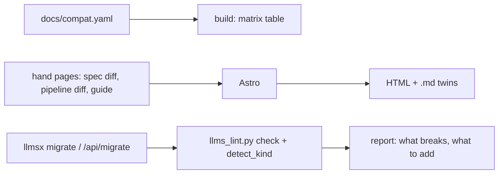

# 11 — V2 vs V1

**Status:** design, not implemented · **Date:** 2026-08-31 · **Surfaces:** web | cli (`llmsx migrate`) | api

## 1. Purpose

Two versioned things share the name and confuse everyone: the **llms.txt spec** (v1 →
v2, modified 2026-08-10) and the **hub's own pipeline** (V1 site dumps → V2 acquisition +
refine + dual index + gate). This component explains both side by side, ships a migration
guide and a compatibility matrix, and backs it with a `migrate` check that tells a V1 file
owner exactly what breaks.

## 2. User stories and flows

- *Publisher with a 2025 file*: "Is my `llms.txt` still valid?" → matrix → `llmsx migrate
  https://…/llms.txt` → list of what changed for them (usually: nothing required, twins and
  headers recommended, `## Optional` no longer mechanical).
- *Hub user*: "What happened to the distilled folders?" → the pipeline page: V1 artifacts
  (`.pages/`, `_master.md`, `_distill_index.json`) are retired once a fact layer exists
  (`docset_rollout cleanup`); V2 layout explained.
- *Tool author*: "Which grammar do consumers expect?" → the matrix rows for full-file
  grammars and discovery headers.

## 3. Inputs → outputs (content outline)

### (a) The spec: v1 → v2

| Rule | v1 | v2 (2026-08-10) | Effect on an existing file |
|---|---|---|---|
| Required elements | H1 + blockquote + sections implied | **H1 only** required; blockquote/prose/sections optional | none; 01 still scores I2 as Medium when the blockquote is missing (quality, not validity) |
| Placement | `/llms.txt` at site root | root **or any subpath**; a file covers the URLs under its path; **most-specific wins** | enables families and split roots (`<section>/llms.txt`) |
| Discovery | none | `Link: <…>; rel="describedby"` on files; `rel="alternate" type="text/markdown"` on HTML pages | add headers (03 serving guide) |
| Markdown twins | `page.html.md` | `page.html.md` **or** `page.md` | either form passes P2 |
| `## Optional` | mechanical: skippable when context is short (consumed by `llms_txt2ctx`) | **convention** for secondary information; `llms_txt2ctx` and its context-expansion mechanics removed from the proposal | keep it last; nothing mechanical depends on it |
| BOM | — | optional BOM tolerated | 01 P14 strips it as hygiene |
| Consumption expectation | expand the file into context | "view or search the index, then follow links"; the index stays small; detail lives behind links | size ladder (small/full) becomes the producer's job |

Source: `skills/document-formats/references/llms-txt.md` §2 and llmstxt.org/changes.

### (b) The hub pipeline: V1 → V2

| Stage | V1 (to 2026-08-29) | V2 (from 2026-08-30) |
|---|---|---|
| Acquire | trafilatura BFS crawl → banner mirror | ladder in `hub/scripts/llms_acquire.py`: `llms-full.txt` → `llms.txt` + `.md` twins → `Accept: text/markdown` → docs API → structured crawl (banner mirror stays the internal format) |
| Clean | none (raw HTML→text) | `docset_refine clean`: boilerplate lines, MDX → markdown, page classes (reference/guide/changelog/marketing/index) |
| Extract | `distill_offline.py bulk` — zero-LLM, output never consumed ("hundreds of pages of repeating internal links") | `extract` (snippets, table rows → parameter, definitions, changelog changes; anchors to real source headings) + `units` (local LLM, evidence rule) + `polish` (Claude) |
| Export | none | `export_llms`: index (split over 10 KB) / full (Mintlify grammar) / small (≤ ~50k tokens) / facts / manifest; `topical`; `vocabulary` |
| Index | one raw vector layer (`nomic` in hub.db for files; `mxbai` for docsets) | raw **and** facts vector layers + FTS5 keyword layer per layer (`docset_indexer keyword-index`) |
| Serve | `web-text-mirror --serve` (HTML) | `llms_serve.py`: `/llms.txt`, `/d/<stem>/…` (+ sections), `/m/<key>/…`, `/t/<slug>/…`, markdown headers |
| Gate | none | `llms_lint.py` (P0–P15 deterministic passes) inside `docset_rollout cleanup`; `/ldo` for the model/live passes |
| Artifacts | `<stem>.pages/`, `_master.md`, `._distill_index.json` | `<stem>.reference/{pages.json, structured.jsonl, units.jsonl, all_units.jsonl}`, `<stem>.llms/` |

Source: `hub/docs/specs/2026-08-30-docset-reference-extraction-design.md`,
`2026-08-30-llms-txt-as-docset-schema-design.md`, `logs/memory-hub.md` v1.1.44–1.1.56.

### Migration guide (page)

1. Run `llmsx migrate <url|file>` (§5). 2. If the report says *full file wearing the wrong
name* (P0/I6: page bodies inside `llms.txt`, > 100 KB): split into `llms.txt` + `llms-full.txt`
with `docset_refine export` (02). 3. Add `.md` twins and the two `Link` headers. 4. Move
skippable material to a trailing `## Optional`. 5. If the index is > 10 KB: hub-and-spoke split.
6. Re-lint (01). 7. For hub users: run `extract → render → export` on each mirror, then
`docset_rollout cleanup` to retire V1 artifacts.

### Compatibility matrix (page)

Rows = producer choices (v1 file, v2 file, split root, family, Mintlify/YAML/Cloudflare
full grammars); columns = consumers (Claude Code, Cursor, generic MCP client, `llms_acquire`,
01 lint, Lighthouse agentic audit); cell = works / degraded (why) / breaks. Generated from a
YAML fixture so a new consumer is one row.

## 4. Architecture

`migrate` is 01's lint with a V1→V2 lens: findings mapped to the matrix rows (I6 → "split",
N6 twin probe → "add twins", H3 → "add headers", N4 → "Optional last"). Reuses
`hub/scripts/llms_lint.py::detect_kind`, `pass_structure`, `pass_links`, `pass_size` and the
`llms_acquire.probe` twin/`Accept` probes.

## 5. API / CLI / MCP surface

`POST /api/migrate {url|text}` → `{kind, spec_version_guess, findings[], steps[]}`;
`llmsx migrate <url|file> [--json]`; MCP: none beyond 01.

## 6. UI

Three tabs (Spec v1→v2 / Hub pipeline / Migrate). Migrate tab = URL box → report with
numbered steps, each linking to the guide section and, where a tool does the step, the 01/02
action. Empty state: a v2-clean file → "nothing required; 2 recommendations". Error: fetch
failed → show HTTP status and the serving-guide link.

## 7. Data model and storage

Static pages + `docs/compat.yaml`. `migrate` is stateless (cached 1 h by URL).

## 8. Tiering, metering and billing hooks

Free; `migrate` shares 01's free-lint limits (size, rate).

## 9. Acceptance bar

- Matrix covers every grammar and route the hub produces; each cell has a test in `hub/tests/`
  (existing `test_llms_acquire.py`, `test_llms_lint.py`, `test_llms_serve.py` cases referenced by id).
- `migrate` on the 15 `outputs/exports` roots → "nothing required" for all (they are v2).
- `migrate` on a synthetic v1 fixture with page bodies → reports "split" as step 1.

## 10. Security, rights, privacy

`migrate` fetches only the given URL (no crawl), 10 s timeout, size cap 10 MB, no storage of
fetched content beyond the cache.

## 11. Dependencies

01 (lint engine), 02 (split/export action), 03 (serving guide, changelog), 14.

## 12. Open questions and assumptions

- "V2" for the hub is a naming choice made here; the code has no version constant — assumed acceptable to date it (2026-08-30) rather than number it.
- Consumer behaviour cells (Cursor ceiling, Claude Code fetch) are dated evidence and need re-verification every 90 days.
