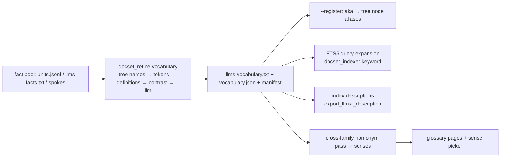

# 12 — Vocabulary (`llms-vocabulary.txt`)

**Status:** design, not implemented · **Date:** 2026-08-31 · **Surfaces:** web | api | cli | mcp

## 1. Purpose

The lexical layer of a conceptual family: the words a field uses, what each means *here*, how
it differs from its neighbours, and what people say instead. Neither index nor facts — it is
what makes both findable (query expansion) and unambiguous (senses). "Cookie" is an HTTP state
token in web docs, a monster in one children's canon, a snack in a recipe corpus; a vocabulary
file pins which sense a family means and lets an agent switch families without guessing.

## 2. User stories and flows

- *Agent*: query "cookie expiry" against a web docset → the FTS5 layer expands through `aka:`
  (session cookie, Set-Cookie) and the sense pinned to the family drops the snack.
- *Author of a topical file*: builds the vocabulary from their fact pool, approves the
  proposed terms, registers `aka:` lists onto the tree node's `aliases` (`--register`), and the
  topical builder's keyword pass starts matching synonyms.
- *Reader*: opens a family's glossary, picks a term, sees senses across families ("this word
  means X here, Y there"), the canonical definition with its source anchor, `not:` contrasts,
  antonyms, and where the term appears (units count).
- *Concept abstractor (06)*: seeds its lexicon from the family's vocabulary (synonyms,
  parts, sub-types, contrasts) before harvesting.

## 3. Inputs → outputs (content outline + grammar)

**Intro pages**: what a vocabulary file is; sources in trust order; the sense model; how the
three consumers use it; how to build one for your own field (walkthrough with the llms.txt
family: index / full / small / facts / twin / describedby / family / split root / unit / anchor).

**File grammar** (`llms-vocabulary.txt`, spec-v2-shaped so any llms reader can open it):

```
# <Family> — vocabulary
> <n> terms of <family>; canonical name, definition, how it differs (not:), what people say instead (aka:). Each line anchored to the unit it came from.
<!-- generated by docset_refine vocabulary vN · <date> · sources: … -->

## Terms
- **<term>** [<sense-id>] (<pos>): <definition> — <url#anchor> · aka: a, b · not: <neighbour> — <how it differs> · ant: <antonym> · broader: <term> · narrower: <term>, <term> · related: <term> · measure: <unit> · field: <family-slug> · verified-as-of: <date>

## Homonyms
- **cookie** [web.cookie] · [folklore.cookie-monster] · [food.cookie]: <one line per sense with its family> — the sense picker's data

## Named, not yet defined
- <term> — seen in <n> units, no definition unit found (evidence rule)
```

Rules: one line per term per sense; `definition` must come from a kept unit (its anchor is the
line's source); `aka:` entries are surface forms that appeared in the pool (backticked tokens
clustered by normalised spelling; the most frequent surface is canonical); `not:` from contrast
cues (not / unlike / vs / rather than / instead of); `ant:` explicit antonyms; **contranyms**
(a word whose senses oppose each other, e.g. "sanction", "cleave", "oversight") are two sense
lines under `## Homonyms` marked `contranym`; a term with no evidence goes to *Named, not yet
defined* and never gets a model-invented definition.

**JSON twin** (`vocabulary.json`): `{family, generated, terms:[{term, sense_id, pos, definition,
source:{url,anchor}, aka[], not:[{term, differs}], ant[], broader[], narrower[], related[],
measure, field, hits, sources, verified_as_of, origin: tree|token|definition|contrast|llm}],
homonyms:[{term, senses:[sense_id…], contranym: bool}], undefined:[{term, hits}]}`.

**Sense model**: `sense_id = <family-slug>.<term-slug>`; a term is disambiguated by the pair
(term × family). Cross-family homonyms are discovered by matching term slugs across
vocabularies; an agent scoped to a family gets that family's sense; an unscoped query gets
the sense picker.

Sources in trust order (from `hub/scripts/docset_refine/vocabulary.py`): 1 tree node names +
existing `aliases`; 2 backticked tokens clustered by normalised spelling; 3 `definition` units
and "X is/are …" sentences → definitions, contrast cues → `not:`; 4 `--llm` (local Ollama)
writes a missing definition/differentiator from ≤ 6 units that mention the term — every name it
returns must appear in those units or it is dropped.

## 4. Architecture



Reused: `hub/scripts/docset_refine/vocabulary.py` (the builder), `topical.py` (pool loading,
tokens), `concept_tree.py` (`aliases`, `slugs`), `docset_indexer.py::fts_match` (expansion
hook: OR the `aka:` surfaces of a matched term). Content pages are hand-written; glossary pages
are generated per family from `vocabulary.json` at build (public families) or on demand (user
families, via the API).

## 5. API / CLI / MCP surface

- `GET /api/vocab/<family>` (the JSON twin), `GET /api/vocab/<family>/<term>` (all senses of the term in that family + homonyms elsewhere), `GET /api/vocab/senses/<term>` (cross-family), `POST /api/vocab/<family>/build {pool, llm: bool, register: bool}` (job).
- `GET /t/<slug>/llms-vocabulary.txt` (already served by `llms_serve.py`).
- `llmsx vocab build --from <pool>… --family <slug> [--llm] [--register]`, `llmsx vocab lookup <term> [--family s]`.
- MCP (13): `hub_vocab_lookup(term, family=None)`; `hub_query_docset` gains `expand=true` (aka expansion).

## 6. UI

Glossary browser per family (alphabetical + by relation: synonyms / contrasts / antonyms /
homonyms), term page (definition with source anchor, `not:` table, aka chips, sense switcher
"in other families this means…", units-that-mention list), sense picker modal when a search
term is a cross-family homonym, "build vocabulary" wizard (pick pool → run → review proposed
terms with evidence counts → approve → register). Empty states: family with no vocabulary →
"build one" CTA; term with no definition → shown under *Named, not yet defined* with its hits.
Error: `--llm` unavailable → deterministic sources only, flagged.

## 7. Data model and storage

Files are the truth (`<family>.llms/llms-vocabulary.txt` + `vocabulary.json`); a Postgres
`senses` index (term_slug, family, sense_id, definition_hash) for cross-family lookup and the
homonym pass; rebuilt from files.

## 8. Tiering, metering and billing hooks

Lookups and public glossaries free. Building: deterministic sources free up to N units;
`--llm` definitions metered (local model tokens); cross-family homonym pass free (string match).

## 9. Acceptance bar

- Every line parses with the grammar above (a `llms_lint.py --kind vocabulary` pass — step 1 deliverable, master §3a); every definition has a resolvable anchor.
- Evidence rule holds: 0 model-written names absent from the cited units (sampled re-read, 20 terms).
- Query expansion measurably helps: on the P12 bank, `expand=true` raises exact-token recall without lowering precision (≥ +1 hit, 0 lost, per family).
- The llms.txt family vocabulary (pilot) ships with ≥ 40 terms, ≥ 5 `not:` contrasts, the cookie-style homonym demo across ≥ 2 families.

## 10. Security, rights, privacy

Definitions are extractive or evidence-checked; sources cited. Private families visible only to
their owner. No steering text accepted in definitions (P9 regex).

## 11. Dependencies

06 (lexicon seed / consumer), 02 (topical builder + `--register`), 09 (tree aliases, node pages), 17 (FTS5 expansion), 03 (glossary page), 01 (vocabulary lint pass).

## 12. Open questions and assumptions

- `ant:`, `broader:`, `narrower:`, `related:`, `measure:` are proposed extensions to the current builder output (today: definition, `not:`, `aka:`); assumed to come from the abstractor's relation taxonomy.
- Sense ids keyed by family may split a term that is actually one sense across two families — a "same-as" link between senses is left open.
