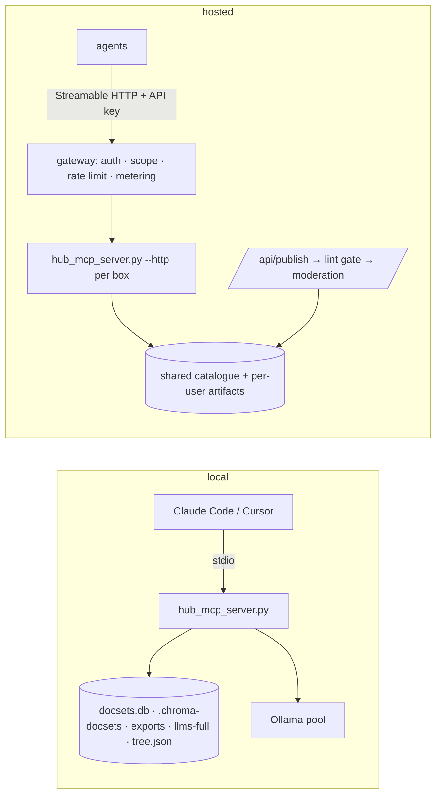

# 13 — MCP server: run it locally, use the hosted one, contribute to it
**Status:** design, not implemented · **Date:** 2026-08-31 · **Surfaces:** mcp | api | cli | web

## 1. Purpose

Turn the hub's `mcp-server/hub_mcp_server.py` into a product with three doors: (a) run the
same server on your own machine over your own docsets; (b) connect an agent to the hosted
server (`https://mcp.llms-explorer.<domain>/mcp`) with an API key and use the shared catalogue
plus your private artifacts; (c) contribute — publish an export, topical file, concept pack or
vocabulary into the shared catalogue once it passes the `/ldo` lint gate. Same tool names on
every door, so a Claude Code / Cursor config only changes its URL.

## 2. User stories and flows

| # | As a… | I want to… | Flow |
|---|---|---|---|
| M1 | developer | point Claude Code at my local hub and query my docsets | `.mcp.json` stdio entry → `hub_query_docset` |
| M2 | agent user | read the shared llms catalogue without installing anything | hosted URL + key → `hub_llms_full_list`, `hub_docset_index`, `hub_concept_*` |
| M3 | paying user | run keyword/hybrid/semantic queries over my own uploaded docset | key with `run` scope → `hub_index_docset` (job) → `hub_query_docset(mode=…)` |
| M4 | contributor | publish my topical file so everyone's agents can read it | `POST /api/publish` → lint gate → moderation → appears under `/t/<slug>/` and in `hub_llms_full_list` |
| M5 | operator | keep owner-only tools off the hosted surface | tool inventory with tier column (§5); server refuses by scope |

Flow M4: upload or point at a job artifact → `llms_lint.py check` (P0–P15 deterministic) must
report 0 High → provenance banner injected → rights check (§10) → queued for moderation →
approved items get a catalogue entry (`catalog.json` shape: key, url, name, site, category,
description, sources) with `sources: ["contributed:<user>"]`.

## 3. Inputs → outputs (contracts and file grammars)

- **Local**: inputs are the hub stores — `.chroma-docsets/` + `docsets.db` (vectors, raw pages,
  FTS5 `kw` table), `text-mirror/<stem>.llms/` exports, `llms-full/{catalog,manifest}.json` +
  `files/`, `concept-tree/tree.json`, Ollama at `HUB_OLLAMA_URLS`. Outputs are the tool
  replies as documented in `hub/docs/MCP.md`.
- **Hosted**: same tools; every reply that carries a served URL uses the public base
  (`https://llms-explorer.<domain>/d/…`, `/m/…`, `/t/…`, `/u/<user>/…`) with the `llms_serve.py`
  headers (`text/markdown; charset=utf-8`, `X-Markdown-Tokens`, `Link: <root>; rel="describedby"`).
- **Contribute**: accepted artifact kinds and their grammar gates —

| Kind | Files | Gate |
|---|---|---|
| docset export | `llms.txt` (+ split sections), `llms-small.txt`, `llms-facts.txt`, `manifest.json`; `llms-full.txt` only if the contributor owns the site | `llms_lint.py check <dir>` 0 High; manifest bytes ± 2% |
| topical file | `llms.txt`, `llms-facts.txt`, `llms-vocabulary.txt`, `manifest.json` (`docset_refine topical` output) | same + every unit line `- [type] text — url#anchor` parses |
| concept pack | the abstractor's `<slug>.llms/` (index, full catalogue, small, facts, vocabulary, `concept-graph.json`, `manifest.json`) | same; `manifest.rights` present |
| vocabulary | `llms-vocabulary.txt` + `vocabulary.json` | vocabulary grammar; every term anchored |

Provenance banner (injected, HTML comment on line 1–3): generator, contributor handle,
date, source hosts, `verified-as-of`.

## 4. Architecture (mermaid diagram + existing hub code reused, by path)



Reused: `mcp-server/hub_mcp_server.py` (18 tools — inventory in `hub/docs/MCP.md`; `--http [port]` mode; `_get_store()` cache;
`_OUTPUT_CAP` 200k chars), `hub/docs/MCP.md` env table, `.mcp.json` wiring,
`libraries/mcp-library/registry.json`, `scripts/llms_serve.py` (headers, routes),
`scripts/llms_lint.py` (gate), `scripts/llms_full_catalog.py` (`catalog.json` entry shape,
`list_entries`, `read_entry`), `scripts/docset_indexer.py` (`keyword-index`, `keyword`,
`resolve_layer`), `scripts/replicate_docsets.py` (one-writer push — the hosted store stays
single-writer per box).

New: the gateway (FastAPI middleware in explorer-api: key → user → scopes → per-tool policy →
usage row), per-user store namespacing (`docset` keys prefixed `u_<user>__`), the publish
pipeline, the moderation queue.

## 5. API / CLI / MCP surface

Tool inventory (hosted). Tier: **public** = no key, read-only, rate-limited; **read** = key
with read scope; **run** = key with run scope, metered; **owner** = hub owner only (not
exposed hosted); **absent** = not registered on the hosted server.

| Tool | What | Hosted tier | Metered unit |
|---|---|---|---|
| `hub_llms_full_list` | catalogue listing | public | — |
| `hub_list_docsets` | list indexed docsets (public + own `u_<user>__*`) | public | — |
| `hub_llms_full_read` | slice/page of a mirrored file | index: public; pages: claimed-site owner only (master D8) | — |
| `hub_concept_search`, `hub_concept_subtree`, `hub_concept_family`, `hub_concept_artifacts` | tree API additions (09 §5, step 2) | public | — |
| `hub_directory_score` | conformance score for a directory entry (10 §5, step 2) | public | — |
| `hub_docset_index` | exported llms.txt / small / facts / manifest / `<section>/llms.txt` | public | — |
| `hub_concept_tree` / `hub_concept_lookup` / `hub_concept_frontier` | tree reads | public | — |
| `hub_concept_queue` | park a concept | read (private tree) / publish (public tree, moderated) | — |
| `hub_query_docset(mode=keyword)` | FTS5 lookup | read | free, quota/day |
| `hub_query_docset(mode=semantic\|hybrid)` | embedding query | run | embedding tokens |
| `hub_ask` | federated answer with LLM | **absent hosted in v1** (master D5) — local only | — |
| `hub_index_docset` | index a mirror (job) | run | embedding tokens + storage |
| `hub_search_codebase` / `hub_search_symbols` / `hub_route` | hub-internal corpora | absent hosted (local only) | — |
| `hub_delete_docset` | destructive | run (own `u_<user>__*` keys only, `confirm=true`; master D5) | — |

**`explorer_*` job tools** (site-level; each starts a Job of the named kind — master §4):

| tool | job kind | tier | metered unit |
|---|---|---|---|
| `explorer_lint` | lint | account | — (deterministic) |
| `explorer_optimize` | optimize | run | model tokens |
| `explorer_job` | — (status/events) | account | — |
| `explorer_abstract` | abstract | run | embeddings + model tokens |
| `explorer_concept_pack` | pack (read a finished pack) | account | — |
| `explorer_deepen_plan` | deepen (`--plan-only`) | account | — |
| `explorer_deepen` | deepen | run | model tokens |
| `explorer_deepen_diff` | — (read a run's diff) | account | — |
| `explorer_family_map` | family | run | model tokens |
| `explorer_family_explore` | family (loop) | run | model tokens |
| `hub_distill_run` | offline stages on the hub | absent hosted | — |
| `hub_memory_search` / `hub_memory_stats` | owner's memory pyramid | absent hosted | — |

Hosted endpoint: `POST https://mcp.llms-explorer.<domain>/mcp` (Streamable HTTP), header
`Authorization: Bearer <api key>`; public tier allows unauthenticated calls to public tools at
60 req/min per IP. REST twins for everything under `/api/mcp/<tool>` so the CLI (`llmsx mcp
call <tool> --json …`) and web playground share the code path.

Client setup (config JSON only):

```json
// Claude Code — local (.mcp.json)
{"mcpServers": {"global_ai_hub": {"command": "/Users/me/.global-ai-hub/.venv/bin/python",
  "args": ["/Users/me/.global-ai-hub/mcp-server/hub_mcp_server.py"],
  "env": {"HUB_OLLAMA_URLS": "http://127.0.0.1:11434=1"}}}}
// Claude Code — hosted
{"mcpServers": {"llms_explorer": {"type": "http", "url": "https://mcp.llms-explorer.example/mcp",
  "headers": {"Authorization": "Bearer lx_…"}}}}
// Claude Desktop (claude_desktop_config.json) — hosted via mcp-remote
{"mcpServers": {"llms_explorer": {"command": "npx", "args": ["-y", "mcp-remote",
  "https://mcp.llms-explorer.example/mcp", "--header", "Authorization: Bearer lx_…"]}}}
// Cursor (.cursor/mcp.json) — hosted
{"mcpServers": {"llms_explorer": {"url": "https://mcp.llms-explorer.example/mcp",
  "headers": {"Authorization": "Bearer lx_…"}}}}
```

## 6. UI (pages, states, empty/error states)

- `/mcp` — three cards: Run locally (install steps, env table from `MCP.md`, copy-paste
  configs), Connect (create key → config snippet with the key filled), Contribute (upload /
  pick artifact → gate result → submit).
- `/mcp/playground` — call any public/read tool with a form, see the JSON reply and the
  served URLs; shows the metered cost preview for run-tier tools.
- `/mcp/keys` — keys with scopes, last used, revoke.
- `/mcp/contributions` — mine: pending / approved / rejected with the lint report; public
  moderation queue for the owner.
- States: gate failed → the lint report inline (pass/attr/severity/msg, from `llms_lint.py
  --json`), fix hints link to 01; rights refused → explanation (§10); rate-limited → 429 with
  tier upgrade link.

## 7. Data model and storage

`api_keys(id, user_id, prefix, hash, scopes[], created, last_used, revoked)`;
`mcp_calls(id, key_id, tool, mode, tokens_in, tokens_out, cost, ms, at)` (the ledger source
for 15); `contributions(id, user_id, kind, slug, dir, lint_json, rights_json, state, reviewer,
decided_at)`; per-user artifacts on disk under `/u/<user>/<slug>.llms/` (served by
explorer-api's `/u/` route mirroring `/d/` — master §3a); shared catalogue = the hub's
`llms-full/catalog.json` + a `contributed/` section, single writer (the publish pipeline),
replicated by `replicate_docsets.py` push.

## 8. Tiering, metering and billing hooks

Public tools free and keyless (rate-limited). `keyword` queries free within a daily quota (15
sets K). Embedding-backed and LLM-backed tools metered per token; `hub_index_docset` also
meters storage (MB·month). Contributions are free and earn a credit (assumed: the catalogue
grows from contributions; credit size in 15's open questions). Local run is free forever — it
is the user's own hardware.

## 9. Acceptance bar (measurable)

- Same tool names, same JSON shapes on stdio and hosted for the public/read tools (contract
  test replays 30 calls both ways, diffs only the base URL).
- Gateway refuses owner/absent tools with a clear error, 100% (test).
- Publish pipeline: an artifact with any High finding is rejected with the finding; an
  approved artifact is served with the provenance banner and correct headers within 60 s.
- Hosted p95 latency: public tools < 200 ms, keyword < 300 ms, semantic < 2 s (Ollama warm).
- Rate limiting verified per tier with a load test; no tool exposes a hub-internal path.

## 10. Security, rights, privacy

- Trust model changes from localhost-only (the hub's) to gateway-authenticated; the server
  process itself still binds 127.0.0.1 behind the tunnel. Keys are hashed; scopes enforced per
  tool; every call logged.
- Namespacing: a user only sees `u_<user>__*` docsets, own trees, own artifacts, plus the
  shared catalogue.
- Rights: a third-party site's `llms-full.txt` is never republished — hosted
  `hub_llms_full_read` serves the generated index publicly and the pages only to the site's
  claimed-site owner or under the internal marker (master D8; the catalogue's `rights` flag is
  informational — the directory links to the source's own URL); index +
  facts are what contributors may publish; full text only when the contributor is the site
  owner (domain verification via DNS TXT or the site's own `llms.txt` linking back).
- Provenance banner mandatory; steering spans (P4) rejected at the gate; secrets (P5) rejected.
- Privacy: uploaded docsets are private by default; deleting an account deletes its namespace.

## 11. Dependencies on other components (by number)

01 (lint gate), 09 (tree tools), 15 (keys, metering, tiers), 10 (contributions update
directory conformance), 02/06/12 (artifact kinds), 17 (semantic index behind
`mode=semantic|hybrid`), 00 platform (gateway, jobs, tunnel).

## 12. Open questions and assumptions

- Assumed Streamable HTTP is the transport the current `mcp` package supports in `--http`
  mode; if it is SSE-only today, the gateway terminates Streamable HTTP and proxies.
- Assumed `mcp-remote` for Claude Desktop until it supports remote servers natively.
- Open: contribution credit size and whether approved contributors get a "verified" badge.
- Decided (master D5): `hub_ask` is not hosted in v1. Was open: whether to expose it at all (it is the most expensive tool; maybe
  paid tiers only).
- Decided (master §5): per-user stores and `/u/` pin to the M5; public reads may hit any follower. Was open: multi-box routing — which box answers a hosted query (the docset store is single-writer
  on M5 with rsync followers; reads can go to any follower).
