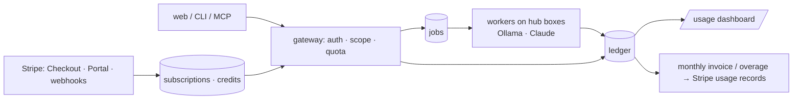

# 15 — Accounts, API keys, tiers and billing
**Status:** design, not implemented · **Date:** 2026-08-31 · **Surfaces:** web | api | cli | mcp

## 1. Purpose

Let anyone read everything that is already public (reference, blog, tree, directory, served
llms files) for free, and charge — profitably — for the things that spend model tokens or GPU
time on the user's behalf: lint with model passes, notes→llms, concept packs, deepen runs,
semantic queries, indexing. One ledger records every token; Stripe turns the ledger into money.

## 2. User stories and flows

| # | As a… | I want to… | Flow |
|---|---|---|---|
| B1 | visitor | read and browse with no account | free tier, no key |
| B2 | new user | sign up with GitHub and get a key | OAuth → account → `/keys` → key with `read` scope |
| B3 | user | lint a small file free, pay when I run the model passes | `/lint` free ≤ 64 KB deterministic; "run model passes" → 402 until credits |
| B4 | paying user | buy a monthly bundle and see what I used | Stripe Checkout → subscription → `/usage` dashboard |
| B5 | user | never be surprised by a bill | hard stop at quota; overage only if opted in; per-job cost preview |
| B6 | user | not pay for a job that failed | verify-gate failure → polish tokens not billed (§8) |
| B7 | owner | know every job's margin | ledger rows carry unit cost and price |

Sign-up: email + passkey (WebAuthn) or OAuth (GitHub, Google); no passwords. Keys: `lx_<prefix>_<secret>`,
shown once, scopes `read` (queries within quota, read own artifacts), `run` (create jobs, metered),
`publish` (contribute to the shared catalogue, 13). Orgs/teams: later (schema reserves `org_id`).

## 3. Inputs → outputs (contracts and file grammars)

Ledger row (the contract every metered component writes):
```json
{"id": "led_…", "user_id": "…", "job_id": "job_…|null", "call_id": "mcp_…|null",
 "component": "01|02|06|07|08|13|17", "model": "qwen3.5:35b|mxbai-embed-large|claude-opus-4-8|claude-sonnet-5",
 "kind": "input|output|embedding|storage_mb_month",
 "units": 12345, "unit_cost_usd": 0.0000012, "price_usd": 0.0000045, "billable": true,
 "reason": "polish|bulk|verify|query", "at": "2026-08-31T04:00:00Z"}
```
Price list (assumed starting points, owner-tunable in Postgres `prices`):

| Model / unit | Marginal cost | Price | Note |
|---|---|---|---|
| Ollama `qwen3.5:35b` tokens (bulk) | ≈ $0.10 / 1M (power + amortised GPU) | $0.50 / 1M | in/out same |
| Ollama `mxbai-embed-large` embeddings | ≈ $0.02 / 1M tokens | $0.10 / 1M | indexing, semantic queries |
| Claude Sonnet 5 tokens | API list price | list × 3 | polish, descriptions |
| Claude Opus 4.8 tokens | API list price | list × 3 | judgment passes (P4/P8/P12), deepen |
| Storage | ≈ $0.005 / MB·month | $0.02 / MB·month | uploaded docsets + artifacts |
| Keyword query | ≈ 0 | free | quota/day per tier |

## 4. Architecture (mermaid diagram + existing hub code reused, by path)



Reused: the hub's own cost signals — `pipeline_manager` stage timeouts and per-host
placement (`BoxPool`), `embed_core` pool weights (which box embedded), `docset_refine units`
token accounting (`CHARS_PER_TOKEN`, `MAX_PREDICT`), `export_llms` manifest token counts
(`chars/4`), `llms_lint.py --json` (deterministic passes are free — no model), the
convergence contract's telemetry row (`optimizer-telemetry.jsonl`: per-iteration tokens) for
`/ldo` runs. New: `explorer-api/billing/` (Stripe client, webhook handler, ledger writer,
quota check), Postgres schema below, usage dashboard island.

## 5. API / CLI / MCP surface

| Method | Path | Purpose | Tier |
|---|---|---|---|
| POST | `/api/auth/passkey/*`, `/api/auth/oauth/{github,google}` | sign in | — |
| GET/POST/DELETE | `/api/keys` | list / create (scopes) / revoke | account |
| GET | `/api/usage?from&to` | ledger aggregates by component/model/day | account |
| GET | `/api/jobs/<id>` | state + cost so far + cost preview | account |
| POST | `/api/billing/checkout` `{plan}` | Stripe Checkout session URL | account |
| GET | `/api/billing/portal` | Stripe customer portal URL | account |
| POST | `/api/billing/webhook` | Stripe events → subscriptions/credits | Stripe only |
| GET | `/api/billing/plans` | public price table | free |

CLI: `llmsx login`, `llmsx keys create --scopes read,run`, `llmsx usage [--month]`,
`llmsx jobs <id>`, `llmsx billing portal`. MCP: no billing tools; a metered tool call on an
exhausted quota returns a structured error `{code: "quota", tier, upgrade_url}`.

Feature → tier → metered unit:

| Feature | Free | Starter ($9/mo) | Pro ($39/mo) | Metered unit |
|---|---|---|---|---|
| Reference, blog, directory, public tree, 3D view | ✓ | ✓ | ✓ | — |
| Served llms files (`/d/ /m/ /t/`) | ✓ (public by design) | ✓ | ✓ | — |
| Lint, deterministic passes (01) | files ≤ 64 KB, 20/day | unlimited | unlimited | — |
| Lint, model passes P4/P8/P12 (01) | — | credits | credits | Claude tokens |
| Keyword queries (13/17) | 200/day | 5k/day | 50k/day | — |
| Semantic / hybrid queries (13/17) | — | credits | credits | embedding tokens |
| Notes → llms (02), topical builds | — | credits | credits | Ollama + Claude tokens |
| Concept pack (06), deepen (07), family explore (08) | — | credits (Ollama) | credits (Ollama + Claude) | tokens |
| Index a docset (13/17) | — | 3 docsets, 200 MB | 25 docsets, 5 GB | embedding tokens + storage |
| Private trees (09) | 1 (fork) | 3 | 20 | — |
| Publish to shared catalogue (13) | — | ✓ | ✓ | — |
| Monthly included credits | $0 | $10 | $50 | — |
| Overage | — | opt-in, at price list | opt-in, at price list | tokens |

## 6. UI (pages, states, empty/error states)

`/account` (profile, passkeys, OAuth links, delete account), `/keys` (create with scopes,
copy-once modal, revoke), `/usage` (spend by day / component / model, credit balance, hard-stop
indicator, CSV export), `/billing` (plan, Checkout buttons, portal link, invoices), job pages
show "estimated cost" before run and "billed" after. Empty states: no usage yet → link to
the free lint; quota hit → what resets when; payment failed → grace period banner (7 days
read-only on paid features).

## 7. Data model and storage

Postgres: `users(id, email, created, org_id)`, `auth_passkeys`, `auth_oauth`, `api_keys`
(13), `plans(id, price_usd, included_credit_usd, quotas jsonb)`, `subscriptions(user_id,
plan_id, stripe_sub_id, state, period_start, period_end)`, `credits(user_id, balance_usd,
updated)`, `ledger` (§3), `jobs` (00), `stripe_events(id, type, payload, processed_at)`
(idempotency), `prices(model, kind, unit_cost_usd, price_usd, effective_from)`.
Retention: ledger 24 months (tax), job artifacts per plan (free 30 days, paid while
subscribed + 90 days), uploads deleted with the account.

## 8. Tiering, metering and billing hooks

- Every worker wraps model calls: Ollama via `embed_core`/`docset_refine.units.llm_options`
  (token counts from the Ollama response `prompt_eval_count`/`eval_count`), Claude via the SDK
  usage block. One ledger row per call; job rows sum them.
- Quota check before a job starts (estimate = input chars/4 × passes × price); hard stop when
  balance + overage allowance < estimate; jobs check balance again at each iteration boundary
  (the convergence loop's natural checkpoint) and exit `BUDGET_EXHAUSTED` cleanly — artifacts
  written so far are kept.
- Failed at a verify gate (`/ldo` blind re-audit dissent, lint High after apply, agent test
  below bar): bulk tokens billed, polish/judgment tokens of the failed iteration
  `billable=false` — the user paid for work that produced nothing they can use.
- Stripe: Checkout for subscriptions, Customer Portal for cards/cancel, webhooks
  (`invoice.paid` → credit top-up, `customer.subscription.updated/deleted` → plan change,
  `invoice.payment_failed` → grace); overage pushed as Stripe usage records daily.
- Profitability: target price ≥ 3× marginal cost. Worked example, one `/ldo` run on a 191-page
  docset with model passes: bulk descriptions/units on Ollama ≈ 2.5M tokens → cost $0.25,
  price $1.25; P4/P8/P12 on Sonnet 5 ≈ 300k in / 40k out → cost ≈ $1.50, price $4.50;
  embeddings 14k units ≈ 1.4M tokens → cost $0.03, price $0.14. Job price ≈ $5.90, cost
  ≈ $1.80, margin ≈ $4.10 (≈ 70%). GPU box fixed cost (power ≈ $30/mo) is covered after ~8 such
  jobs; Claude spend is pass-through × 3.

## 9. Acceptance bar (measurable)

- Ledger completeness: every model call in a job has a row; sum(rows) = job cost (test with a
  recorded job). Reconciliation script: ledger vs Ollama/Claude usage logs within 1%.
- No job runs without a passing quota check; a job stopped for budget leaves artifacts and a
  `BUDGET_EXHAUSTED` status, never a half-written file.
- Stripe webhook idempotency: replaying any event changes nothing (test).
- Free-tier abuse: 20 lint/day and 200 keyword/day enforced per user and per IP.
- Dashboard numbers equal `/api/usage` aggregates; invoice equals ledger for the period.

## 10. Security, rights, privacy

Passkeys + OAuth only; keys hashed (argon2), prefix-searchable, scoped, revocable; key leak
response = revoke + spend cap per key (`max_usd_day`). Served llms files are public by design —
metering is on model-backed endpoints only, so scraping the served files costs nothing but
bandwidth (Cloudflare caching). Ledger and invoices are personal data: export on request,
delete with account (ledger kept anonymised for tax). GDPR basics: privacy page, DPA for
Stripe, EU data residency not promised in v1. No card data touches the API (Stripe-hosted).

## 11. Dependencies on other components (by number)

13 (keys, MCP metering), 01/02/06/07/08/17 (metered producers), 09 (private-tree limits),
00 platform (jobs, gateway, Postgres).

## 12. Open questions and assumptions

- Assumed prices and tiers above; revisit after the first month of real ledger data.
- Assumed Ollama marginal cost from box power only (hardware already owned); a rented GPU
  changes the bulk price.
- Open: contribution credits (13) — amount, and whether they can exceed the monthly bundle.
- Open: org billing (seats vs pooled credits).
- Open: do free users get any Ollama-only credits (e.g. $1/month) to try a notes→llms build?
