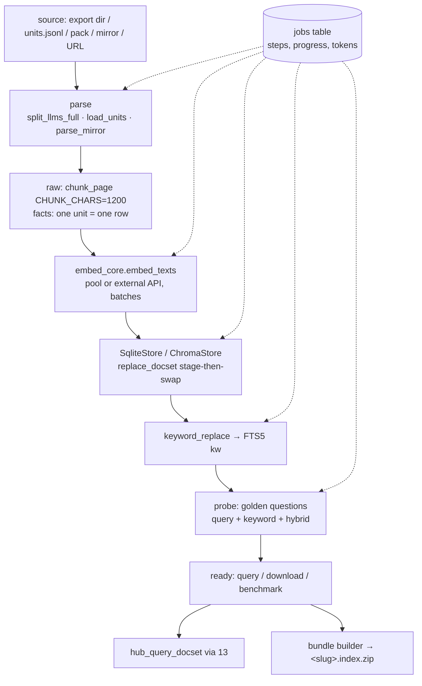

# 17 — Semantic indexer: index your own material, reproduce it locally

**Status:** design, not implemented · **Date:** 2026-08-31 · **Surfaces:** web | api | cli | mcp

## 1. Purpose

Turn any llms-family artefact — a docset export, a facts file, a concept pack (06), a notes
export (02), or a plain `llms-full.txt` — into a queryable index: a vector collection plus an
FTS5 keyword table plus a manifest, with the embedding model chosen by the user, hosted under
their account or downloaded as a bundle that runs anywhere the hub's `SqliteStore` fallback runs
(one SQLite file). Every step is shown ("what is happening") and every command is given so the
user can reproduce the whole thing on their own machine with Ollama. A benchmark harness scores
models on the user's own golden questions, so model choice is a measurement, not a guess.

## 2. User stories and flows

- **Docs owner**: uploads `docs.example.com.llms/` (from 02 or their own export) → picks
  `mxbai-embed-large` → watches chunking/embedding/keyword steps → queries it → downloads the
  bundle → wires it into their agent with the `.md` twin URLs intact.
- **Researcher**: indexes a concept pack (06) and a notes export (02) into one index → asks
  cross-source questions → exports.
- **Engineer comparing models**: indexes the same facts file with three models → runs the golden
  set → sees hit rate, latency and index size per model → keeps one.
- **Local-first user**: never uploads; copies the "reproduce" commands, runs them against the hub
  scripts in this repo with a local Ollama, gets the identical bundle.
- **Agent** (via MCP): `hub_query_docset(user_docset, q, mode="hybrid")` against the user's
  hosted index.

Flow: `choose source → choose model(s) → (estimate) → job: chunk/units → embed (batches) → store →
keyword-index → probe (golden) → ready → query / download / delete`.

## 3. Inputs → outputs (contracts and file grammars)

**Inputs** (one job = one source + one model):
- `<stem>.llms/` export dir (`llms.txt`, `llms-full.txt`, `llms-facts.txt`, `manifest.json`) —
  raw layer from the full file's page blocks (`llms_acquire.split_llms_full`, any of the four
  grammars), facts layer from the facts file's unit lines (`- [type] text — url#anchor …`).
- `units.jsonl` (docset_refine schema `{id, type, text, source_url, anchor, page_class,
  keywords, code, origin}`) — facts layer only.
- A concept pack dir (06 output contract: same files + `units.jsonl`).
- A banner mirror `====/URL:/====` (the hub's internal page format).
- Plain `llms-full.txt` URL (fetched, grammar detected; third-party → private index, §10).

**Outputs**
- Hosted index: `<user>__<slug>` (raw) and `<user>__<slug>__facts` (facts), registered in the
  user's store with `model`, `backend`, `pages`, `chunks`, `updated_at` (the hub's `docsets`
  registry row), FTS5 rows in `kw` for both layers.
- **Downloadable bundle** `<slug>.index.zip`:
  ```
  manifest.json      {slug, layers:{raw:{key,model,dims,chunks},facts:{key,model,dims,units}}, tokenizer:"unicode61", created, source:{kind,sha256}, hub_version}
  docsets.db         SQLite: docsets, chunks(text, vector JSON, model, unit_type, origin), pages(url,text), kw (FTS5)   — the SqliteStore layout
  chroma/            optional: the Chroma collection dirs when the user picked the chroma backend
  README.md          how to query it (python snippet + llmsx command), which model to embed queries with
  ```
  The single-SQLite form is the default: it needs only Python and `sqlite3` with FTS5 (the hub
  verified FTS5 on SQLite 3.53) and, for the vector leg, any embedding endpoint serving the
  recorded model.
- Benchmark report `benchmark.json`: per model `{hit@1, hit@5, mrr, keyword_hit, hybrid_hit,
  ms_p50, ms_p95, index_bytes, embed_seconds, tokens}` over the golden set.

**Model table** (allowlist; dims recorded per docset, queries refused across models):

| model | dims | where | cost note | quality note |
|---|---|---|---|---|
| `mxbai-embed-large` (default) | 1024 | Ollama, hub pool | local, free | the hub's standard for every semantic_ops store |
| `nomic-embed-text` | 768 | Ollama | local, free | the hub's `hub.db` file-index model — never mix with the above |
| `bge-m3` | 1024 | Ollama | local, free | multilingual, longer inputs |
| `text-embedding-3-small` / `-large` | 1536 / 3072 | OpenAI API | per 1k tokens | strong; API key required (user's own or metered) |
| `voyage-3` | 1024 | Voyage API | per 1k tokens | strong on code/docs; API key required |

## 4. Architecture (mermaid diagram + existing hub code reused, by path)



Reused: `hub/scripts/docset_indexer.py` (`parse_mirror`, `chunk_page`, `load_units`,
`docset_key`, `facts_key`, `SqliteStore`/`ChromaStore` with `replace_docset`, `keyword_replace`,
`keyword_query`, `query`, `docset_model`, `dump_chunks`, `resolve_layer`, `fts_match`),
`hub/scripts/embed_core.py` (weighted pool `HUB_OLLAMA_URLS`, `embed_model`, batch embedding,
`EmbeddingUnavailable`), `hub/scripts/llms_acquire.py` (`split_llms_full`),
`hub/scripts/replicate_docsets.py` (the push pattern, for moving a user index between boxes),
`hub/scripts/box_schedule.py` / `quiet_hours_enforce.py` (the pool respects the work laptop's
quiet hours — jobs show "waiting for capacity"), `hub/docs/specs/2026-08-30-docset-golden-baseline.md`
(golden-set format and scoring). New: `explorer-api/indexer/{jobs,bundle,benchmark,models}.py`,
external-embedding adapters (OpenAI, Voyage) behind the same `embed_texts` signature, the
per-user store path `stores/<user>/docsets.db` + `stores/<user>/chroma/`.

Stage-then-swap is kept: a job populates a staging key and swaps on success, so a failed embed
never leaves a half index queryable.

## 5. API / CLI / MCP surface

| Surface | Call | Notes |
|---|---|---|
| REST | `POST /api/index {source:{kind,url|upload_id|artifact_id}, model, layers:[raw,facts], backend:sqlite|chroma, golden?:[…]}` → `{job_id, estimate:{tokens,seconds,usd}}` | estimate first when `?dry_run=1` |
| REST | `GET /api/index/jobs/<id>` | `{step, progress:{done,total}, tokens, seconds, log_tail[], error}` — steps: parse, chunk, embed, store, keyword, probe |
| REST | `GET /api/index/<key>` | manifest: model, dims, layers, counts, golden score, size |
| REST | `POST /api/index/<key>/query {question, mode, layer, top}` | same hit shapes as 16 / MCP |
| REST | `GET /api/index/<key>/download` | signed URL to `<slug>.index.zip`, 24 h |
| REST | `DELETE /api/index/<key>` | dry run unless `confirm=true` (mirrors `hub_delete_docset`) |
| REST | `POST /api/index/<key>/benchmark {models:[…], golden:[…]}` → job → `benchmark.json` | re-embeds per model |
| CLI | `llmsx index create <path|url> --model mxbai-embed-large [--layers raw,facts] [--backend sqlite]`, `llmsx index status <job>`, `llmsx index query <key> "<q>" --mode hybrid`, `llmsx index download <key>`, `llmsx index bench <key> --models a,b,c`, `llmsx index local <path>` (runs the hub scripts locally, no upload) | |
| MCP | `hub_index_docset(mirror, layer)` (exists), `hub_query_docset(...)` (exists), `hub_list_docsets()` (exists) — scoped to the caller's store by API key (13) | |

**Reproduce-it-yourself** (rendered on the page with the user's own file names substituted):
```
# raw layer from a mirror, facts layer from units, keyword layers, then probes
.venv/bin/python scripts/docset_indexer.py index <mirror.md> --name <key>
.venv/bin/python scripts/docset_indexer.py index <stem>.reference/all_units.jsonl --units --name <key>
.venv/bin/python scripts/docset_indexer.py keyword-index <key> --layer raw
.venv/bin/python scripts/docset_indexer.py keyword-index <key> --layer facts
.venv/bin/python scripts/docset_indexer.py query <key> "why split big files" --layer facts
.venv/bin/python scripts/docset_indexer.py keyword <key> "X-Markdown-Tokens" --mode phrase
# pool + model: HUB_OLLAMA_URLS="http://127.0.0.1:11434=1" HUB_EMBED_MODEL=mxbai-embed-large
# move it to another box: replicate_docsets.py push   (M5 is the single writer)
```

## 6. UI (pages, states, empty/error states)

- `/index` (signed in) — list of the user's indexes: key, model, dims, layers, units/chunks,
  golden score, size, updated; actions query / download / benchmark / delete.
- `/index/new` — wizard: source (pick an artefact from 02/06/10-claimed site, upload a
  `<stem>.llms` zip or `units.jsonl`, or paste a URL), model (table §3 with dims/cost badges),
  layers, backend, optional golden questions (paste or pick from a prior `/ldo` bank);
  **estimate** card (tokens, minutes, cost) before "Create".
- `/index/jobs/<id>` — the "what is happening" panel: step timeline (parse → chunk → embed →
  store → keyword → probe) with counts (`embedded 3200/13382 units`), throughput, pool host in
  use, quiet-hours wait state, live log tail, cancel.
- `/index/<key>` — manifest, query box (three legs like 16), golden score, "download bundle",
  "reproduce locally" tab with the exact commands and the README the bundle carries,
  "benchmark" tab (bar charts per model: hit@5, latency, size).
- States: estimate exceeds quota → blocked with upgrade path; embedding endpoint down →
  job `waiting` with retry backoff, keyword layer still built and queryable; cross-model query
  attempt → clear error naming the recorded model; source parses to 0 units → job fails at
  `parse` with the lint findings (01) explaining why.

## 7. Data model and storage

Per-user hub-format store (so every hub tool works unchanged):
`stores/<user_id>/docsets.db` (+ `chroma/` when chosen) using the `SqliteStore` schema
(`docsets`, `chunks` with `vector` JSON + `model` + `unit_type` + `origin`, `pages`, FTS5 `kw`).
Postgres:

```
index_jobs(id pk, user_id fk, source jsonb, model, dims int, layers text[], backend, step enum, progress jsonb, tokens int,
           seconds int, cost_usd numeric, error text, staging_key, final_key, created_at, finished_at)
indexes(key pk, user_id fk, slug, model, dims, backend, layers jsonb{raw:{chunks},facts:{units}}, bytes bigint,
        golden jsonb{n, hit1, hit5, facts_ge_raw bool}, public bool default false, created_at, updated_at)
benchmarks(id pk, index_key fk, models text[], golden_ref, results jsonb, created_at)
bundles(id pk, index_key fk, path, bytes, sha256, expires_at)
```
Quotas: storage per tier (§8) counted from `bytes`; bundles expire after 24 h and are rebuilt on
demand. Deletion removes the store rows, chroma dir, bundle and registry row in one transaction
(the hub's `delete_docset` converges on retry).

## 8. Tiering, metering and billing hooks

| Feature | Tier | Metered unit |
|---|---|---|
| Local reproduce guide, bundle README | free | — |
| Keyword-only index (no embeddings) up to 50 MB source | free | — |
| Default-model index (`mxbai-embed-large`, hub pool) | free up to 20k units/month, then metered | embedding tokens (local rate) |
| Other Ollama models | paid | embedding tokens (local rate) |
| OpenAI / Voyage models | paid; or bring-your-own key (unmetered, we pass through) | provider tokens at cost + margin |
| Benchmark (N models) | paid | N × embedding tokens |
| Storage | free 500 MB, paid tiers 5 / 50 GB | GB-month |
| Hosted queries via API/MCP | keyword free; vector/hybrid metered beyond free daily quota | embedding tokens |
| Bundle download | free | egress fair use |

Ledger rows per job step (embed batches record model + tokens as they complete, so a cancelled
job bills only what ran). A job that fails at `probe` (golden facts < raw) still bills embeddings
but is flagged and the user is offered a re-run with the refine polish step (02) at no extra
storage.

## 9. Acceptance bar (measurable)

- Round trip: index `code.claude.com.llms/` (191 pages, 13,976 units) with the default model in
  < 6 min on the pool; keyword layers in < 5 s; bundle builds in < 30 s; the downloaded bundle
  answers the golden set with identical hits to the hosted index (byte-identical `docsets.db`
  query results).
- Cross-model safety: querying with a different model than recorded returns the error, never
  empty results (test with 768d vs 1024d).
- Golden rule enforced: facts layer ≥ raw layer on the hub's golden set for every hub docset
  re-indexed through this path.
- Benchmark harness reproduces the hub's pilot numbers for `mxbai-embed-large` within ±5 % hit@5.
- Reproduce guide: a fresh machine with Python 3.12+, SQLite ≥ 3.35 (FTS5) and Ollama runs the
  six commands from `hub/` in this repo and gets the same `kw` row count and `docsets` registry
  row as the hosted job (CI test in the repo's `hub/tests/` against a fixture mirror).
- Stage-then-swap: killing a job mid-embed leaves the previous index queryable and no staging key
  visible.

## 10. Security, rights, privacy

- Indexes are private by default; `public=true` only for sources the user owns or that are
  rights-clean (01/10 rights rule: third-party full text stays private; a public index exposes
  units/chunks ≤ 1,200 chars with source URLs, never whole pages).
- Bring-your-own API keys are stored encrypted (KMS-backed), used only for that user's jobs,
  deletable; never logged.
- Per-user stores are separate SQLite files/dirs — no cross-tenant table; MCP scoping by API
  key resolves to the user's store path (13).
- Uploaded sources are scanned by the linter's P5/P4 passes (secrets, steering) before indexing;
  P5 High blocks `public=true` until resolved.
- Quiet hours and pool weights are the hub's; user jobs never place embedding traffic on the
  work laptop during its restricted window.
- Bundle download URLs are signed and short-lived; bundles contain no account data.

## 11. Dependencies on other components (by number)

- **01** linter — source validation at `parse`, P5/P4 gating for public indexes, P11 probes.
- **02** notes→llms, **06** concept packs, **10** claimed sites — the sources.
- **09** concept tree — an index registered under a node's `llmsFile` becomes queryable from the
  node page.
- **13** MCP hosting — `hub_index_docset` / `hub_query_docset` / `hub_list_docsets` scoping.
- **15** accounts/billing — quotas, ledger, BYO keys.
- **16** intro/demo — the same query path; "reproduce this" hand-off lands here.

## 12. Open questions and assumptions

- Assumed the per-user store is a separate `docsets.db` per user rather than a shared multi-tenant
  DB — simpler isolation, more files; revisit if user count makes the file count a problem.
- Assumed external embedding providers (OpenAI, Voyage) are offered; each needs a rate-limit and
  cost table kept current — proposed to launch with Ollama models only and add providers behind
  BYO keys first.
- Open: Chroma backend for hosted indexes at all, or SQLite-only (vectors as JSON, brute-force
  cosine) with a size ceiling (~200k rows) — proposed SQLite-only at launch, Chroma for > 200k.
- Open: whether to allow re-embedding an existing hub public docset with a user-chosen model as
  a private copy (cheap, useful for benchmarks) — proposed yes, storage-metered.
- Assumed free quotas (20k units/month, 500 MB) — tune against pool capacity.
- Assumed the golden-set format is the hub's baseline spec; a UI to author golden questions may
  belong to 01's question bank instead.
