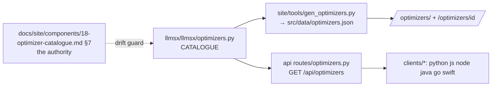

# 18 — Optimizer catalogue

**Status:** design + implemented (catalogue, site pages, `GET /api/optimizers`) · **Date:** 2026-09-01 · **Surfaces:** web | api | cli | lib

## 1. Purpose

There are nine convergence-loop optimizers in this estate and no single place that
names them. `skills/deep-optimizer-router-SKILL.md` routes between eight of them for
an agent; nothing publishes the set to a human, a client library, or an HTTP caller.
This component is that publication: **one catalogue, one shape, one authority**.

An optimizer here means the same thing it means in the router: a multi-pass
audit-and-fix loop over one artifact kind that rates every finding by severity,
applies every Medium-or-higher fix in place, verifies the result against a gate the
domain can actually check, and repeats until the exit condition holds. Not a
one-shot review. The loop and its gate are what make it an optimizer.

The ninth — and the one this platform sells — is **`ldo`, the deep llms.txt
optimizer**, which gains a mode the skill never had: a *corpus* mode that takes an
arbitrary pile of loosely related material and produces the llms family with the
widest defensible coverage of it. That mode is component 19; this component
publishes it alongside its siblings so a reader arriving at "optimizers" sees the
whole family and not one product.

## 2. User stories and flows

- *Engineer with a slow SQL query*: opens `/optimizers/`, reads nine one-line
  domains, lands on `/optimizers/dqo/`, sees the gate (`EXPLAIN ANALYZE`, plan
  improved, result set unchanged) and the alias, and knows in twenty seconds whether
  this is the tool.
- *Agent author*: `GET /api/optimizers` and gets the routing table as JSON — id,
  alias, domain, artifact kinds, gate, pass count, whether it is hosted — and writes
  a router without scraping a SKILL.md.
- *Library user*: `llmsx.optimizers()` in Python, Go, Swift, Java, Node or the
  browser returns the same nine records from the same endpoint.
- *Docs maintainer*: arrives at `/optimizers/ldo/`, follows the corpus mode straight
  into `/create/`.

Flow (web): `/optimizers/` catalogue → one page per optimizer → the ones that are
hosted link their app (`/create/`, and the lint surface of 01); the ones that are
agent-only say so and link the skill.

Flow (api): `GET /api/optimizers` → the whole catalogue; `GET /api/optimizers/{id}`
→ one record, 404 for an unknown id. Both public, both unmetered — a catalogue that
needs a key is a catalogue nobody routes with.

## 3. Inputs → outputs (contracts and file grammars)

Input: none. The catalogue is static data, versioned in the repo.

Output, one record per optimizer:

```json
{
  "id": "ldo",
  "name": "llms deep optimizer",
  "alias": "/ldo",
  "skill": "llms-deep-optimizer",
  "domain": "llms.txt, llms-full.txt, llms-small.txt, llms-facts.txt, family indexes, topical llms files",
  "artifacts": ["llms.txt", "llms-full.txt", "llms-small.txt", "llms-facts.txt", "manifest.json"],
  "passes": 16,
  "gate": "llms_lint.py deterministic gate, FTS5 keyword + vector + agent-usability probes",
  "hosted": true,
  "surface": "/create/",
  "summary": "…one paragraph…"
}
```

`id` is the alias without its slash and is the URL slug (`/optimizers/<id>/`) and the
API path segment. `hosted` is the honest field: `true` only where this platform runs
the loop for you. `surface` is the route that runs it, or `null`.

**The catalogue table in §7 is the authority.** `llmsx/llmsx/optimizers.py`
transcribes it; `llmsx/tests/test_optimizers.py` re-parses this document and fails
if the two disagree — the same drift guard 15 §5 and `api/plans.py` use.

## 4. Architecture (mermaid diagram + existing hub code reused, by path)



Reused: the router's own routing table (`skills/deep-optimizer-router-SKILL.md`) is
the source the §7 table was transcribed from; `site/tools/gen_tree.py`'s
generator-writes-JSON-that-a-page-renders shape (D9) is copied exactly, so the
catalogue pages stay build-time static like every other read-only surface.

Not reused, deliberately: nothing reads the eight sibling SKILL.md files at build
time. They live in `~/.claude/skills`, outside this repo, on one machine; a build
that reads them would be green here and broken on Cloudflare.

## 5. API / CLI / MCP surface

```
GET /api/optimizers                     → {"generated": …, "optimizers": [record, …]}   public, unmetered
GET /api/optimizers/{id}                → record | 404                                   public, unmetered
```

CLI: `llmsx optimizers` (table), `llmsx optimizers <id>` (one record), `--json` on
both. Local by default — the catalogue is in the package, so the CLI answers with no
network at all; `--api <url>` fetches the hosted copy instead.

Libraries: `optimizers()` and `optimizer(id)` on every client in `clients/`.

MCP: none. A catalogue is a document, not a tool; agents read `/optimizers/llms.txt`.

## 6. UI (pages, states, empty/error states)

- `/optimizers/` — nine rows: name, alias, domain, gate, and a `hosted` marker. The
  hosted ones lead the list; the agent-only ones follow under a heading that says so
  rather than being silently mixed in.
- `/optimizers/<id>/` — the record as prose: what it optimizes, the alias, the pass
  count, the gate it verifies against, where to run it. A hosted optimizer's page
  ends in its app link; an agent-only one ends in the skill name and the router.
- Empty/error: there is no empty state — the catalogue is static and non-empty, and
  a test asserts nine records. An unknown `/optimizers/<id>/` is a 404 from the
  static build, not a rendered "not found" page.

## 7. Data model and storage

No storage. This table is the data:

| id | name | alias | passes | hosted | gate | domain |
|---|---|---|---|---|---|---|
| `ldo` | llms deep optimizer | `/ldo` | 16 | yes | `llms_lint.py` deterministic gate; FTS5 keyword, vector and agent-usability probes | llms.txt, llms-full.txt, llms-small.txt, llms-facts.txt, family indexes, topical llms files |
| `cdo` | code deep optimizer | `/cdo` | 18 | no | build, lint and test verify gate; regressions backed out | source files and whole repositories, any language |
| `ddo` | document deep optimizer | `/ddo` | 15 | no | blind re-audit and a human-voice pass | prose documents: specs, RFCs, runbooks, KB articles |
| `pdo` | prompt deep optimizer | `/pdo` | 16 | no | injection guard and an optimization-algorithm pick | production prompts shipped in code |
| `sko` | skill optimizer | `/sko` | 15 | no | trigger eval and a hub registry sync | SKILL.md files |
| `dqo` | deep query optimizer | `/dqo` | 12 | no | EXPLAIN / EXPLAIN ANALYZE; plan improved, result set unchanged | SQL queries and files, Postgres MySQL SQLite SQL Server |
| `deso` | design deep optimizer | `/deso` | 11 | no | re-render, contrast and axe verification | graphic, brand and UI/UX screens |
| `dso` | deep strategy optimizer | `/dso` | 19 | no | project test suite and a figure-verification gate | trading strategies, their cards and backtests |
| `dmqo` | deep MongoDB MQL optimizer | `/dmqo` | 14 | no | `explain` verified; index recommendations | MongoDB find queries and aggregation pipelines |

`hosted: yes` means this platform runs the loop. Today that is `ldo` alone, whose
hosted surface is `/create/` (component 19) and whose deterministic half is 01's
lint. The other eight are agent-side skills; the catalogue names them because a
reader looking for "the optimizers" wants the whole set, and saying "we host one of
nine" is more useful than implying we host none or all.

Pass counts are the skills' own, transcribed. A skill that changes its pass count
changes this table, and the drift guard makes that a diff rather than a surprise.

## 8. Tiering, metering and billing hooks

None. `GET /api/optimizers` is public and unmetered on every tier, and the CLI
answers it from the package without a request at all. Running an optimizer is
metered — that is components 01 and 19 — but *reading which optimizers exist* is
part of the free surface, in the same class as the reference and the directory.

## 9. Acceptance bar (measurable)

- `GET /api/optimizers` returns exactly the nine records of §7, and each `id` is a
  valid URL slug and API path segment.
- The drift guard passes: `llmsx/tests/test_optimizers.py` re-parses §7 and matches
  every field of `optimizers.CATALOGUE`.
- `/optimizers/` builds, lists all nine, and links a built page for each; every
  internal link resolves (`site/tests/test_scaffold.py::test_internal_links_resolve`).
- The section has a `.md` twin and appears in the site's own `llms.txt`; the family
  still lints 0 High.
- `llmsx optimizers` prints nine rows with no network access.

## 10. Security, rights, privacy

Nothing here is user data, so there is nothing to leak. Two rights notes:

- The summaries are this repo's own prose about its own and its siblings' skills,
  not copied SKILL.md bodies. The catalogue links to a skill by name; it does not
  republish it.
- `hosted` must never be optimistic. Claiming a loop is hosted when nothing runs it
  is the one dishonest field this table could carry, so §9's acceptance ties `hosted:
  true` to a `surface` route that the build actually produces.

## 11. Dependencies on other components (by number)

- **01** — the llms linter/optimizer; `ldo`'s deterministic half and its findings
  rubric. `/optimizers/ldo/` links it.
- **19** — corpus synthesis; `ldo`'s hosted corpus mode and the `/create/` app.
- **20** — the client libraries that expose `optimizers()`.
- **03** — the reference section, where the `/ldo` attribute and pass tables already
  live; the catalogue links there rather than restating them.

## 12. Open questions and assumptions

- **Read-only payload shape.** The catalogue pages ship as build-time JSON
  (`src/data/optimizers.json`) rather than calling `/api/optimizers` at render time,
  exactly as master §12 **D9** settles for components 09, 10 and 16. The API route
  exists for libraries and agents, not for the site's own pages.
- **Assumed:** pass counts and gates are stable enough to transcribe. They change a
  few times a year; the drift guard turns each change into a one-line diff in two
  files rather than a silent inconsistency.
- **Deferred:** hosting a second optimizer. `cdo` and `ddo` are the plausible next
  two, and both need the step-4 job runner before `hosted` could honestly flip.
