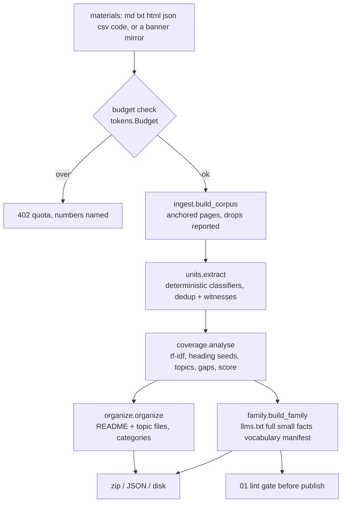

# 19 — Corpus synthesis (throw docs at it)

**Status:** design + implemented (engine, API, `/create/`) · **Date:** 2026-09-01 · **Surfaces:** web | api | cli | lib

## 1. Purpose

Take an arbitrary amount of loosely related material — a folder of notes, three
READMEs, a wiki export, a CSV of parameters and a pasted transcript — and return
**useful, delineated, structured markdown**: one file per topic (or grouped into
categories), every line carrying the source it came from, plus the full llms
family over the same material and a measured statement of how well it is
covered.

Two things separate this from component 02, which it shares an engine seam with.
02 is a *wizard* that walks a user from an upload to a published family, with a
skeleton they choose. This is the *headless* version of the same job: one call,
no skeleton, the topics discovered from the material itself, and a number
attached to the result. 02 is the product; 19 is the endpoint 02 and the six
client libraries and the CLI all reduce to.

The number is the point. "Most comprehensive coverage" is a claim, and a claim
with no measurement behind it is a sales line. §7 defines **comprehensiveness**
as a computed 0–1 quantity with three named factors, and §9 makes its behaviour
— *more material must not lower it* — an acceptance test rather than an
assertion.

**What comprehensiveness is not.** It measures how completely the output covers
the *supplied material*, not how completely the material covers the subject as
it exists in the world. Three good notes, fully organised, score well. The
report says so, in a `small-corpus` gap, every time the corpus is under five
sources — because the alternative is a number that reads as a subject verdict
and is not one.

## 2. User stories and flows

- *Engineer with a folder of internal notes*: drops 40 markdown files into
  `/create/`, sees the topic list and the coverage numbers before spending
  anything, downloads a zip of topic files plus an `llms.txt` family to commit
  next to the code.
- *Anyone above the free ceiling*: pastes 300 KB, is told **before** the work
  starts that it is 75k tokens against a 25k free ceiling, and is shown what the
  cheapest plan that lifts it costs.
- *Automation*: `POST /api/corpus` with a list of documents and a key, gets back
  the same files as JSON, in CI, on every docs change.
- *CLI, offline*: `llmsx corpus ./notes --subject "Runbooks" --out ./runbooks` —
  no key, no network, no model, because the pipeline is deterministic.
- *Someone deciding whether to bother*: `POST /api/corpus/preview` returns the
  topics, the coverage numbers and the gaps without rendering a file.

Flow: **measure** the input against the budget → **ingest** to anchored pages →
**extract** units → **analyse** into topics, coverage and gaps → **organize**
into topic files → **render** the llms family → return files + summary.

The budget is checked first, on the raw input, and the refusal names the
numbers. A ceiling discovered halfway through is a ceiling that has already
spent the caller's quota.

## 3. Inputs → outputs (contracts and file grammars)

**Input.** A list of `{name, text, source?}`. `name` decides how the bytes are
read — markdown and text as-is, HTML through a heading-preserving reader, JSON
and JSONL as headed sections, CSV/TSV as a table, source files as a fenced
block under a heading naming the file. `source` is kept when the caller knows
the real URL; without it the page is `upload://<corpus_id>/<name>`, rewritten to
the served page URL on publish (component 02 §3's rule, not a second one).

**Anchoring.** Every unit's anchor is the slug of the nearest **real** heading
above it. A file with no headings anchors to `#top` and says so. Headings inside
fenced code are not headings. No heading is ever synthesised to make an anchor
look better.

**Output.**

```
README.md                  the index: coverage table, topics (or categories), gaps, unplaced
<nn>-<topic>.md            one per topic, flat layout
<category>/<nn>-<topic>.md one per topic, grouped layout (>= 6 topics)
llms.txt                   spec v2: H1, blockquote, generated comment, H2 sections of link lines
llms-full.txt              mintlify grammar, declared in line 1: '# Title' / 'Source: <url>' / body / ---
llms-small.txt             the same index shape, budgeted, reference-class first, says where it cut
llms-facts.txt             '- [type] text — url#anchor', grouped by topic, an HTML anchor per section
llms-vocabulary.txt        term | units | sources | weight | first seen (a URL) — never an unsourced row
manifest.json              bytes and tokens per file, sections, coverage, drop counts, ladder_ok
```

A topic file's sections are unit kinds in reading order — definitions, concepts,
facts, parameters, how-to, examples, changes, problems, questions, ideas,
quotes, notes — fixed, not "whatever was encountered first". Unit types are the
hub's `docset_refine.UNIT_TYPES` exactly; a type this pipeline invented would be
a type the hub's exporter cannot render.

**Summary JSON** accompanies the files: input tokens, budget, pages, units,
merged duplicates, sources, the full coverage report, the drop list with
reasons, and a per-file `{path, bytes, tokens}`.

## 4. Architecture (mermaid diagram + existing hub code reused, by path)



Everything is in `llmsx/llmsx/`: `tokens.py`, `ingest.py`, `units.py`,
`coverage.py`, `organize.py`, `family.py`, `pipeline.py`. Stdlib only, zero
dependencies, so the same code runs in the API process, in the CLI on a bare
box, and in CI.

**Deliberately not reused at this tier:** the hub's `docset_refine` chain
(`clean` → `extract` → `units` → `polish` → `render` → `export_llms`). It is the
better pipeline and it is what the *metered* path will call — it has model
stages, an embedding pool and the hub's own store. But it lives in
`~/.global-ai-hub`, on one machine, and needs Ollama and Claude. A free tier
that required it would not be a free tier, and a client library that required it
would not install. `pipeline.MODEL_STAGES` names the three seams where the hub
chain attaches: reclassifying the units the deterministic rules called
`statement`, naming topics from content rather than from their strongest terms,
and polishing unit text into standalone sentences.

The output grammars are the hub's, checked by `hub/scripts/llms_lint.py`, so a
family produced here and a family produced there pass the same gate.

## 5. API / CLI / MCP surface

```
POST /api/corpus/preview   {documents[], subject?, max_topics?}   → topics, coverage, gaps, drops  (no files)
POST /api/corpus           {documents[], subject?, categorise?, layout?, small_budget?}
                                                                  → {summary, files[{path, text|bytes, tokens}]}
POST /api/create           {documents[]|text, subject?}           → the llms family only, the /create/ app's endpoint
GET  /api/corpus/limits                                           → this caller's ceiling, used and remaining
```

All three POSTs are authenticated and quota-checked. `documents[]` is
`{name, text, source?}`. `GET /api/corpus/limits` is the honest way for a UI to
show the ceiling before the user pastes 300 KB into a box.

CLI:

```
llmsx corpus PATH... --subject S [--out DIR] [--categorise/--flat] [--max-topics N] [--json]
llmsx corpus PATH... --preview          topics and coverage only, nothing written
llmsx create PATH... --out DIR          the llms family only
```

Local by default and offline: no key, no network, no model. `--api URL` sends
the same request to the hosted endpoint instead, which is what a caller wants
when they are over the local machine's patience rather than over a quota.

Libraries: `corpus(documents, ...)`, `preview(documents, ...)`, `create(...)`,
`limits()` on every client in `clients/`.

MCP: none in v1. The gateway's hosted tool set is fixed by master **D5** and
adding to it is a decision, not an implementation detail.

## 6. UI (pages, states, empty/error states)

`/create/` — the app. One page, four states:

- **Empty**: a drop zone and a paste box, with the free ceiling stated up front
  (25,000 tokens per run, 5 runs a day) and a live token counter as material is
  added. The counter is the same estimator the quota enforces, so the number on
  screen is the number that will be checked.
- **Over the ceiling**: the run button is disabled, the overage is quantified
  ("62,400 tokens — 37,400 over"), and the upgrade link names the cheapest plan
  that lifts it. The material is not uploaded. Nothing is spent to be told no.
- **Result**: the coverage table, the topic list with depth per topic, the gap
  list, and the file list with token counts — each downloadable, plus download
  all.
- **Error**: an unreadable file is listed with its reason beside the files that
  did read; the run still happens. A corpus that yields no topics says so and
  shows the drop list, because "no topics" is almost always "everything was
  dropped".

Signed out, the page renders and the counter works — both are client-side — and
the run button says what it needs. The site stays static; `/create/` is an
island like the account pages.

## 7. Data model and storage

No new tables for the synchronous path: a corpus run is a request, not a job.
The metered model-pass path is a `Job` row and belongs to step 4's runner.

The measured quantities, which are the contract:

| Quantity | Definition | Why this way |
|---|---|---|
| `breadth` | Share of the corpus's tf-idf-weighted vocabulary appearing in a unit some topic placed | Weighted, so a term used once in one source cannot drag it down like a term the corpus is built on |
| `depth` | Size-weighted mean of per-topic depth; each topic scores on units (target 20), distinct sources (target 6) and unit kinds (target 6) | Kinds is what separates a covered topic from twelve restatements of one claim |
| `placement` | Units a topic could claim ÷ all units | Unplaced units usually share vocabulary with placed ones, so breadth does not see them |
| `comprehensiveness` | Geometric mean of the three | Arithmetic would let a corpus score well by being excellent at one third of the job |

Gap kinds and severities: `thin` (high), `undefined` (medium), `single-source`
(medium), `unplaced` (medium), `small-corpus` (medium), `oversized` (low),
`unevidenced` (low). Each carries a remedy phrased as *material to add*, because
the reader of this report cannot fix it with a code change.

## 8. Tiering, metering and billing hooks

The free ceiling is component 15 §5's `Corpus synthesis (19)` row and is loaded
from `api/plans.py` like every other limit — **25,000 tokens per run, 5 runs per
day** on free; unlimited per run and per day on Starter and Pro. Two quota keys:
`corpus_max_tokens` (a `cap`, checked against the measured input) and
`corpus_per_day` (a `counter`, over the day's corpus jobs).

The deterministic pipeline spends no model tokens, so a free run costs the
platform CPU and nothing else. That is why the free tier can exist at this size
at all, and why the ceiling is about protecting a shared box rather than about
recovering per-call cost.

Metered work is the model passes named in §4 — reclassification, topic naming,
polish — and the embeddings a hosted index would need (component 17). Those are
`Job`s, priced from the ledger's price list, and are step 4's. Until they exist,
no corpus run writes a ledger row, and the honest description of the paid tiers
here is *no ceiling*, not *better output*.

## 9. Acceptance bar (measurable)

All of these are `llmsx/tests/test_corpus_pipeline.py`:

- **Depth pays** — adding a second, independent document on a subject already in
  the corpus raises `depth`.
- **Breadth pays** — adding material about a subject not previously present adds
  a topic.
- **Monotonic** — `comprehensiveness` over (base, +depth, +breadth) is
  non-decreasing.
- **Noise does not pay** — the same document twice yields the same unit count
  and the same score, and reports the duplicate.
- **Every unit carries a source and an anchor**; the anchor is the nearest real
  heading; a fenced `# comment` is not a heading.
- **Grammars** — the index is spec v2, the full file declares `mintlify` in line
  one, every facts line ends in a URL, no vocabulary row is unsourced.
- **The manifest measures the bytes it shipped** — per-file bytes and tokens
  equal the rendered files.
- **The ladder climbs, or the manifest says it cannot** (`ladder_ok: false` with
  a note) — a three-sentence corpus has an index as big as its full text and
  should say so rather than publish a size ladder that is not one.
- **Deterministic** — two runs over the same material are byte-identical, and
  input order does not change the result.
- **The budget refuses before any work happens**, naming used and limit.
- **Preview agrees with the run it precedes** — same units, same topics, same
  order.

## 10. Security, rights, privacy

- **Uploaded material is the user's.** It is processed in the request and not
  persisted by this component; publishing to `/u/<user>/<slug>.llms/` is
  component 15's route and its `private, no-store` headers.
- **Third-party full text is never republished publicly** (master **D8**). A
  corpus built from someone else's docs can be served back to its owner and
  downloaded by them; it does not enter the shared catalogue. The publish path
  in component 13 enforces that, not this one.
- **Nothing is inferred into a source.** A unit whose text cannot be tied to a
  page is not written. This is the rule that keeps a generated facts file
  checkable, and it is enforced structurally: a unit is constructed with its
  page's source or not at all.
- **The `upload://` scheme never leaks a filesystem path.** It carries the
  caller's own `name` for the material, which the caller supplied.
- **Denial of service** is the live risk of a free synchronous endpoint. The
  token cap bounds one request; the daily counter bounds a caller; both are
  checked before work. Pathological inputs — a 40 MB single line, a file of
  NULs — are bounded by the page-size split and the text check in ingestion.

## 11. Dependencies on other components (by number)

- **01** — the lint gate every produced family must pass at 0 High before it can
  be published, and the rubric the grammars in §3 are checked against.
- **02** — the wizard over this engine; shares the anchoring rule and the unit
  types, and adds the skeleton chooser and the publish step.
- **15** — the plan table the ceiling comes from, and the account the daily
  counter is kept against.
- **17** — indexing a produced corpus for search; the natural next call after a
  run.
- **18** — the optimizer catalogue, where `ldo`'s corpus mode is published.
- **20** — the six client libraries that expose this surface.

## 12. Open questions and assumptions

- **Assumed: deterministic is enough for the free tier.** It produces complete,
  anchored, lint-passing output today. The model passes are an improvement on a
  working result, and §4 names exactly where they attach. If that turns out to
  be wrong — if unpolished units read badly enough that people do not use the
  free tier — the fix is to move a cheap local model pass in, not to gate the
  tier.
- **Open: whether the synchronous endpoint stays synchronous.** A 25k-token
  corpus runs in well under a second; a 5 MB one on a paid tier will not. The
  cutover to the step-4 job runner is a size threshold nobody has measured yet.
- **Open: category naming.** Categories are named from the vocabulary their
  member topics share, which produces serviceable names and occasionally a
  clumsy one. This is the first thing a model pass should fix (§4, `name`).
- **D9 does not apply here.** `/create/` is an island calling `/api/corpus`
  at runtime, not a build-time JSON payload, because the input is the user's and
  cannot exist at build time. The read-only-payload deviation D9 records is
  about published data, and there is none here.
