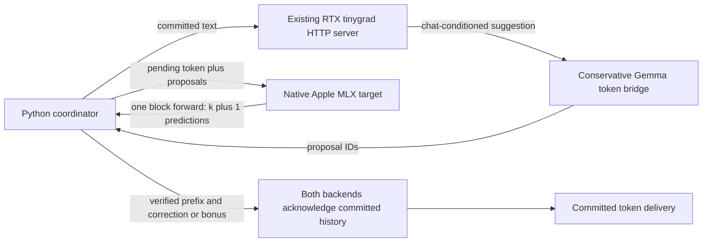

Public evidence export: 2026-09-30. Download the [source overlay and receipt bundle](https://llmsx.org/downloads/benchmarks/speculative-decoding-2026-09-30/experiment-bundle.zip) for the repository paths referenced in commands. This document retains failed qualification results.

# Apple Silicon target and RTX 5080 draft: validation plan

Version: 1.0.0. Delta: executable backend, correctness gates and first hardware measurements after the [investigation](https://llmsx.org/downloads/benchmarks/speculative-decoding-2026-09-30/experiment-bundle.zip). Tracking: TASK-69. Package: llmsx 0.2.4; native sidecar 0.1.0.

The integration can test genuine greedy speculative decoding over the canonical `llmsx-research-gemma31-mlx` weights. Corrected hardware tests found exact-token failures in four block trials. The available RTX Qwen2-14B chat drafter also makes the prototype substantially slower. The implementation and repeatable validation harness are complete; correctness and performance gates prevent research-route promotion.

## What the integration does



[The Python package](https://llmsx.org/downloads/benchmarks/speculative-decoding-2026-09-30/experiment-bundle.zip) contains the token protocol, coordinator, native HTTP client, RTX adapter, tokenizer bridge, streamed measurements and validation CLI. [The Go sidecar](https://llmsx.org/downloads/benchmarks/speculative-decoding-2026-09-30/experiment-bundle.zip) imports Ollama v0.35.0 at `cc4069396f3ad2c370c53eed2e4a42ac13adab84`, loads existing local manifest blobs, and calls the actual Gemma `Forward` and `Unembed` methods. Every verification uses one causal forward over the pending token and proposed tokens. The target returns k+1 greedy predictions. Native snapshots restore the accepted cache prefix; the correction or bonus remains pending for the next round.

The canonical manifest is pinned to `559e7d6999dbf031c7f842e84257eea6d43a8adcb6ff90a727baa05d4a5e6b0d`. The full tokenizer fingerprint is `5f29b160b4d08cc73236f10311cf16d766edd54421d54617ca5ffe74546a6e4f`. The installed Ollama reports the same source revision with a dirty build. Same weights therefore require fresh runtime parity tests. The bundled Gemma assistant loads with the manifest; the sidecar's verifier does not use it for drafting.

The RTX adapter calls the existing `127.0.0.1:8000` Qwen2-beta-14B-Chat server. Its proposals use that server's chat conditioning. They do not represent a Gemma raw-prefix draft. The bridge accepts a suggestion only when full-prefix retokenization preserves every committed target ID. Failed alignment, incomplete UTF-8 or an excessive text prefix produces an empty proposal, which executes one plain target step. This supports greedy verification of arbitrary suggestions. It does not implement stochastic p/q acceptance across different tokenizers or claim a qualified Gemma draft.

No second TinyGPU process is created. A second NV device owner can reset the live device. Switching the RTX server to a smaller raw-continuation model requires a controlled single-owner transition. The integration leaves saved provider settings, canonical model artifacts and paused indexing untouched.

## Repeatable commands

From the repository root, build and preflight the sidecar as documented in its README. Its `--probe` does not load model weights. Start its explicit `--model` process on loopback port 11551 with a 4096-token experimental cap. Check that another copy of the target is not resident before starting it. The saved research alias still requests 65,536 tokens.

```sh
cd llmsx
uv run --extra dev pytest tests/test_speculative*.py
uv run --extra dev ruff check llmsx/speculative tests/test_speculative*.py
cd ../native/speculative-mlx
go test ./...
go vet ./...
go mod verify
cd ../..
PYTHONPATH=llmsx python3 -m llmsx.speculative doctor
PYTHONPATH=llmsx python3 -m llmsx.speculative validate --execute \
  --prompts-file docs/verification/speculative-decoding-2026-09-30/short-prompts.json \
  --tokens 64 --draft-lengths 2,4,8 --repeats 2 --oracle-cases \
  --output /tmp/speculative-short-results.json
PYTHONPATH=llmsx python3 -m llmsx.speculative check-cache --execute \
  --prompts-file docs/verification/speculative-decoding-2026-09-30/window-prompts.json \
  --output /tmp/speculative-cache-results.json
```

The installed entry point is `llmsx-speculative`; `python -m llmsx.speculative` works without third-party Python dependencies. `validate`, `check-cache` and `canonical` require `--execute`. This is an explicit local execution control for future operators; this session's user already authorized the validation work. `doctor` reads loaded endpoint metadata and performs no generation. It does not start a service.

For the ordinary installed Ollama control, stop the experiment-owned native process first, then use the already available scoped Ollama endpoint:

```sh
PYTHONPATH=llmsx python3 -m llmsx.speculative canonical --execute \
  --ollama-url http://127.0.0.1:11435 \
  --prompts-file docs/verification/speculative-decoding-2026-09-30/short-prompts.json \
  --tokens 64 --repeats 2 --output /tmp/speculative-ollama-control.json
```

Exact raw prompt bytes are stored in the fixture JSON. Corrected Gemma chat fixtures include the explicit `<bos>` rendered by its template. Initial native tokenization uses the tokenizer's actual default BOS policy, matching Ollama's raw MLX pipeline. The loaded canonical tokenizer reports `tokenizer_add_bos=false`; neither endpoint automatically adds another BOS for these raw fixtures. Bridge re-encoding also disables automatic BOS to preserve the committed IDs. Explicit BOS tokens remain part of history when present. `raw=true` and `think=false` bypass response parsing in the ordinary control. Temporary greedy options neutralize repetition, frequency and presence penalties. EOS is retained in native token-ID parity and removed for API output-byte comparisons; the Ollama raw API does not expose the sampled token IDs.

## Gates and acceptance criteria

| Gate | Required evidence | Acceptance criterion |
|---|---|---|
| 0: provenance and capabilities | Exact manifest/tokenizer/source, model inventory, context limits, one-forward verifier | Fail before inference on incompatible IDs, metadata or capabilities; never synthesize a missing backend |
| 1: deterministic contract tests | Independent autoregressive oracle, full/partial/first rejection, budget, EOS, stale state, cancellation, partial commits and failures | Exact IDs and history hashes; both acknowledgements before delivery; cleanup on uncertain state |
| 2: live target cache correctness | Plain one-token target versus block verification; forced first/middle/last rejection and full acceptance; abort/retry and fresh-cache continuation | Exact token-ID parity, exact logical state and cache offsets, including after the actual 1024-token sliding window |
| 3: actual RTX suggestions | Three stored prompts, k=2/4/8, paired repetitions, acceptance and fallback diagnostics | Exact target parity; show proposals and accepted IDs separately from target-only fallbacks |
| 4: canonical installed-runtime control | Identical raw prompts, BOS, context and neutral sampling; streaming client timestamps and engine receipt | Report output-byte and token-count evidence separately; isolate cold load and warmed/cached trials |
| 5: workload and long-context qualification | Real research/tool syntax, evidence quality, 4K/8K/32K/65K contexts, cancellations, Unicode boundaries and memory pressure | Zero unsupported claims or unintended tool execution; exact native parity; measured memory headroom and cleanup |
| 6: performance promotion | At least 20 paired warmed runs per representative workload, balanced order, cold runs separate, repeated sessions | Proposed minimum: median end-to-end throughput improves at least 15% over canonical; p95 first-token latency worsens no more than 10%; no correctness or quality regressions |

Gate 6 thresholds are a proposed engineering decision, not measured results. Current short tests are exploratory, and the baseline always precedes the draft-length trials. Draft-length order alternates between repetitions. A production benchmark must balance engine order, control prompt caching, and use the ordinary canonical runtime as the practical baseline.

Measure wall time, first committed token, decoded text availability, acceptance, proposal length, verify/commit/transport costs, peak memory and failures. Count target token IDs or the engine's actual `eval_count`. Never use whitespace estimates or the existing bridge's synthetic duration fields. Multiple accepted tokens arrive as one committed block; their identical timestamps describe buffered delivery, not zero-time native decoding. GPU kernel durations remain null without synchronized instrumentation. Native measurements include prefill, all HTTP draft/tokenizer work and final decode, but exclude model startup. The ordinary control includes load time and records load/prefill/cache receipts. Warmed comparisons must account for that difference.

## Recorded results

The [initial smoke receipt](https://llmsx.org/downloads/benchmarks/speculative-decoding-2026-09-30/experiment-bundle.zip) used a five-token bare-text prefix with a 12-token output budget. It proved native block/single-step parity and forced rollback branches. It was not checked against an ordinary canonical raw-runtime control. It achieved about 15.5 target tokens/sec and 1.7–1.8 with the RTX draft, with zero accepted draft tokens.

The [malformed-prefix receipt](https://llmsx.org/downloads/benchmarks/speculative-decoding-2026-09-30/experiment-bundle.zip) used raw chat cues without their explicit template BOS. All six native and ordinary controls emitted repeated separators. Their exact parity and zero RTX acceptance establish mechanical behavior only. The corresponding [ordinary receipt](https://llmsx.org/downloads/benchmarks/speculative-decoding-2026-09-30/experiment-bundle.zip) is retained with that qualification. Its resident throughput and the earlier 9–22x slowdown are not useful-task performance results.

The [prompt-format probes](https://llmsx.org/downloads/benchmarks/speculative-decoding-2026-09-30/experiment-bundle.zip) compare correctly rendered BOS prefixes with and without the explicit empty thought channel. Both produced the correct Paris value. The corrected short fixtures include BOS and the large-model no-thinking cue. This is an explicit raw rendering choice, not a claim that the installed alias's automatic chat renderer chooses that template. The corrected [short workload receipt](https://llmsx.org/downloads/benchmarks/speculative-decoding-2026-09-30/experiment-bundle.zip) uses those prefixes with a 64-token cap. The Paris value is correct but fenced despite a JSON-only instruction. The Python function is correct, while its explanation reaches the cap. These fixtures are useful probes, not full research-quality qualification.

Of 30 trial comparisons, four fail strict parity: both real k=8 code trials and the accepted/middle-rejection k=8 code oracles. All first diverge at generated index 60, the 61st token: plain native selects `tells` (12630), while those trials select `specifies` (54945). The k=2 and k=4 real trials pass this sample. The receipt remains `correctness_fail`.

| Path | Samples | Median committed tokens/sec | Accepted/proposed draft IDs | Strict sample parity |
|---|---:|---:|---:|---|
| Native one-token control | 6 | 21.13 | not applicable | reference |
| RTX draft k=2 | 6 | 2.51 | 30/426 (7.04%) | pass |
| RTX draft k=4 | 6 | 1.87 | 50/772 (6.48%) | pass |
| RTX draft k=8 | 6 | 1.21 | 74/1374 (5.39%) | fail on both code runs |

These medians describe the diagnostic workload. Divergent outputs are not qualified performance comparisons. End-to-end rates count terminal EOS IDs when emitted and include all adapter costs. The ratio of draft-path and native medians is about 0.119/0.088/0.057; it is not the median of the paired ratios. There is no speedup evidence. The code trials reach their 64-token cap; JSON and explanation controls emit 17 and 58 native IDs including terminal EOS.

The [window receipt](https://llmsx.org/downloads/benchmarks/speculative-decoding-2026-09-30/experiment-bundle.zip) used a 1118-token prefix with one literal BOS and disabled automatic BOS. The stored window fixture retains this explicit BOS. Full acceptance and forced first/middle/last rejection preserved continuation parity beyond the actual 1024-token window. The ordinary RTX adapter fell back on all 11 real rounds in each of the k=4 and k=8 paths (11 emitted IDs per path, including EOS, under a 12-token cap) because this prefix exceeded its conservative byte cap. Its small timing differences are target-only noise and provide no cross-device speedup evidence.

The [final cache receipt](https://llmsx.org/downloads/benchmarks/speculative-decoding-2026-09-30/experiment-bundle.zip) used the restored 1118-token fixture on the final sidecar. An invalid correction was rejected; explicit abort restored every cache offset and the committed digest. Retrying returned the same token. Subsequent continuation matched a fresh cache. The real tokenizer marked incomplete byte prefixes invalid UTF-8 and the completed scalar valid.

The corrected [ordinary canonical control](https://llmsx.org/downloads/benchmarks/speculative-decoding-2026-09-30/experiment-bundle.zip) uses the exact corrected raw fixture with the same 64-token cap. Visible bytes match four of six native baselines; both code controls select `specifies`. All six token counts agree after removing native terminal EOS; ordinary `eval_count` excludes that terminator. The first cold call reports 3.717 seconds of engine load and 4.326 seconds client wall time. Five subsequent resident calls have median 46.57 engine-counted tokens per client wall second. Different cache, prefill and runtime behavior prevent attributing the rate difference to the bundled assistant; its activation is uninstrumented. The [comparison receipt](https://llmsx.org/downloads/benchmarks/speculative-decoding-2026-09-30/experiment-bundle.zip) preserves these counts and mismatches.

The [same-prefix diagnostic](https://llmsx.org/downloads/benchmarks/speculative-decoding-2026-09-30/block-parity.md) reproduces score and token selection changes across block shapes and cache histories. It includes a direct one-token control at the failing prefix, observer checks and selected-logit causal controls. Exact bundled kernel dispatch remains unknown. Floating-point projection or attention arithmetic is a plausible mechanism, and cache implementation defects have not been ruled out globally.

Gates 0 and 1 pass the tested contract. Gate 2 passes the recorded window/cache probes but fails the short block parity comparison. Gate 3 fails for real k=8 suggestions. Gate 4 supplies an ordinary control, with two byte mismatches. Gate 5 remains unqualified and gate 6 has not been run. The current implementation is a backend experiment with saved failing receipts. Canonical provider/model settings and research routing remain unchanged.


## Next candidate and stop conditions

First resolve or isolate native block numerical parity at the saved failing prefix. A one-token verifier can serve as the oracle but loses block work savings. Then test a much smaller raw-prefix drafter on the RTX with a qualified token bridge or identical Gemma tokenizer. Its entire request, prefill, transfer and rollback cost must fit inside the target work saved by accepted tokens. Gemma4 loading on installed tinygrad is not qualified; a Gemma draft requires verifying or implementing loader support or using another compatible runtime; renaming a Qwen endpoint does not qualify it. Compare that candidate with the canonical Ollama runtime's bundled assistant behavior before making a routing change. Only after correctness passes should workload and balanced performance qualification proceed.

Stop a candidate on any token/state mismatch, unrecoverable cache error, out-of-memory failure, unsupported evidence claim or performance regression. Save its failed receipt and diagnose the actual failing symbol or request. Resume from the recorded gate rather than treating successful mocks as hardware proof. No unverified tool call is executed by this coordinator.

Primary references: [Ollama source pinned to the imported revision](https://github.com/ollama/ollama/tree/cc4069396f3ad2c370c53eed2e4a42ac13adab84), [Transformers assisted-decoding documentation](https://github.com/huggingface/transformers/blob/main/docs/source/en/assisted_decoding.md), [Universal Assisted Generation explanation](https://huggingface.co/blog/universal_assisted_generation). The conservative chat-suggestion adapter here is a separate implementation; published UAG benchmark numbers do not apply to this hardware.

To reproduce the selected-logit diagnostic while the native sidecar is running:

```sh
PYTHONPATH=llmsx python3 scripts/diagnose_speculative_logits.py --execute \
  --position 60 \
  --input docs/verification/speculative-decoding-2026-09-30/short-results.json \
  --output /tmp/speculative-logit-diagnostic-position60.json
```

The diagnostic requires the same manifest, tokenizer fingerprint, model and prompt token count. It checks every reconstruction and rollback acknowledgement. Its logit inspection uses the same forward as normal verification. It needs no separate model copy or additional RTX owner.
